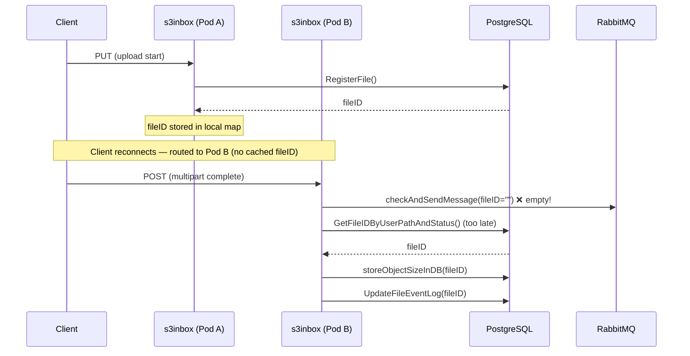
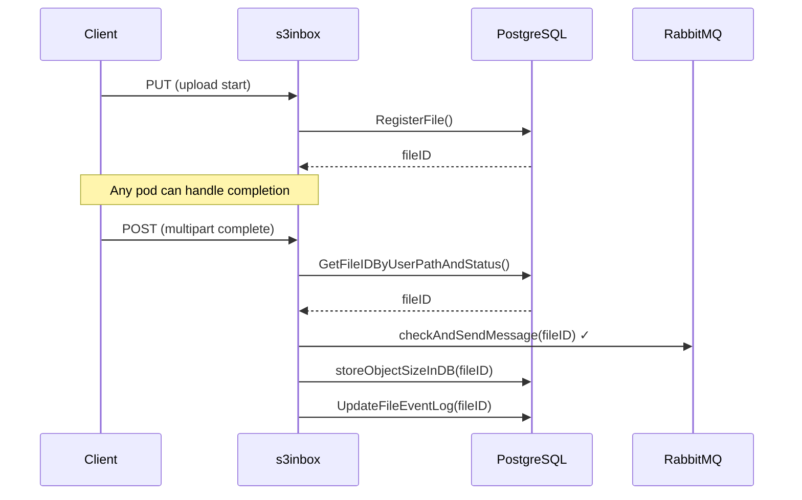

# Replace s3inbox In-Memory File ID Cache with Database Lookups

## Context and Problem Statement

The s3inbox service maintains an in-memory `map[uniqueFileID]string`
([proxy.go#L43][proxy-go-L43]) to track file IDs between the initial
`RegisterFile` call (on PUT) and the upload completion handler. This map is
accessed concurrently by HTTP handler goroutines with no synchronization, which
caused a **fatal crash in production** due to concurrent map writes
([#2295][issue-2295]):

```text
fatal error: concurrent map writes

goroutine 13331 [running]:
main.(*Proxy).allowedResponse(0xc0000a8180, ...)
    /go/cmd/s3inbox/proxy.go:254 +0x10f6
main.(*Proxy).ServeHTTP(0xc0000a8180, ...)
    /go/cmd/s3inbox/proxy.go:109 +0x17b
```

A hotfix ([822354f][hotfix-commit]) added `sync.RWMutex` to the v3.1.0
production branch. However, the underlying design has several remaining
problems:

1. **Per-pod state** — when a client reconnects to a different s3inbox pod
   (e.g., after a network interruption or load-balancer rotation), the file ID
   is not available on the new pod. The code has a DB fallback for this case
   ([proxy.go#L237][proxy-go-L237], added for [#1358][issue-1358]), but the
   fallback runs *after* `checkAndSendMessage` has already been called with an
   empty file ID ([proxy.go#L228][proxy-go-L228]), meaning a message with a
   missing correlation ID is sent to the broker before the DB lookup occurs.
2. **TOCTOU races** — multiple map reads within the same handler can return
   different results if another goroutine deletes or modifies the entry between
   calls.
3. **Memory leak on incomplete uploads** — if an upload starts (registering in
   the map) but never completes (no delete), the entry stays in memory forever.
4. **Duplicate overwrite messages** — `sendMessageOnOverwrite`
   ([proxy.go#L578][proxy-go-L578]) fires based on an S3 `HeadObject` check,
   not the in-memory map. Multiple pods receiving concurrent PUT requests for
   the same file can each independently send an overwrite message. Note: this
   problem is not caused by the in-memory cache and will not be solved by
   replacing it — it requires separate coordination (out of scope for this ADR).

[issue-2295]: https://github.com/neicnordic/sensitive-data-archive/issues/2295
[issue-1358]: https://github.com/neicnordic/sensitive-data-archive/issues/1358
[hotfix-commit]: https://github.com/neicnordic/sensitive-data-archive/commit/822354f668c08f3a3531cfa9dfc0ad8d3292805f
[proxy-go-L43]: https://github.com/neicnordic/sensitive-data-archive/blob/1001e975/sda/cmd/s3inbox/proxy.go#L43
[proxy-go-L228]: https://github.com/neicnordic/sensitive-data-archive/blob/1001e975/sda/cmd/s3inbox/proxy.go#L228
[proxy-go-L237]: https://github.com/neicnordic/sensitive-data-archive/blob/1001e975/sda/cmd/s3inbox/proxy.go#L237
[proxy-go-L578]: https://github.com/neicnordic/sensitive-data-archive/blob/1001e975/sda/cmd/s3inbox/proxy.go#L578

## Decision Drivers

* **Production stability** — the concurrent map crash already hit production;
  the fix must be robust, not a band-aid.
* **Multi-pod correctness** — s3inbox runs behind a load balancer; any request
  in an upload session may land on any pod.
* **Simplicity** — the team is small; the fix should reduce complexity, not add
  it.

## Considered Options

1. **Remove the in-memory cache — use PostgreSQL as source of truth**
2. **sync.RWMutex with read-once pattern** (port the hotfix to main, improve it)
3. **Ristretto (in-process cache with TTL)**
4. **Redis as shared state layer**

## Decision Outcome

Proposed: **Option 1** — remove the in-memory cache entirely and retrieve the
file ID from PostgreSQL when needed. To be confirmed at the NeIC SDA-Devs
bi-weekly meet-up.

### Consequences

* Good, because all four in-memory cache problems (crash, per-pod state, TOCTOU,
  memory leak) are eliminated.
* Good, because the multi-pod reconnection case becomes the normal path rather
  than a buggy fallback.
* Neutral, because one additional DB query is added per completed upload, but
  this is negligible next to the S3, broker, and DB operations already in the
  same code path.
* Neutral, because the duplicate overwrite message problem (item 4) remains —
  it is a separate concern requiring its own solution.

### Confirmation

The fix is confirmed when:

* The `fileIDs` map and its associated `sync.RWMutex` (from the hotfix) are
  removed from the `Proxy` struct.
* The existing integration tests in `proxy_test.go` pass without modification
  (they exercise both single-part and multipart upload flows).
* A concurrent upload test reproducing the crash from #2295 can be added and
  passes.

## Pros and Cons of the Options

### Option 1: Remove the in-memory cache — use PostgreSQL

Eliminate the `fileIDs` map entirely. On upload completion — whether a
single-part PUT or a multipart POST (both handled by `uploadFinishedSuccessfully`
at [proxy.go#L326][proxy-go-L326]) — call `GetFileIDByUserPathAndStatus` to
retrieve the file ID from the database *before* sending the broker message or
updating the event log:

[proxy-go-L326]: https://github.com/neicnordic/sensitive-data-archive/blob/1001e975/sda/cmd/s3inbox/proxy.go#L326

**Current flow** (simplified, showing the bug):



**Proposed flow** (Option 1):



* Good, because it eliminates the entire class of concurrency bugs (no shared
  mutable state).
* Good, because it is the simplest change — removes code rather than adding it.
* Good, because it works correctly across multiple pods with zero coordination.
* Good, because it eliminates the memory leak on incomplete uploads.
* Good, because it fixes the existing bug where the broker message is sent with
  an empty file ID in the reconnection case.
* Neutral, because it adds one indexed DB query per completed upload. The same
  code path already performs `RegisterFile`, `UpdateFileEventLog`,
  `SetSubmissionFileSize`, S3 `HeadObject`, and broker `SendMessage`.

### Option 2: sync.RWMutex with read-once pattern

Port the production hotfix to `main` and improve it by reading the cached value
once per handler invocation, avoiding repeated lock acquisitions and TOCTOU
races.

```go
p.mu.RLock()
cachedFileID := p.fileIDs[fileIdentifier]
p.mu.RUnlock()
// Use cachedFileID throughout — no further map reads
```

* Good, because it fixes the crash.
* Good, because it is the minimal change from the production hotfix.
* Good, because it addresses the TOCTOU race (Nanjiang's feedback in #2295).
* Bad, because per-pod state remains — the DB fallback is still needed for
  cross-pod reconnection, and the existing fallback has the empty-fileID bug
  described above.
* Bad, because the memory leak on incomplete uploads remains.
* Bad, because it adds synchronization complexity that must be maintained.

### Option 3: Ristretto (in-process cache with TTL)

Replace the `map` with a [ristretto][ristretto] cache (already used in the
download service). Entries auto-evict after a configurable TTL.

[ristretto]: https://github.com/hypermodeinc/ristretto

* Good, because it fixes the crash (ristretto is thread-safe).
* Good, because TTL-based eviction fixes the memory leak.
* Neutral, because it still has per-pod state — does not fix the multi-pod
  problem or the empty-fileID bug.
* Bad, because TTL introduces a new failure mode: if the TTL is shorter than the
  upload duration, the entry evicts mid-upload.

### Option 4: Redis as shared state layer

Add Redis to the SDA infrastructure for the s3inbox file ID mapping.

* Good, because it solves per-pod state (shared across pods).
* Good, because TTL prevents memory leaks.
* Bad, because it adds a new infrastructure dependency (Redis).
* Bad, because it introduces a new failure mode (Redis unavailability).
* Bad, because the problem can be solved without new infrastructure (Option 1).

Redis may still be worth evaluating for other cross-service caching needs
(e.g., shared session caching in the download service) if a measured need
arises.

## More Information

### Related issues

* [#2295][issue-2295] — concurrent map read/write crash in s3inbox (production)
* [#1358][issue-1358] — client reconnecting to different s3inbox pod loses
  file ID state
