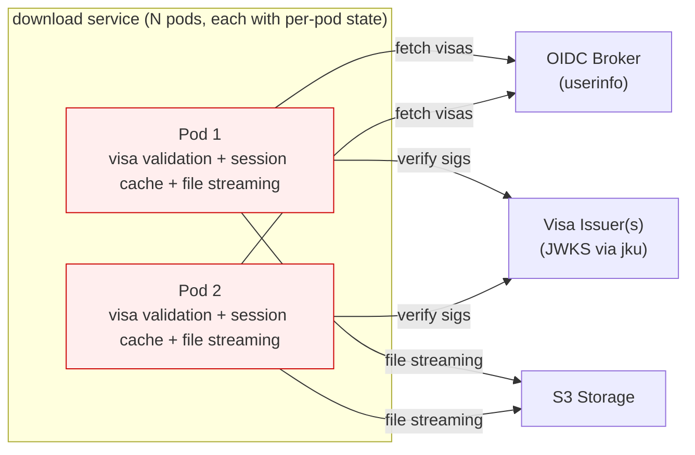
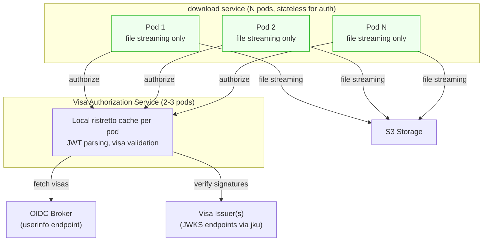

# Separate Visa Authorization Service

## Context and Problem Statement

The download API v2 service (`sda/cmd/download`) embeds GA4GH visa validation
directly in its HTTP middleware ([auth.go][v2-auth]). On each request without a
cached session, the service:

1. Fetches visas from the OIDC userinfo endpoint (or extracts them from the
   token itself, configurable via `visa.source`) ([validator.go#L104][v2-validator-L104])
2. For each `ControlledAccessGrants` visa, validates all required claims:
   `by`, `value`, `source`, `asserted`, and rejects non-empty `conditions`
   ([validator.go#L393][v2-validator-L393])
3. Verifies the visa JWT signature by fetching the signing key via `jku` from
   the trusted issuer allowlist ([jwks_cache.go][v2-jwks])
4. Checks each visa's dataset value against the local database
5. Caches results in a per-pod ristretto cache with three tiers: session cookie,
   token hash, and per-visa validation ([auth.go#L465][v2-auth-L465])

The v2 implementation has significantly improved GA4GH compliance over the
legacy `sda-download` service (see [Gap Analysis](#gap-analysis) below).
However, two architectural problems remain:

**Per-pod session loss.** The session cache is local to each pod. When a user's
request is routed to a different download pod (e.g., after scaling or pod
restart), the cached session is not available and the full visa re-validation
flow must run again — involving external HTTP calls to the OIDC userinfo
endpoint and each visa issuer's JWKS endpoint. This is not an interactive
re-authentication (the bearer token is still valid), but it adds latency and
external service load on every pod switch.

**Scaling mismatch.** Download pods need many instances for heavy I/O (streaming
large encrypted genomic files). Each pod also carries the visa validation
burden, meaning the authorization cache scales with I/O capacity rather than
with authorization demand.

[Issue #2228][issue-2228] proposes extracting visa validation into a separate
service. The GA4GH Passport specification defines a
[Passport Clearinghouse][ga4gh-passport] as "a service that consumes Visas and
uses them to make an authorization decision." The architectural separation
aligns with this model.

[issue-2228]: https://github.com/neicnordic/sensitive-data-archive/issues/2228
[ga4gh-passport]: https://ga4gh.github.io/data-security/ga4gh-passport
[ga4gh-aai]: https://ga4gh.github.io/data-security/aai-openid-connect-profile
[v2-auth]: https://github.com/neicnordic/sensitive-data-archive/blob/4d54b229/sda/cmd/download/middleware/auth.go
[v2-auth-L465]: https://github.com/neicnordic/sensitive-data-archive/blob/4d54b229/sda/cmd/download/middleware/auth.go#L465
[v2-validator-L104]: https://github.com/neicnordic/sensitive-data-archive/blob/4d54b229/sda/cmd/download/visa/validator.go#L104
[v2-validator-L393]: https://github.com/neicnordic/sensitive-data-archive/blob/4d54b229/sda/cmd/download/visa/validator.go#L393
[v2-jwks]: https://github.com/neicnordic/sensitive-data-archive/blob/4d54b229/sda/cmd/download/visa/jwks_cache.go
[v2-trust]: https://github.com/neicnordic/sensitive-data-archive/blob/4d54b229/sda/cmd/download/visa/trust.go

## Decision Drivers

* **Multi-pod correctness** — download pods run behind a load balancer; session
  loss on pod switch causes unnecessary external calls and added latency.
* **Separation of concerns** — authorization logic and file streaming have
  different scaling profiles and failure modes.
* **Operational simplicity** — prefer solutions that do not require new
  infrastructure (Redis, etc.) when an architectural change suffices.
* **Reusability** — other SDA services (API, future services) may need
  visa-based authorization.

## Considered Options

1. **Separate Visa Authorization Service with local caching**
2. **Redis-backed shared session cache in the download service**
3. **Keep current architecture (status quo)**

## Decision Outcome

Proposed: **Option 1** — extract visa validation into a separate service with
local ristretto caching per pod. To be confirmed at the NeIC SDA-Devs
bi-weekly meet-up.

### Consequences

* Good, because download pods become stateless for authorization — scale to N
  pods with no session loss.
* Good, because authorization and file streaming scale independently.
* Good, because no new infrastructure (Redis) is required.
* Neutral, because it introduces a new service to deploy, but it replaces
  complexity (per-pod session caching in the download service) rather than
  adding to it.
* Neutral, because authorization cache misses can still occur on Visa
  Authorization Service pod switches. However, with only 2-3 pods, this is
  far less frequent than with N download pods.
* Bad, because it adds a network hop per download request that needs
  authorization. Mitigated by co-location in the same cluster.

### Confirmation

The separation is confirmed when:

* The download service no longer contains visa validation logic — all
  authorization is delegated to the Visa Authorization Service.
* The Visa Authorization Service has its own integration tests covering: valid
  visa acceptance, expired visa rejection, untrusted issuer rejection,
  `ControlledAccessGrants` type filtering, and `conditions` claim rejection.
* Download service integration tests pass with the Visa Authorization Service
  as the authorization backend.

## Pros and Cons of the Options

### Option 1: Separate Visa Authorization Service with local caching

Extract the visa validation logic from `sda/cmd/download/visa/` and
`sda/cmd/download/middleware/auth.go` into a dedicated service.

**Current architecture:**

> Session lost on pod switch — full visa re-validation required.

**Proposed architecture:**

**Cache semantics for the Visa Authorization Service:**

The v2 download service already implements a three-tier caching strategy
([auth.go#L465][v2-auth-L465]) that should carry over to the extracted service:

* **Cache key:** SHA-256 hash of the bearer token.
* **Cached value:** authorized dataset list (`AuthContext`).
* **TTL:** bounded by the minimum of: access token `exp`, earliest visa `exp`,
  and configured maximums (`visa.cache.token-ttl`, `visa.cache.validation-ttl`,
  `visa.cache.userinfo-ttl`). The TTL never exceeds the token's remaining
  lifetime.
* **Eviction:** ristretto handles eviction automatically via TTL and cost-based
  admission.
* **Revocation:** token revocation before expiry is not detected by local
  caching. This is an accepted trade-off consistent with the current behavior
  and typical OIDC deployments. If near-real-time revocation is required in the
  future, Redis or a token introspection endpoint would be needed.

The separation works because the two workloads have different scaling profiles:

* **Download pods** need many instances for heavy I/O (streaming large encrypted
  genomic files). They currently also carry the session cache, which is why
  per-pod state loss is painful.
* **Visa Authorization Service pods** are lightweight (JWT parsing, OIDC HTTP
  calls, visa claim inspection). Only 2-3 pods are needed for HA. With few
  pods, a local ristretto cache with TTL is sufficient — the worst case on a
  cache miss is one extra round of OIDC calls, which is acceptable for a
  service that does no file I/O.

* Good, because download pods become **stateless for authorization**.
* Good, because it requires **no new infrastructure** — no Redis, no new
  databases.
* Good, because it creates a reusable service for visa-based authorization.
* Neutral, because the Visa Authorization Service is a new service to deploy
  and monitor.
* Bad, because it adds a network hop for authorization. Mitigated by
  co-location in the same Kubernetes cluster.

### Option 2: Redis-backed shared session cache in the download service

Add Redis to the infrastructure and replace the per-pod ristretto session cache
with a shared Redis-backed cache.

* Good, because it solves session loss across pods without architectural change.
* Bad, because it adds a new infrastructure dependency (Redis).
* Bad, because it introduces a new failure mode (Redis unavailability) requiring
  fallback logic.
* Bad, because authorization and file streaming remain coupled in the same
  service.

Redis should be re-evaluated if the Visa Authorization Service scales beyond
2-3 pods and local caching becomes insufficient, or if other SDA services
develop a measured need for shared caching.

### Option 3: Keep current architecture (status quo)

* Good, because no work is required.
* Bad, because session loss on pod switch continues — users experience added
  latency on every pod rotation.
* Bad, because authorization and I/O scaling remain coupled.
* Bad, because visa validation logic cannot be reused by other services without
  code duplication.

## More Information

### Gap Analysis: GA4GH Passport Clearinghouse Compliance {#gap-analysis}

The GA4GH [Passport specification][ga4gh-passport] and [AAI OIDC
Profile][ga4gh-aai] define a Passport Clearinghouse as a service that evaluates
visas for authorization decisions.

The download API has two implementations: the **legacy** `sda-download` service
and the **v2** implementation at `sda/cmd/download`. The v2 implementation is
the future and the basis for this ADR. The gap analysis below applies to v2
unless noted otherwise.

#### What v2 implements today

| Spec Requirement | Status | Implementation |
| --- | --- | --- |
| Filter by visa type | Done | Only processes `ControlledAccessGrants` visas |
| Validate required claims (`by`, `value`, `source`, `asserted`) | Done | `validateControlledAccessGrant()` checks all four are present and non-empty ([validator.go#L393][v2-validator-L393]) |
| Reject visas with unsupported `conditions` | Done | Rejects non-empty `conditions` via `rejectNonEmptyConditions()` ([validator.go#L430][v2-validator-L393]) |
| Verify visa JWT signature via `jku` | Done | Fetches JWKS and verifies; `jku` checked against trusted allowlist ([jwks_cache.go][v2-jwks]) |
| Verify `jku` is trusted before calling | Done | Trusted issuer configuration is **required** when visa is enabled — startup fails if not set. HTTPS enforced for `jku` URLs unless explicitly overridden ([trust.go][v2-trust]) |
| Validate standard JWT claims (`exp`, `iat`, `nbf`) | Done | Standard JWT validation |
| `asserted` staleness check | Done | Optional: configurable via `visa.validate-asserted`, rejects visas asserted in the future (with clock skew tolerance) |
| Trust relationship with Broker | Done | Configured via OIDC discovery URL |
| Visa source modes (UserInfo / Token) | Done | Configurable: `userinfo` (default, GA4GH recommended) or `token` mode; opaque tokens always fall back to userinfo ([validator.go#L104][v2-validator-L104]) |
| Three-tier caching with TTL | Done | Session cookie → token hash → per-visa validation cache; TTL bounded by token and visa expiry ([auth.go#L465][v2-auth-L465]) |

Note: the legacy `sda-download` service has significant gaps — its `Visa`
struct only contains `type` and `value`, it does not validate `source`, `by`,
`asserted`, or `conditions`, and its trusted issuer check is conditional
(returns `true` if no trusted list is configured). The legacy service should be
retired in favor of v2.

#### Remaining gaps

| Spec Requirement | Gap | Severity | Remediation |
| --- | --- | --- | --- |
| **`source` policy enforcement** — SHOULD verify source against policy per dataset | v2 validates that `source` is present and non-empty, but does not enforce policy rules like "only accept visas sourced from DAC X for dataset Y." `source` differs from `iss`: the issuer signs the JWT, the source made the access decision. | Medium | Add policy configuration mapping datasets to allowed sources. |
| **Token Exchange** — SHOULD prefer over UserInfo ([AAI spec][ga4gh-aai]) | v2 supports UserInfo and direct token extraction but not RFC 8693 Token Exchange. | Medium | Implement Token Exchange flow as an additional visa source mode. |
| **Linked Identities** — MUST verify when combining visas across different `sub` values | SDA uses a single OIDC broker (Life Science AAI); all visas share the same `sub`. Matters only for federated multi-IdP deployments. | Low | Defer until GDI federation requires multi-IdP support. |
| **Access Token Polling** — visa invalid if >1 hour old unless polling confirms validity | Only applies to Visa Access Tokens. v2 uses Visa Document Tokens (validated via `jku` signature). | Low | Defer — not applicable to current token flow. |
| **Full `conditions` evaluation** — evaluate Disjunctive Normal Form conditions | v2 correctly rejects visas with conditions but cannot evaluate them. If a visa issuer requires conditions to be satisfied, those visas are denied. | Low | Implement DNF conditions evaluator when needed for specific visa issuers. |

#### Path to full GA4GH compliance

Full Clearinghouse compliance is a goal for federated GDI deployments, not a
day-one requirement:

1. **Done (v2):** All required visa claims validated, `conditions` rejected,
   trusted issuer enforcement mandatory
2. **With service extraction:** Add `source` policy enforcement per dataset,
   Token Exchange
3. **For GDI federation:** Linked identity support, full `conditions` evaluation
   (DNF), Access Token Polling

The service is named "Visa Authorization Service" (working title) rather than
"Passport Clearinghouse" to avoid implying full GA4GH Clearinghouse compliance.
The service could be renamed once broader compliance is achieved.

### Related issues

* [#2228][issue-2228] — separate Passport Clearinghouse service (idea, to be
  fleshed out as part of implementation planning)
* [ADR-0003][adr-0003] — s3inbox shared state strategy (related per-pod state
  problem, solved independently via database lookups)

[adr-0003]: 0003-shared-state-strategy-for-s3inbox-and-caching.md
