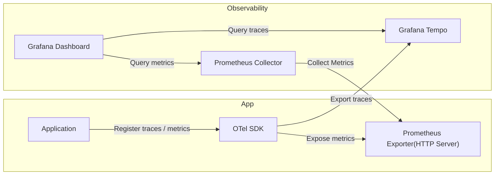

---
# These are optional metadata elements. Feel free to remove any of them.
status: proposed # proposed | accepted | rejected | deprecated | superseded
decision-makers:
  - "@neicnordic/sensitive-data-development-collaboration"
date: "2026-05-20" # when the decision was last updated
---

# Metrics and tracing in the sensitive-data-archive applications

## Context and Problem Statement

Tracing and metrics are helpful tools to be able to monitor(and debug) a system if configured and implemented in a reasonable manner in relation to the system.

With metrics and tracing the ability to inspect message and request handling is enhanced, this helps support:
* Finding where and why requests / message handling fails.
* Finding where and why requests / message handling is unexpectedly slow.
* How the system performance changes depending on load, over time, when new changes are deployed, etc

The sensitive-data-archive applications do not currently collect or export any tracing nor metrics.
The aim of this ADR is to detail how tracing and metrics collection and exposing could be implemented in the sensitive-data-archive.

## Decision Drivers

* We want to improve the detection of issues or potential problems in the applications.

## Decision Outcome

The idea is to implement metrics and tracing collection and exporting through [OpenTelemetry](https://opentelemetry.io/)(otel) which 
is an open source observability framework. 

An otel client will be setup in the application through the [go otel sdk](https://github.com/open-telemetry/opentelemetry-go).
This will allow applications to report traces and metrics to the otel client. And then the otel client will be responsible for exporting/exposing them.
Metrics will be exported 

The following diagram show an example setup where the otel sdk will export traces to a Grafana Tempo, and expose metrics through a Prometheus endpoint

The Observability parts in the above diagram is the suggested infrastructure setup, but could be modified by the operator.

[OpenTelemetry](https://opentelemetry.io/) is the chosen observability instrumentation, as it's comprehensive, and vendor-neutral. 
It supports exporting traces in different protocols, eg: [OpenTelemetry Protocol](https://opentelemetry.io/docs/specs/otlp/), [Jaeger](https://www.jaegertracing.io/), or [Zipkin](https://zipkin.io/).

[Prometheus](https://prometheus.io/) is the chosen metrics exporting protocol, as it's a standard and easily integrated in kubernetes and tools such as grafana to visualise metrics.

[OpenTelemetry Protocol](https://opentelemetry.io/docs/specs/otel/protocol/) is the chosen tracing protocol, as it's natively supported by the chosen observability instrumentation([otel](https://opentelemetry.io/))  

### Consequences

* Good, because with traces we can see
  * Total message / request handling duration
  * Time spent in each service
  * Failed spans
  * Slow database queries
  * External API latency 
* Good, because with metrics we can monitor
  * Request rate
  * Error rate
  * Latency percentiles
  * CPU/memory usage
  * Database connection counts
  * etc
* Bad, because there will be a minor overhead in application from instrumentation
* Bad, because there will be additional infrastructure components to maintain
