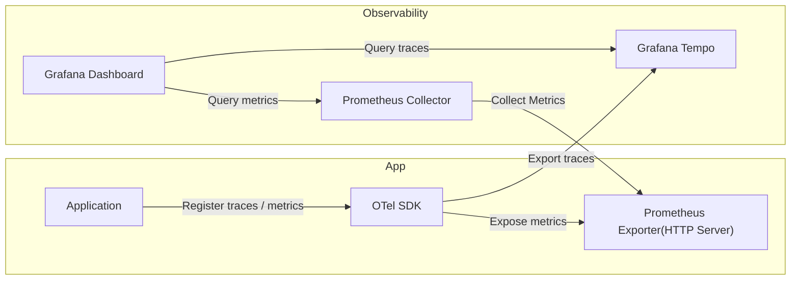

# Metrics and tracing in the sensitive-data-archive applications

## Context and Problem Statement

Tracing and metrics are helpful tools to be able to monitor and debug a system.

With metrics and tracing the ability to inspect message and request handling is enhanced, this helps support:

* Finding where and why requests / message handling fails.
* Finding where and why requests / message handling is unexpectedly slow.
* How the system performance changes depending on load, over time, when new changes are deployed, etc

The sensitive-data-archive applications do not currently collect or export any tracing nor metrics.
The aim of this ADR is to detail which technologies will be used to instrument the collection and exposing/exporting of tracing and metrics in the sensitive-data-archive.

## Decision Drivers

* We want to improve the detection of issues or potential problems in the applications.

## Considered Options

* Use [OpenTelemetry](https://opentelemetry.io/) for instrumentation, [Prometheus](https://prometheus.io/) for the metrics export, and [OpenTelemetry Protocol](https://opentelemetry.io/docs/specs/otlp/) (OTLP) for trace export.

For tracing and metrics no other major affecting options were considered as any other option would be less desirable and most likely require more work.

## Decision Outcome

Chosen option: Use [OpenTelemetry](https://opentelemetry.io/) for instrumentation, [Prometheus](https://prometheus.io/) for the metrics export, and [OpenTelemetry Protocol](https://opentelemetry.io/docs/specs/otlp/) (OTLP) for trace export.

[OpenTelemetry](https://opentelemetry.io/) is the chosen observability instrumentation, because it's open source, comprehensive, vendor-neutral, and it supports exporting traces in different protocols, eg: [OpenTelemetry Protocol](https://opentelemetry.io/docs/specs/otlp/), [Jaeger](https://www.jaegertracing.io/), or [Zipkin](https://zipkin.io/).

[Prometheus](https://prometheus.io/) is the chosen metrics exporting protocol, because it's a standard and easily integrated in Kubernetes and tools such as Grafana to visualise metrics.

[OpenTelemetry Protocol](https://opentelemetry.io/docs/specs/otlp/) (OTLP) is the chosen tracing protocol, because it's natively supported by the chosen observability instrumentation([OTel](https://opentelemetry.io/))

The following diagram shows an example setup where the OTel sdk will export traces to a Grafana Tempo, and expose metrics through a Prometheus endpoint

The Observability parts in the above diagram are the suggested infrastructure setup, but could be modified by the operator.

### Consequences

* Good, because with traces we can see
  * Total message / request handling duration
  * Time spent in each service
  * Failed spans
  * Slow database queries
  * External API latency
* Good, because with metrics we can monitor
  * Request rate
  * Error rate
  * Latency percentiles
  * CPU/memory usage
  * Database connection counts
  * etc
* Bad, because there will be a minor overhead in application from instrumentation
* Bad, because there will be additional infrastructure components to maintain

## More Information

There is a [POC branch](https://github.com/neicnordic/sensitive-data-archive/tree/poc/otel_tracing_and_metrics) (based on quite old version of the sda-stack: v2.1.34) with the described setup.
To test you can run:

1. `make build-all`
2. `make integrationtest-sda-s3-run`
3. You can now go to [locally hosted Grafana](http://localhost:3000) and login with admin:admin
4. On the [Grafana/Explore](http://localhost:3000/explore) you should be able to select Tempo, or Prometheus as source
5. You should now be able to see Prometheus metrics and traces in grafana.

In short the application level setup is as follows:

1. Application starts
2. An [OTel client](https://github.com/open-telemetry/opentelemetry-go) is initialized.
3. OTel client starts Prometheus exposing through an HTTP server
4. Application startup complete (after starting additional needed resources, etc)
5. Application reports span to OTel client
6. OTel client exports traces based on exporter configuration
