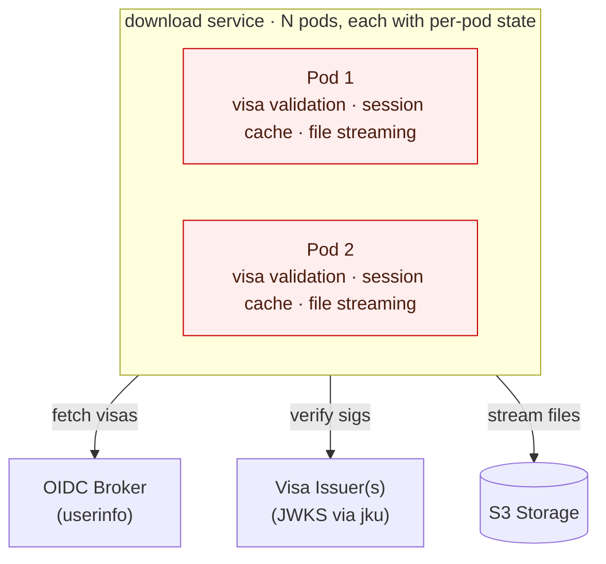
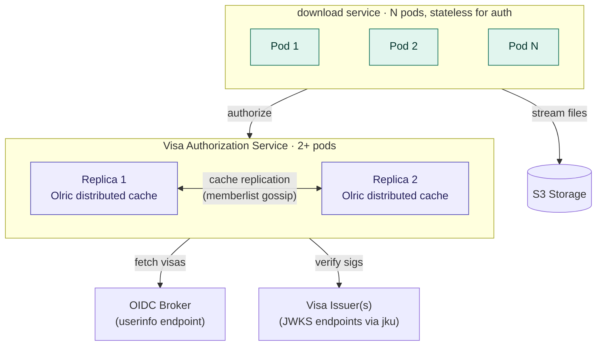

# Separate Visa Authorization Service?

## Context and Problem Statement

The download API v2 service (`sda/cmd/download`) embeds GA4GH visa validation
directly in its HTTP middleware ([auth.go][v2-auth]). On each request without a
cached session, the service:

1. Fetches visas from the OIDC userinfo endpoint (or extracts them from the
   token itself, configurable via `visa.source`)
   ([validator.go#L104][v2-validator-L104])
2. For each `ControlledAccessGrants` visa, validates all required claims:
   `by`, `value`, `source`, `asserted`, and rejects non-empty `conditions`
   ([validator.go#L393][v2-validator-L393])
3. Verifies the visa JWT signature by fetching the signing key via `jku` from
   the trusted issuer allowlist ([jwks_cache.go][v2-jwks])
4. Checks each visa's dataset value against the local database
5. Caches results in a per-pod ristretto cache with three tiers: session
   cookie, token hash, and per-visa validation ([auth.go#L465][v2-auth-L465])

The v2 implementation has significantly improved GA4GH compliance over the
legacy `sda-download` service (see [Gap Analysis](#gap-analysis) below).
However, two architectural problems remain:

**Per-pod session loss.** The session cache is local to each pod. When a
user's request is routed to a different download pod (e.g., after scaling or
pod restart), the cached session is not available and the full visa
re-validation flow must run again — involving external HTTP calls to the OIDC
userinfo endpoint and each visa issuer's JWKS endpoint. This is not an
interactive re-authentication (the bearer token is still valid), but it adds
latency and external service load on every pod switch.

**Scaling mismatch.** Download pods need many instances for heavy I/O
(streaming large encrypted genomic files). Each pod also carries the visa
validation burden, meaning the authorization cache scales with I/O capacity
rather than with authorization demand.

[Issue #2228][issue-2228] proposes extracting visa validation into a separate
service. The GA4GH Passport specification defines a
[Passport Clearinghouse][ga4gh-passport] as "a service that consumes Visas and
uses them to make an authorization decision." The architectural separation
aligns with this model.

Originally drafted as ADR-0004 in PR #2320; converted to an RFC under
[ADR-0005][adr-0005] because the open questions below haven't converged yet.

[issue-2228]: https://github.com/neicnordic/sensitive-data-archive/issues/2228
[ga4gh-passport]: https://ga4gh.github.io/data-security/ga4gh-passport
[ga4gh-aai]: https://ga4gh.github.io/data-security/aai-openid-connect-profile
[v2-auth]: https://github.com/neicnordic/sensitive-data-archive/blob/4d54b229/sda/cmd/download/middleware/auth.go
[v2-auth-L465]: https://github.com/neicnordic/sensitive-data-archive/blob/4d54b229/sda/cmd/download/middleware/auth.go#L465
[v2-validator-L104]: https://github.com/neicnordic/sensitive-data-archive/blob/4d54b229/sda/cmd/download/visa/validator.go#L104
[v2-validator-L393]: https://github.com/neicnordic/sensitive-data-archive/blob/4d54b229/sda/cmd/download/visa/validator.go#L393
[v2-jwks]: https://github.com/neicnordic/sensitive-data-archive/blob/4d54b229/sda/cmd/download/visa/jwks_cache.go
[v2-trust]: https://github.com/neicnordic/sensitive-data-archive/blob/4d54b229/sda/cmd/download/visa/trust.go
[v2-auth-L327]: https://github.com/neicnordic/sensitive-data-archive/blob/4d54b229/sda/cmd/download/middleware/auth.go#L327
[adr-0003]: ../decisions/0003-shared-state-strategy-for-s3inbox-and-caching.md
[adr-0005]: ../decisions/0005-introduce-rfcs-as-upstream-exploration-phase.md

## Decision Drivers

* **Multi-pod correctness** — download pods run behind a load balancer; session
  loss on pod switch causes unnecessary external calls and added latency.
* **Separation of concerns** — authorization logic and file streaming have
  different scaling profiles and failure modes.
* **Operational simplicity** — prefer solutions that do not require new
  infrastructure (Redis, etc.) when an architectural change suffices.
* **Reusability** — other SDA services (API, future services) may need
  visa-based authorization.

## Considered Options

1. **Separate Visa Authorization Service** (with Olric for distributed caching)
2. **Redis-backed shared session cache in the download service**
3. **Keep current architecture (status quo)**

## Open Questions

* **Olric in production.** Has anyone in the NeIC SDA community run Olric in
  production? What's the operational maturity? What is the upgrade story when
  the embedded library version changes?
* **Latency budget.** What is the acceptable per-request latency for the new
  network hop into the authorization service? Has anyone measured the current
  cache-hit / cache-miss latency on the download path to compare against?
* **Memberlist in NeIC k8s.** Does each NeIC site's Kubernetes networking
  support memberlist gossip (UDP + TCP between pods on a non-standard port)?
  Headless service DNS works in most clusters but not all.
* **Wait or extract?** Could `source` policy enforcement and Token Exchange
  be added inside the current download service, deferring the extraction
  until there is a *second* consumer of visa authorization?
* **Replica count and TTLs.** What replication factor and what cache TTLs are
  realistic for SDA traffic patterns? The numbers in the design are sketches,
  not measurements.
* **Legacy `sda-download` coexistence.** How does the new service relate to
  the legacy `sda-download` during the v2 rollout? Does it serve both, or only
  v2?
* **Naming.** "Visa Authorization Service" is a working title chosen to avoid
  implying full GA4GH Clearinghouse compliance. When (if ever) does it become
  the "Passport Clearinghouse"?

## Pros and Cons of the Options

### Option 1: Separate Visa Authorization Service

Extract the visa validation logic from `sda/cmd/download/visa/` and
`sda/cmd/download/middleware/auth.go` into a dedicated service. The
authorization service maintains an in-process distributed cache via Olric;
download pods become stateless for authorization and hold no cache.

**Current architecture:**

> Session lost on pod switch — full visa re-validation required.

**Proposed architecture:**

**Distributed cache with [Olric](https://github.com/buraksezer/olric):**

The v2 download service uses ristretto (in-process, per-pod) for caching
([auth.go#L465][v2-auth-L465]). The Visa Authorization Service replaces
ristretto with [Olric][olric] — an embedded distributed cache for Go that
provides automatic peer discovery, replication, and TTL support without
external infrastructure.

[olric]: https://github.com/buraksezer/olric

* **Replication mode:** full replication — every cache write is replicated to
  all members. With 2 replicas this means every entry exists on both pods,
  eliminating cache misses on pod switch.
* **Peer discovery:** Olric uses [memberlist][memberlist] (HashiCorp's gossip
  protocol) for automatic peer discovery. In Kubernetes, peers are discovered
  via a headless service DNS record.
* **Minimum replicas:** 2 (no quorum required, unlike Raft-based solutions).
* **Cache key:** SHA-256 hash of the bearer token.
* **Cached value:** authorized dataset list.
* **TTL:** bounded by the minimum of: access token `exp`, earliest visa
  `exp`, and configured maximums. Carried over from v2's existing
  `computeCacheTTL` logic.
* **Revocation:** one mitigation is to periodically re-validate visas (e.g.,
  hourly) for all non-expired cached tokens by re-fetching from the userinfo
  endpoint. This aligns with the GA4GH recommendation of polling no more than
  once per hour. If near-real-time revocation is required beyond periodic
  re-validation, a token introspection endpoint would be needed.

[memberlist]: https://github.com/hashicorp/memberlist

**Why Olric over alternatives:**

* **vs. ristretto (current):** ristretto is per-pod only — cache misses on
  every pod switch, generating unnecessary OIDC calls.
* **vs. Redis:** requires new external infrastructure to deploy and maintain.
* **vs. Raft-based KV (e.g., hashicorp/raft):** requires odd replica counts
  for quorum, strong consistency is unnecessary for a TTL-bounded
  authorization cache where eventual consistency is acceptable.
* **vs. hand-rolled HTTP broadcast:** Olric provides peer discovery, failure
  handling, and replication as a library — avoids reinventing distributed
  cache primitives.

The separation works because the two workloads have different scaling
profiles:

* **Download pods** need many instances for heavy I/O (streaming large
  encrypted genomic files). They currently also carry the session cache,
  which is why per-pod state loss is painful.
* **Visa Authorization Service pods** are lightweight (JWT parsing, OIDC
  HTTP calls, visa claim inspection). 2+ pods are needed for HA. Olric's full
  replication ensures every replica has every cache entry, so pod switches
  do not cause cache misses or unnecessary OIDC calls.

* Good, because download pods become **stateless for authorization**.
* Good, because it requires **no new infrastructure** — no Redis, no new
  databases.
* Good, because it creates a reusable service for visa-based authorization.
* Neutral, because the Visa Authorization Service is a new service to deploy
  and monitor.
* Bad, because it adds a network hop for authorization. Mitigated by
  co-location in the same Kubernetes cluster.

### Option 2: Redis-backed shared session cache in the download service

Add Redis to the infrastructure and replace the per-pod ristretto session
cache with a shared Redis-backed cache.

* Good, because it solves session loss across pods without architectural
  change.
* Bad, because it adds a new infrastructure dependency (Redis).
* Bad, because it introduces a new failure mode (Redis unavailability)
  requiring fallback logic.
* Bad, because authorization and file streaming remain coupled in the same
  service.

Redis is unnecessary given Olric's embedded distributed caching. It could be
re-evaluated if other SDA services develop a measured need for a shared
external cache beyond what Olric provides.

### Option 3: Keep current architecture (status quo)

* Good, because no work is required.
* Bad, because session loss on pod switch continues — users experience added
  latency on every pod rotation.
* Bad, because authorization and I/O scaling remain coupled.
* Bad, because visa validation logic cannot be reused by other services
  without code duplication.

## More Information

### Direction currently favoured

Option 1, the separate Visa Authorization Service with Olric. It is the only
option that makes download pods stateless for authorization without adding
external infrastructure, and it sets up a reusable home for visa logic that
other SDA services may need later. The blockers are the
[open questions](#open-questions) above — Olric's operational maturity, the
latency budget for the extra hop, and whether the extraction can wait until
there is a second consumer of visa authorization. If those questions land,
this RFC is ready to be promoted to an ADR per [ADR-0005][adr-0005].

### Gap Analysis: GA4GH Passport Clearinghouse Compliance {#gap-analysis}

The GA4GH [Passport specification][ga4gh-passport] and [AAI OIDC
Profile][ga4gh-aai] define a Passport Clearinghouse as a service that
evaluates visas for authorization decisions.

The download API has two implementations: the **legacy** `sda-download`
service and the **v2** implementation at `sda/cmd/download`. The v2
implementation is the future and the basis for this RFC. The gap analysis
below applies to v2 unless noted otherwise.

#### What v2 implements today

| Spec Requirement | Status | Implementation |
| --- | --- | --- |
| Filter by visa type | Done | Only processes `ControlledAccessGrants` visas |
| Validate required claims (`by`, `value`, `source`, `asserted`) | Done | `validateControlledAccessGrant()` checks all four are present and non-empty ([validator.go#L393][v2-validator-L393]) |
| Reject visas with unsupported `conditions` | Done | Rejects non-empty `conditions` via `rejectNonEmptyConditions()` ([validator.go#L430][v2-validator-L393]) |
| Verify visa JWT signature via `jku` | Done | Fetches JWKS and verifies; `jku` checked against trusted allowlist ([jwks_cache.go][v2-jwks]) |
| Verify `jku` is trusted before calling | Done | Trusted issuer configuration is **required** when visa is enabled — startup fails if not set. HTTPS enforced for `jku` URLs unless explicitly overridden ([trust.go][v2-trust]) |
| Validate standard JWT claims (`exp`, `iat`, `nbf`) | Done | Standard JWT validation |
| Validate `aud` (audience) claim | Done | Verified against configured audience when `oidc.audience` is set ([auth.go#L327][v2-auth-L327]) |
| `asserted` staleness check | Done | Optional: configurable via `visa.validate-asserted`, rejects visas asserted in the future (with clock skew tolerance) |
| Trust relationship with Broker | Done | Configured via OIDC discovery URL |
| Visa source modes (UserInfo / Token) | Done | Configurable: `userinfo` (default, GA4GH recommended) or `token` mode; opaque tokens always fall back to userinfo ([validator.go#L104][v2-validator-L104]) |
| Three-tier caching with TTL | Done | Session cookie → token hash → per-visa validation cache; TTL bounded by token and visa expiry ([auth.go#L465][v2-auth-L465]) |

Note: the legacy `sda-download` service has significant gaps — its `Visa`
struct only contains `type` and `value`, it does not validate `source`, `by`,
`asserted`, or `conditions`, and its trusted issuer check is conditional
(returns `true` if no trusted list is configured). The legacy service should
be retired in favor of v2.

#### Remaining gaps

| Spec Requirement | Gap | Severity | Remediation |
| --- | --- | --- | --- |
| **`source` policy enforcement** — SHOULD verify source against policy per dataset | v2 validates that `source` is present and non-empty, but does not enforce policy rules like "only accept visas sourced from DAC X for dataset Y." `source` differs from `iss`: the issuer signs the JWT, the source made the access decision. | Medium | Add policy configuration mapping datasets to allowed sources. |
| **Token Exchange** — SHOULD prefer over UserInfo ([AAI spec][ga4gh-aai]) | v2 supports UserInfo and direct token extraction but not RFC 8693 Token Exchange. | Medium | Implement Token Exchange flow as an additional visa source mode. |
| **Linked Identities** — MUST verify when combining visas across different `sub` values | SDA uses a single OIDC broker (Life Science AAI); all visas share the same `sub`. Matters only for federated multi-IdP deployments. | Low | Defer until multi-IdP support is required. |
| **Access Token Polling** — visa invalid if >1 hour old unless polling confirms validity | Only applies to Visa Access Tokens. v2 uses Visa Document Tokens (validated via `jku` signature). | Low | Defer — not applicable to current token flow. |
| **Full `conditions` evaluation** — evaluate Disjunctive Normal Form conditions | v2 correctly rejects visas with conditions but cannot evaluate them. If a visa issuer requires conditions to be satisfied, those visas are denied. | Low | Implement DNF conditions evaluator when needed for specific visa issuers. |

#### Path to full GA4GH compliance

Full Clearinghouse compliance can be pursued incrementally as requirements
emerge:

1. **Done (v2):** All required visa claims validated, `conditions` rejected,
   trusted issuer enforcement mandatory
2. **With service extraction:** Add `source` policy enforcement per dataset,
   Token Exchange
3. **For GDI federation:** Linked identity support, full `conditions`
   evaluation (DNF), Access Token Polling

The service is named "Visa Authorization Service" (working title) rather than
"Passport Clearinghouse" to avoid implying full GA4GH Clearinghouse
compliance. The service could be renamed once broader compliance is achieved.

### Related issues

* [#2228][issue-2228] — separate Passport Clearinghouse service (idea, to be
  fleshed out as part of implementation planning)
* [ADR-0003][adr-0003] — s3inbox shared state strategy (related per-pod state
  problem, solved independently via database lookups)
