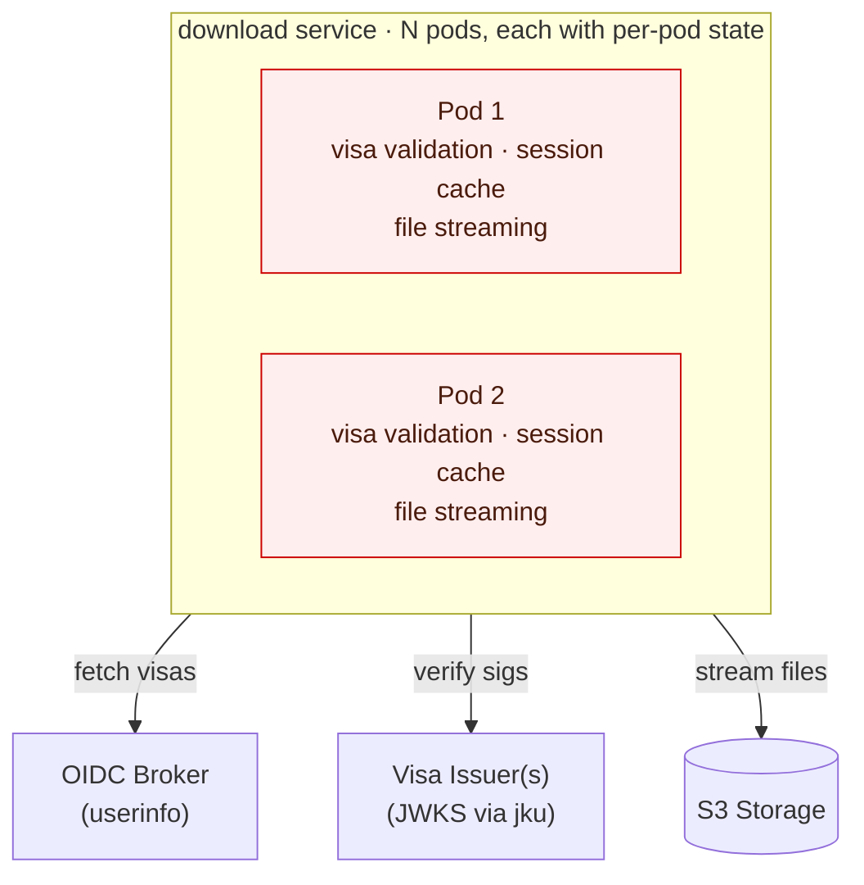
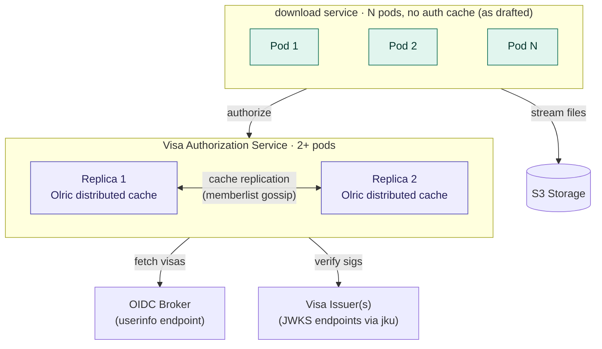
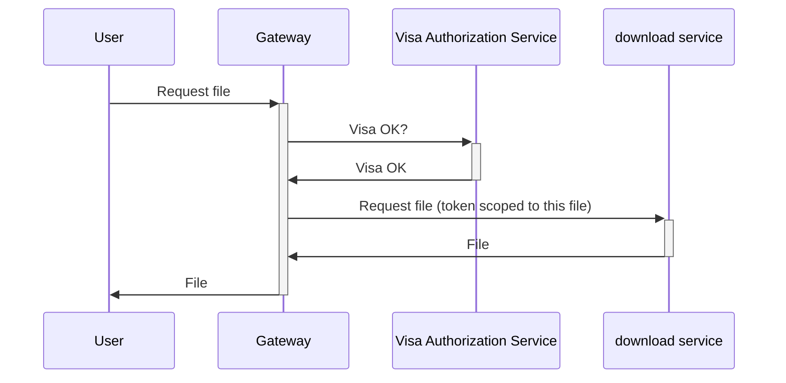

# Separate Visa Authorization Service?

## Context and Problem Statement

The download API v2 service (`sda/cmd/download`) embeds GA4GH visa validation
directly in its HTTP middleware ([auth.go][v2-auth]). On each request without a
cached session, the service:

1. Fetches visas from the OIDC userinfo endpoint (or extracts them from the
   token itself, configurable via `visa.source`)
   ([validator.go#L104][v2-validator-L104])
2. Verifies each visa's JWT signature by fetching the signing key via `jku`
   from the trusted issuer allowlist ([jwks_cache.go][v2-jwks])
3. For each verified `ControlledAccessGrants` visa, validates all required
   claims: `by`, `value`, `source`, `asserted`, and rejects non-empty
   `conditions` ([validator.go#L393][v2-validator-L393])
4. Checks each visa's dataset value against the local database
5. Caches results in per-pod ristretto caches: session cookie and token hash
   in the middleware ([auth.go#L465][v2-auth-L465]), per-visa validation in
   the validator ([validator.go#L38][v2-validator-L38]). Three further
   per-pod caches sit behind these: JWKS ([jwks_cache.go][v2-jwks]),
   userinfo responses, and database lookups.

The v2 implementation has significantly improved GA4GH compliance over the
legacy `sda-download` service (see
[Gap Analysis](#gap-analysis-ga4gh-passport-clearinghouse-compliance) below).
However, two architectural problems remain:

**Per-pod session loss.** The session cache is local to each pod. When a
user's request is routed to a different download pod (e.g., after scaling or
pod restart), the cached session is not available and the full visa
re-validation flow must run again — involving external HTTP calls to the OIDC
userinfo endpoint and each visa issuer's JWKS endpoint. This is not an
interactive re-authentication (the bearer token is still valid), but it adds
latency and external service load on the first request that reaches a cold
pod. No download ingress in the chart carries session affinity by default:
the legacy `download` ingress lost the annotation in chart 3.0.18 and the
`downloadV2` ingress, added afterwards, never had it (see
[Option 4](#option-4-session-affinity-on-the-download-ingress)), so with
several replicas a pod switch happens on ordinary load-balancer rotation, not
only after scaling or a restart.

The cost is bounded per token, not per request. The token-hash tier is
checked before any validation and written after every successful one,
whether or not the client returns the session cookie
([auth.go#L466][v2-auth-L466], [auth.go#L593][v2-auth-L593]), with a TTL of
min(`visa.cache.token-ttl`, token `exp`, earliest visa `exp`); the flag
defaults to 3600 s. A client reusing one bearer token therefore pays at most
one full validation per replica per TTL window — at the chart default of two
`downloadV2` replicas, roughly two userinfo round trips per token per hour.
Aggregate load still scales with the number of distinct concurrent tokens, a
refreshed access token is a new key in every tier, and the bound does not
hold across pod restarts or for concurrent misses on a cold pod (see *Miss
coalescing* under [Open Questions](#open-questions)). Nobody has measured
that aggregate; doing so is step 2 of the
[direction currently favoured](#direction-currently-favoured).

**Scaling mismatch.** Download pods need many instances for heavy I/O
(streaming large encrypted genomic files). Each pod also carries the visa
validation burden, meaning the authorization cache scales with I/O capacity
rather than with authorization demand. This driver is unquantified: nobody
has measured it to be a problem yet (see
[Option 7](#option-7-keep-validation-in-process-behind-a-shared-go-library)),
which is why the direction below defers a separate service until a
measurement or a second consumer justifies it.

[Issue #2228][issue-2228] proposes extracting visa validation into a separate
service. The GA4GH Passport specification defines a
[Passport Clearinghouse][ga4gh-passport] as "a service that consumes Visas and
uses them to make an authorization decision." The architectural separation
aligns with this model.

Originally drafted as ADR-0004 in PR #2320; converted to an RFC under
[ADR-0005][adr-0005] because the open questions below haven't converged yet.

[issue-2228]: https://github.com/neicnordic/sensitive-data-archive/issues/2228
[ga4gh-passport]: https://ga4gh.github.io/data-security/ga4gh-passport
[ga4gh-aai]: https://ga4gh.github.io/data-security/aai-openid-connect-profile
[v2-auth]: https://github.com/neicnordic/sensitive-data-archive/blob/4d54b229/sda/cmd/download/middleware/auth.go
[v2-auth-L465]: https://github.com/neicnordic/sensitive-data-archive/blob/4d54b229/sda/cmd/download/middleware/auth.go#L465
[v2-validator-L104]: https://github.com/neicnordic/sensitive-data-archive/blob/4d54b229/sda/cmd/download/visa/validator.go#L104
[v2-validator-L393]: https://github.com/neicnordic/sensitive-data-archive/blob/4d54b229/sda/cmd/download/visa/validator.go#L393
[v2-jwks]: https://github.com/neicnordic/sensitive-data-archive/blob/4d54b229/sda/cmd/download/visa/jwks_cache.go
[v2-trust]: https://github.com/neicnordic/sensitive-data-archive/blob/4d54b229/sda/cmd/download/visa/trust.go
[v2-auth-L327]: https://github.com/neicnordic/sensitive-data-archive/blob/4d54b229/sda/cmd/download/middleware/auth.go#L327
[v2-validator-L38]: https://github.com/neicnordic/sensitive-data-archive/blob/71d3dfb8/sda/cmd/download/visa/validator.go#L38
[v2-validator-L430]: https://github.com/neicnordic/sensitive-data-archive/blob/4d54b229/sda/cmd/download/visa/validator.go#L430
[v2-validator-skip]: https://github.com/neicnordic/sensitive-data-archive/blob/71d3dfb8/sda/cmd/download/visa/validator.go#L201-L205
[v2-validator-token-mode]: https://github.com/neicnordic/sensitive-data-archive/blob/71d3dfb8/sda/cmd/download/visa/validator.go#L115-L152
[v2-validator-identity]: https://github.com/neicnordic/sensitive-data-archive/blob/71d3dfb8/sda/cmd/download/visa/validator.go#L364-L367
[v2-validator-multi-identity]: https://github.com/neicnordic/sensitive-data-archive/blob/71d3dfb8/sda/cmd/download/visa/validator.go#L233-L238
[v2-validator-source]: https://github.com/neicnordic/sensitive-data-archive/blob/71d3dfb8/sda/cmd/download/visa/validator.go#L424-L428
[v2-validator-dataset]: https://github.com/neicnordic/sensitive-data-archive/blob/71d3dfb8/sda/cmd/download/visa/validator.go#L347
[v2-trust-L49]: https://github.com/neicnordic/sensitive-data-archive/blob/71d3dfb8/sda/cmd/download/visa/trust.go#L49
[v2-auth-L437]: https://github.com/neicnordic/sensitive-data-archive/blob/71d3dfb8/sda/cmd/download/middleware/auth.go#L437
[v2-auth-L466]: https://github.com/neicnordic/sensitive-data-archive/blob/71d3dfb8/sda/cmd/download/middleware/auth.go#L466
[v2-auth-L593]: https://github.com/neicnordic/sensitive-data-archive/blob/71d3dfb8/sda/cmd/download/middleware/auth.go#L593
[v2-auth-failure]: https://github.com/neicnordic/sensitive-data-archive/blob/71d3dfb8/sda/cmd/download/middleware/auth.go#L539-L557
[grants-download]: https://github.com/neicnordic/sensitive-data-archive/blob/71d3dfb8/postgresql/initdb.d/04_grants.sql#L164-L179
[grants-lega-out]: https://github.com/neicnordic/sensitive-data-archive/blob/71d3dfb8/postgresql/initdb.d/04_grants.sql#L215
[chart-download-v2]: https://github.com/neicnordic/sensitive-data-archive/commit/af1aa1db4da2bce546370e7612a5ef9468c902a9
[adr-0003]: ../decisions/0003-shared-state-strategy-for-s3inbox-and-caching.md
[adr-0005]: ../decisions/0005-introduce-rfcs-as-upstream-exploration-phase.md
[adr-0006]: ../decisions/0006-metrics-and-tracing.md
[pr-2320]: https://github.com/neicnordic/sensitive-data-archive/pull/2320
[chart-affinity-add]: https://github.com/neicnordic/sensitive-data-archive/commit/208b9a870c9d290836b61abe5648c077ad63bba9
[chart-affinity-drop]: https://github.com/neicnordic/sensitive-data-archive/commit/c40f9876026e6894d7818d0f95215ea6b7336263

## Decision Drivers

* **Multi-pod correctness** — download pods run behind a load balancer; session
  loss on pod switch causes unnecessary external calls and added latency.
* **Separation of concerns** — authorization logic and file streaming have
  different scaling profiles and failure modes.
* **Operational simplicity** — prefer solutions that do not require new
  infrastructure (Redis, etc.) when an architectural change suffices.
* **Reusability** — other SDA services (API, future services) may need
  visa-based authorization.

## Considered Options

1. **Separate Visa Authorization Service** (with Olric for distributed caching)
2. **Redis-backed shared session cache in the download service**
3. **Keep current architecture (status quo)**
4. **Session affinity on the download ingress** (raised in review by @pontus)
5. **Authorization at a gateway in front of the download service** (raised in
   review by @viklund)
6. **Postgres-backed shared session cache in the download service** (the
   ADR-0003 pattern; added by the authors 2026-08-31)
7. **Keep validation in-process behind a shared Go library** (reuse without
   a service; added by the authors 2026-08-31)
8. **Short-lived signed grant verified locally** (the token half of Option 5
   without the gateway; added by the authors 2026-09-02)

These are not all mutually exclusive: Option 4 composes with any of the
others, Options 6 and 7 together are the direction currently favoured, and
Option 8 can be minted by whichever of Options 1, 5 or 7 does the validation.

## Open Questions

The first three block promotion (see the
[direction currently favoured](#direction-currently-favoured)); the rest are
ordered roughly by how much they change the outcome, with the questions the
direction has made moot at the end.

* **Where does the authorization check sit?** @viklund asked (2026-03-30, not
  yet answered in the thread) why the download service should call the
  authorization service at all, rather than a gateway in front of download
  making the call and passing on a token scoped to the requested file (see
  [Option 5](#option-5-authorization-at-a-gateway-in-front-of-the-download-service)).
  If the answer is the gateway, the shape of the scoped token — audience,
  lifetime, replay handling, whether it carries the subject for the audit
  log, and who holds its signing key — is part of the same question (see
  [Option 8](#option-8-short-lived-signed-grant-verified-locally)). Live at
  merge time; to be taken up at the next NeIC SDA-Devs meet-up. Blocks
  promotion.
* **Failure semantics.** The current code already answers this, and three
  upstream failures answer it three different ways
  ([auth.go#L539-L557][v2-auth-failure]). Userinfo unavailable (visa source
  `userinfo`, or an opaque token): `permission.model: visa` answers `401`
  "Visa validation failed." — an upstream outage reported to the user as a
  bad token — while `combined` continues with owned datasets only and skips
  the cache write, so every request during the outage re-attempts the failing
  upstream. A JWKS endpoint unavailable: the individual visa is skipped
  ([validator.go#L201-L205][v2-validator-skip]) and the request succeeds with
  a smaller dataset list, which is then cached for the normal TTL — datasets
  silently disappear until the entry expires. The database unavailable while
  populating owned datasets: a warning is logged and the owned set is empty.
  Whatever holds the cache, the questions are: should an upstream outage be a
  `503` — never `401` or `403`, and never a silent fall-through to a narrower
  or wider allow set — should a partial result ever be cached, and does an
  already-started stream continue? These apply to every option and are
  undecided. Blocks promotion.
* **Measure before choosing.** How often does a cache miss actually happen
  in production, on which tier, and what does it cost in userinfo/JWKS calls
  and latency? Nothing in the repository can answer this today: the download
  service exports no metrics ([ADR-0006][adr-0006] settles the stack,
  OpenTelemetry + Prometheus, but nothing is wired up yet), and
  `sda/cmd/download/benchmark/` compares legacy and v2 endpoint latency with
  one shared client that always carries a cookie jar, so it rides a warm
  session rather than measuring misses. The measurement therefore means
  counters in download-v2 on real traffic, and it needs an owner, a budget it
  is judged against, and a decision date, or "measure first" becomes
  indefinite. Blocks promotion.
* **Latency budget.** What is the acceptable per-request latency for the new
  network hop into the authorization service? @pontus's concern in review is
  the cross-node case for workloads with many small requests (htsget-style
  range reads); @jbygdell's experience is that pod-to-pod latency inside the
  cluster is small. Has anyone measured the current cache-hit / cache-miss
  latency on the download path to compare against? Co-location (one
  authorization pod per node, `internalTrafficPolicy: Local` on its Service)
  is a possible mitigation nobody has tested.
* **Session affinity as an interim measure.** The `sda-svc` chart set cookie
  affinity on four ingresses, the legacy `download` ingress among them, from
  0.26.4 until 3.0.18 removed every hard-coded ingress-nginx annotation; the
  `downloadV2` ingress was added later and has never had it (see
  [Option 4](#option-4-session-affinity-on-the-download-ingress)). Should
  ingress-nginx sites set it through `downloadV2.ingressAnnotations` (or
  `download.ingressAnnotations` for the legacy service) while this RFC is
  open, whichever option is eventually chosen? The
  [direction currently favoured](#direction-currently-favoured) answers: yes,
  as a documented opt-in recipe, not as a chart default.
* **Wait or extract?** Could `source` policy enforcement and Token Exchange
  be added inside the current download service, deferring the extraction
  until there is a *second* consumer of visa authorization? The
  [direction currently favoured](#direction-currently-favoured) answers yes
  for both: neither needs a separate service. `source` policy is scheduled
  in step 1; Token Exchange is not scheduled at all.
* **Miss coalescing.** Independent of where the cache lives, concurrent
  requests carrying the same token (or the same `jku`) on a cold pod should
  be single-flighted, so a cold pod makes one upstream call per token rather
  than one per request. The current code does not do this. Note the bound:
  in-process single-flight is one upstream call per pod per key, so a rolling
  restart still costs up to one call per replica per token — small at the
  chart default of two replicas, but not zero. Where does it belong?
* **What is the cache keyed on?** Both the Olric design and the Option 6
  table key on a hash of the bearer token, so a shared tier helps only when
  the *same* token reaches a cold pod; a token refresh starts a fresh entry
  in every tier. Whether a key closer to the identity (`iss`, `sub`) would
  help further is open, and has a sharp edge: the authorized dataset list is
  not a property of the subject alone — with `visa.source: token` it comes
  from the presented token's own claim, and with `userinfo` it depends on the
  token's scope — and a refresh is today the practical point at which a
  permission change is picked up. Not proposed; recorded so the measurement
  above can say whether it would be worth the complexity.
* **Operational shape of a Postgres L2.** If
  [Option 6](#option-6-postgres-backed-shared-session-cache-in-the-download-service)
  is adopted, several mechanics decide whether it is safe on the managed
  instances the sites run, and none is settled: a logged or `UNLOGGED` table
  (and the cold-cache-after-failover consequence either way); autovacuum
  settings and an index on `expires_at` for a high-churn TTL table; expiry
  evaluated server-side (`WHERE expires_at > now()`) rather than against a
  pod's clock, given that `computeCacheTTL` uses pod-local time today; what a
  failed write does during a failover (validate but do not cache, never
  `5xx`); what the policy/config version column is derived from; and whether
  the writes share the connection pool the handlers already use.
* **Should `oidc.audience` be required?** Audience validation is implemented
  but off by default (see the gap analysis below). Should it be required
  when `visa.enabled` is true, the way `visa.trusted-issuers-path` already is
  (startup fails when unset)? That closes the audience-confusion case at the
  cost of breaking deployments that leave `global.oidc.id` empty. Raised by
  @jbygdell in review (2026-03-17).
* **Revocation window.** What window does SDA commit to for a withdrawn grant
  to stop being honoured? Under the defaults it is at most an hour with
  `visa.source: userinfo` and the access token's lifetime with
  `visa.source: token` (see the Access Token Polling row in the gap
  analysis). Any shared or persisted cache is bound by the same ceiling.
* **Cache TTLs.** What cache TTLs are realistic for SDA traffic patterns? The
  chart already ships defaults for the per-pod caches
  (`global.downloadV2.visa.cache`: token 3600 s, JWK 300 s, validation
  120 s, userinfo 60 s) and `downloadV2.replicaCount: 2`; the numbers in the
  Olric design were sketches, and none of these has been validated against
  load.
* **Signed grant versus a shared cache.** Nobody has weighed
  [Option 8](#option-8-short-lived-signed-grant-verified-locally) against
  the Postgres L2 tier; it is undiscussed in the thread and due at the next
  meet-up.
* **Legacy `sda-download` coexistence.** How does the new service relate to
  the legacy `sda-download` during the v2 rollout? Does it serve both, or only
  v2?
* **Naming.** "Visa Authorization Service" is a working title chosen to avoid
  implying full GA4GH Clearinghouse compliance. When (if ever) does it become
  the "Passport Clearinghouse"?
* **Olric in production.** Has anyone in the NeIC SDA community run Olric in
  production? What's the operational maturity? What is the upgrade story when
  the embedded library version changes? Moot under the
  [direction currently favoured](#direction-currently-favoured), which does
  not plan Olric; kept so it is not re-derived if a distributed cache returns.
* **Memberlist in NeIC k8s.** Does each NeIC site's Kubernetes networking
  support memberlist gossip (UDP + TCP between pods on a non-standard port)?
  Headless service DNS works in most clusters but not all. Moot, as above.

## Pros and Cons of the Options

### Option 1: Separate Visa Authorization Service

Extract the visa validation logic from `sda/cmd/download/visa/` and
`sda/cmd/download/middleware/auth.go` into a dedicated service. The
authorization service maintains an in-process distributed cache via Olric;
as drafted, download pods hold no authorization cache at all — a property
the Bad bullets below dispute.

**Current architecture:**


```mermaid
flowchart TB
    subgraph pods["download service · N pods, each with per-pod state"]
        D1["Pod 1\nvisa validation · session cache\nfile streaming"]
        D2["Pod 2\nvisa validation · session cache\nfile streaming"]
    end

    OIDC["OIDC Broker\n(userinfo)"]
    JWKS["Visa Issuer(s)\n(JWKS via jku)"]
    S3[("S3 Storage")]

    pods -->|"fetch visas"| OIDC
    pods -->|"verify sigs"| JWKS
    pods -->|"stream files"| S3

    style D1 fill:#fee,stroke:#c00,color:#4a1b0c
    style D2 fill:#fee,stroke:#c00,color:#4a1b0c
```

> Session lost on pod switch — full visa re-validation required.

**Proposed architecture:**


```mermaid
flowchart TB
    subgraph download["download service · N pods, no auth cache (as drafted)"]
        D1["Pod 1"] ~~~ D2["Pod 2"] ~~~ DN["Pod N"]
    end

    subgraph auth["Visa Authorization Service · 2+ pods"]
        direction LR
        CH1["Replica 1\nOlric distributed cache"]
        CH2["Replica 2\nOlric distributed cache"]
        CH1 <-->|"cache replication\n(memberlist gossip)"| CH2
    end

    OIDC["OIDC Broker\n(userinfo endpoint)"]
    JWKS["Visa Issuer(s)\n(JWKS endpoints via jku)"]
    S3[("S3 Storage")]

    download -->|"authorize"| auth
    download -->|"stream files"| S3
    auth -->|"fetch visas"| OIDC
    auth -->|"verify sigs"| JWKS

    style D1 fill:#e1f5ee,stroke:#0f6e56,color:#04342c
    style D2 fill:#e1f5ee,stroke:#0f6e56,color:#04342c
    style DN fill:#e1f5ee,stroke:#0f6e56,color:#04342c
    style CH1 fill:#eeedfe,stroke:#534ab7,color:#26215c
    style CH2 fill:#eeedfe,stroke:#534ab7,color:#26215c
```

**Distributed cache with [Olric](https://github.com/buraksezer/olric):**

The v2 download service uses ristretto (in-process, per-pod) for caching
([auth.go#L465][v2-auth-L465]). The Visa Authorization Service replaces
ristretto with [Olric][olric] — an embedded distributed cache for Go that
provides automatic peer discovery, replication, and TTL support without
external infrastructure.

[olric]: https://github.com/buraksezer/olric

* **Replication mode:** Olric partitions the key space and keeps
  `ReplicaCount` copies of each partition, with asynchronous (optimistic)
  replication by default; synchronous replication exists but there is no
  consensus, and reads are best-effort, eventually consistent. "Every entry on
  both pods" is the outcome of setting `ReplicaCount` to the member count,
  not a guarantee of the model; a stale or missing entry after a write is
  possible and must be treated as a cache miss, never as a denial.
* **Peer discovery:** Olric uses [memberlist][memberlist] (HashiCorp's gossip
  protocol) for automatic peer discovery. In Kubernetes, peers are discovered
  via a headless service DNS record.
* **Minimum replicas:** 2 (no quorum required, unlike Raft-based solutions).
* **Cache key:** SHA-256 hash of the bearer token.
* **Cached value:** authorized dataset list.
* **TTL:** bounded by the minimum of: access token `exp`, earliest visa
  `exp`, and configured maximums. Carried over from v2's existing
  `computeCacheTTL` logic.
* **Revocation:** @jbygdell suggested in review (2026-03-17) that the
  clearinghouse re-check visas on a schedule (hourly or so) for all
  non-expired tokens; an earlier draft folded that in as re-fetching from the
  userinfo endpoint. Neither form buys anything here. Re-verifying a
  *retained visa JWT* detects only expiry and key rotation — a GA4GH visa
  carries no revocation signal beyond `exp`, so a DAC withdrawal is invisible
  to it; only a fresh passport fetch from the broker would see it. A fresh
  fetch needs the raw bearer token, which is deliberately not retained: the
  cache key is a hash of the token and the cached value is a dataset list
  (v2's cached `AuthContext` holds a parsed `jwt.Token`, nil for opaque
  tokens, never the raw string), and keeping raw tokens purely to poll would
  widen the blast radius of a cache compromise for no gain. What bounds
  exposure instead is maximum staleness: `computeCacheTTL` caches an allow
  decision for no longer than the minimum of the token `exp`, the earliest
  visa `exp`, and `visa.cache.token-ttl` (default 3600 s). At the shipped
  defaults a cached allow is therefore at most an hour old, and the first
  request after the TTL lapses re-validates from scratch — the same bound an
  hourly poll would give, without retaining tokens. This holds for today's
  ristretto, for Olric, and for Option 6's table alike. If near-real-time
  revocation is ever required, that needs token introspection or an
  event-driven invalidation, not polling.

[memberlist]: https://github.com/hashicorp/memberlist

**Why Olric over alternatives:**

* **vs. ristretto (current):** ristretto is per-pod only — cache misses on
  every pod switch, generating unnecessary OIDC calls.
* **vs. Redis:** requires new external infrastructure to deploy and maintain.
* **vs. Raft-based KV (e.g., hashicorp/raft):** requires odd replica counts
  for quorum, strong consistency is unnecessary for a TTL-bounded
  authorization cache where eventual consistency is acceptable.
* **vs. hand-rolled HTTP broadcast:** Olric provides peer discovery, failure
  handling, and replication as a library — avoids reinventing distributed
  cache primitives.
* **vs. Postgres (Option 6):** added 2026-08-31. Postgres is already
  deployed, already on the request path, and already the source of truth
  for permissions; a table gives the shared cache without a gossip mesh.
  This comparison is what changed the
  [direction currently favoured](#direction-currently-favoured).

The separation works because the two workloads have different scaling
profiles:

* **Download pods** need many instances for heavy I/O (streaming large
  encrypted genomic files). They currently also carry the session cache,
  which is why per-pod state loss is painful.
* **Visa Authorization Service pods** are lightweight (JWT parsing, OIDC
  HTTP calls, visa claim inspection). 2+ pods are needed for HA, and a cache
  shared across them is what stops a pod switch from re-running the full
  validation flow. Subject to the replication caveats above: replication is
  asynchronous and best-effort, so a stale or missing entry after a switch is
  possible and is handled as a cache miss, never as a denial.

**Standalone service or sidecar?** @pontus suggested in review (2026-03-18)
running the authorization service as a sidecar in each download pod, which
removes the network hop. The authors' reply (2026-03-19): a sidecar does not
solve session loss, because each sidecar's cache is 1:1 with its download
pod; the code separation it gives is also given by a standalone service,
which in addition can be reused by other services. The GA4GH specification
defines the Passport Clearinghouse as a functional role, not a deployment
topology, so both are compliant. This RFC explores the standalone service;
the sidecar is recorded here so it is not re-derived.

* Good, because the expensive validation state — userinfo and JWKS calls,
  visa claim checks — leaves the streaming path (but see the
  local-decision-cache bullet below).
* Good, because it requires **no new external infrastructure** — no Redis,
  no new databases.
* Good, because it creates a reusable service for visa-based authorization.
* Neutral, because the Visa Authorization Service is a new service to deploy
  and monitor.
* Bad, because it adds a network hop for authorization. @pontus's objection
  in review: when the hop crosses nodes, workloads with many small requests
  pay it on every request, and with session affinity available (Option 4) the
  proposal risks being slower than today for a scaling benefit that is not
  yet needed. @jbygdell's observation is that pod-to-pod latency inside the
  cluster is small. A possible mitigation, untested: one authorization pod
  per node (DaemonSet) with `internalTrafficPolicy: Local` on its Service,
  so calls never leave the node — though a per-node authorization pod
  recreates the scaling coupling the extraction was meant to remove.
* Bad, because download pods cannot actually stay cache-free — the point
  @pontus queried in review (2026-03-18), asking whether the clients calling
  the authorization service really hold no cache: without a short-lived
  local decision cache every htsget range request pays the RPC,
  so "stateless for authorization" collapses to "the expensive validation
  state lives elsewhere" — which Options 6 and 7 achieve without a service.
* Bad, because Olric is new infrastructure in all but packaging: membership,
  partition ownership, rebalancing, network policy, rolling-upgrade
  compatibility, and split-brain behaviour have to be understood and
  operated at every NeIC site.

### Option 2: Redis-backed shared session cache in the download service

Add Redis to the infrastructure and replace the per-pod ristretto session
cache with a shared Redis-backed cache.

* Good, because it solves session loss across pods without architectural
  change.
* Bad, because it adds a new infrastructure dependency (Redis).
* Bad, because it introduces a new failure mode (Redis unavailability)
  requiring fallback logic.
* Bad, because authorization and file streaming remain coupled in the same
  service.

Redis is unnecessary: Option 6 gives a shared cache in a store every
deployment already runs. It could be re-evaluated if a measured need for a
shared external cache beyond what Postgres provides ever arises.

### Option 3: Keep current architecture (status quo)

* Good, because no work is required.
* Bad, because session loss on pod switch continues — users experience added
  latency on every pod rotation.
* Bad, because authorization and I/O scaling remain coupled.
* Bad, because visa validation logic cannot be reused by other services
  without code duplication.

### Option 4: Session affinity on the download ingress

Raised by @pontus in review (2026-03-18). Keep the per-pod cache and have the
load balancer route a client's subsequent requests to the pod that already
holds its session. This is not new: chart 0.26.4
([208b9a87][chart-affinity-add], June 2024) set
`nginx.ingress.kubernetes.io/affinity: "cookie"` on four ingresses — auth,
doa, s3-inbox and the legacy `download` — guarded by
`global.ingress.ingressClassName` being `nginx`. Chart 3.0.18
([c40f9876][chart-affinity-drop], December 2025, "Parameterize the ingress
annotations") removed every hard-coded ingress-nginx annotation from the
templates so that any ingress controller is supported out of the box, and
the affinity annotation went with them; no controller-neutral default
replaced it. The `downloadV2` ingress was added later
([af1aa1db][chart-download-v2], April 2026) and has never carried it, so for
v2 this is "enable", not "re-enable". A deployment that wants it sets, under
`downloadV2.ingressAnnotations` (or `download.ingressAnnotations` for the
legacy service):

```yaml
nginx.ingress.kubernetes.io/affinity: "cookie"
nginx.ingress.kubernetes.io/affinity-mode: "persistent"
nginx.ingress.kubernetes.io/session-cookie-max-age: "3600"
```

`affinity-mode` matters: the ingress-nginx default, `balanced`, re-shuffles
sessions when the endpoint set changes, which is exactly the rolling restart
this measure is meant to survive; `persistent` keeps them. The cookie max-age
should follow `global.downloadV2.session.expiration` (3600 s by default).
The ingress-nginx affinity cookie (`INGRESSCOOKIE` by default) is distinct
from the download session cookie.

* Good, because it is a values-only change to the chart; no new service, no
  new infrastructure.
* Good, because it can be applied today, alongside any other option, as an
  interim measure.
* Bad, because it only helps clients that return the affinity cookie;
  scripted and CLI clients without a cookie jar get a cold cache on the first
  request that lands on a new pod. The token-hash tier serves them after
  that, so affinity buys less than the session-cookie tier alone suggests.
* Bad, because a pod restart or scale-down still loses the session, and the
  mechanism is specific to ingress-nginx.
* Bad, because reinstating it as a chart default would reverse the intent of
  [c40f9876][chart-affinity-drop]; it belongs in values as a documented
  recipe, which also means it is silently absent on sites that do not copy
  it.
* Bad, because affinity pins all of one client's parallel streams to a single
  pod; a user starting many large downloads at once loads one replica while
  the others idle.
* Bad, because authorization and streaming remain coupled and nothing becomes
  reusable. The authors' reply (2026-03-19) preferred Option 1 for this
  reason: the separation is wanted for its own sake, not only for the
  session-loss symptom. That reply stands for affinity as a final answer, not
  as the interim step the direction below proposes.

### Option 5: Authorization at a gateway in front of the download service

Raised by @viklund in review (2026-03-30). Instead of the download service
calling the authorization service, a gateway in front of it makes the call
and forwards the request only if the visa check passes:


```mermaid
sequenceDiagram
    participant User
    participant Gateway
    participant Auth as Visa Authorization Service
    participant Download as download service
    User->>+Gateway: Request file
    Gateway->>+Auth: Visa OK?
    Auth->>-Gateway: Visa OK
    Gateway->>+Download: Request file (token scoped to this file)
    Download->>-Gateway: File
    Gateway->>-User: File
```

The "Visa OK" can be turned into a narrower token, so that the request the
download service sees is only valid for the file that was asked for. More
generally, the gateway is where a chain of middlewares (authorization, rate
limiting, audit) would sit before a request reaches any SDA service.

* Good, because the download service never sees an unauthorized request and
  only validates one narrow, locally issued token; visa logic leaves the
  streaming path entirely instead of moving behind an RPC.
* Good, because the file-scoped token is a capability: a replayed download
  request cannot be widened to other files.
* Good, because it composes with Option 1 rather than replacing it. The
  ingress-nginx `auth-url` subrequest and Envoy `ext_authz` implement this
  pattern with the authorization service as the backend and a response header
  carrying the scoped token upstream; the question is who calls the service,
  not whether it exists.
* Bad, because SDA has no gateway today; the chart has one ingress per
  service and nothing in between. This adds a component, or a dependency on
  the ingress controller's external-auth semantics, against the
  no-new-infrastructure driver.
* Bad, because scoping the token to a file means the authorization service
  must understand the download API's URL scheme and resolve file to dataset
  before the request reaches download, which couples it to that API and
  works against the reusability driver.
* Bad, because a proxying gateway adds a hop to the streaming path for large
  files (the subrequest model avoids this), and the scoped token adds a
  signing key to manage.
* Bad, because a token scoped to a file must still carry the user identity:
  the download service writes the authenticated subject into every audit
  event, and the chart can require a real audit logger
  (`global.downloadV2.audit.required`), so a grant that says only "this file,
  for 60 s" would empty the field the audit log is judged on. Carrying `sub`
  and `iss` through fixes that but makes the grant an identity-bearing token
  rather than a bare capability.

A variant without the gateway — validate once, mint a short-lived scoped
grant, verify it locally — is the token half of this option separated from
the gateway half; it is recorded as
[Option 8](#option-8-short-lived-signed-grant-verified-locally).

Not yet discussed in the thread; recorded as an open question.

### Option 6: Postgres-backed shared session cache in the download service

Added by the authors 2026-08-31. Every SDA deployment already runs
PostgreSQL, it is the source of truth for dataset permissions, and the
download service already queries it on the request path (the middleware's
`DatasetLookup` on a cache miss; `GetFileByPath` and `CheckDatasetExists` in
the handlers). [ADR-0003][adr-0003] replaced s3inbox's per-pod in-memory
cache with database lookups for the same reason; it named shared session
caching in the download service only as something to revisit with *Redis*
if a measured need arose, and did not evaluate Postgres for it.

Keep the middleware's two ristretto tiers — session cookie and token hash —
as a per-pod L1 and add an L2 table — token hash, subject, authorized
dataset list, policy/config version, `expires_at` — read on L1 miss, written
after a full validation, expired lazily on read and swept periodically. A
miss on pod switch then costs one indexed primary-key read instead of a
userinfo round trip. The per-visa validation cache and the JWKS cache stay
per-pod and are unaffected; the JWKS cache is warm after the first request
per issuer.

* Good, because it needs no new infrastructure, no new service, and no
  gossip between pods; the operators already run the store.
* Good, because every Olric open question above (production maturity,
  memberlist in NeIC clusters, replication factor) disappears.
* Good, because the row carries the same TTL-bounded decision the Olric
  design would have replicated in RAM, without gossip and without a second
  store.
* Neutral, because the row is not only a token hash and a dataset list: the
  handlers read the cached subject as the audit log's user id, and on the
  opaque-token path the subject comes from the userinfo call this tier exists
  to avoid, so `subject` has to be stored. The table is thus a short-lived
  record of which subject held which datasets; the expiry sweep is what
  bounds its retention, so it has to actually run.
* Bad, because a row in that table is an authorization verdict, and a cache
  hit today short-circuits every check: the middleware returns the cached
  context before the token is parsed, let alone its signature, issuer,
  audience or expiry verified ([auth.go#L466][v2-auth-L466]). An L2 with the
  same semantics means whoever can write the table can authorize a bearer
  string of their own choosing without ever presenting a visa; today the
  equivalent attack needs code execution inside a download pod. The L2 row
  must therefore not be sufficient on its own: on an L2 hit the token's
  signature and expiry are still verified locally (the JWKS is cached per
  pod, so this is cheap), and the row carries only the expensive part, the
  visa/userinfo result.
* Bad, because the `download` role holds `SELECT` and nothing else today
  ([04_grants.sql#L164-L179][grants-download]), and it is granted to
  `lega_out` together with `mapper` and `api`
  ([04_grants.sql#L215][grants-lega-out]), so a write grant added to the role
  reaches that user too. Scoping the write to the download service means a
  dedicated least-privilege role with `INSERT`/`DELETE` on the cache table
  only, wired through the chart as its own database user — the chart falls
  back to `global.db.user` when `credentials.download.dbUser` is unset —
  delivered as a migration every managed-Postgres site must apply.
* Bad, because a cached allow dies with the pod today, so a rolling restart
  forces re-validation; persisted rows survive restarts and redeploys and the
  TTL becomes the only bound. A table is easier to invalidate precisely than
  per-pod RAM, so the design has to say what the invalidation path is —
  delete by subject, by policy version, or truncate.
* Bad, because a short-TTL cache table is a workload Postgres is not
  naturally good at: every write and every sweep delete produces WAL and dead
  tuples, replicated to standbys and archived for PITR, for rows that are
  worthless after an hour. `UNLOGGED` avoids that cost but is not replicated
  and is truncated on crash recovery, so the L2 is empty after a failover — a
  cold cache at LS AAI exactly when the site is already degraded (see the
  operational-shape open question).
* Bad, because it puts a write on the miss path; the write burst on a
  rolling restart needs to be measured, and misses should be single-flighted
  per token so concurrent requests do not stampede userinfo.
* Bad, because authorization stays inside the download service; this option
  answers the session-loss problem, not the reusability driver (see
  Option 7).

### Option 7: Keep validation in-process behind a shared Go library

Added by the authors 2026-08-31. Reuse inside a Go monorepo does not require
a network service. Move `sda/cmd/download/visa` (and the cache logic it
needs) to a shared internal package with a stable interface, so `api` or a
future DRS service can validate visas in-process the day they need to.

* Good, because it gives the code separation, ownership, and testability
  that motivate Option 1, at zero deployment cost.
* Good, because it keeps a later extraction cheap: a Visa Authorization
  Service becomes a thin binary around the same package.
* Good, because combined with Option 6 it covers both decision drivers this
  RFC started from, without a new service.
* Bad, because decisions are not shared across services; each consumer
  validates independently (at worst once per token per service per TTL), and
  a policy change has to be rolled out to every consumer.
* Bad, because it does not decouple authorization scaling from streaming
  scaling — which nobody has yet measured to be a problem.
* Bad, because the reusable surface is smaller than it looks. Nothing outside
  `sda/cmd/download` imports `visa` today, and the package already validates
  in-process behind its own interface; what a second consumer — or the "thin
  binary" above — cannot reuse is the session and decision-cache layer, which
  lives as package-level state in the middleware (`InitAuth`, the two caches,
  `computeCacheTTL`, the cookie handling) and in `config.Visa*()` accessors
  outside the package. The move is mechanical, but it is that layer, not the
  validator, that has to be made injectable.

### Option 8: Short-lived signed grant verified locally

Added by the authors 2026-09-02; the token half of Option 5 separated from
the gateway half. Validate visas once, wherever that happens, mint a
short-lived grant scoped to a dataset or file, and let download pods verify
that grant locally with a public key. No distributed cache state and no
per-request RPC; a signing key to rotate instead.

* Good, because it needs neither a shared cache nor a per-request RPC; a
  warm download pod does a signature check and nothing else.
* Good, because a grant is verifiable in-process by any future consumer,
  which serves the reusability driver without a service.
* Neutral, because it composes with any of Options 1, 5 or 7 as the minting
  site.
* Bad, because it adds a signing key to generate, distribute and rotate
  through the chart — the first on the authorization path; the chart wires
  only verification keys and a pagination HMAC secret today — and that key
  can mint access to any file for any user.
* Bad, because a minted grant cannot be revoked before it expires, the same
  trade-off as any cached decision, and a grant obtained by an attacker is
  fully replayable for its file within its lifetime unless it is audience-,
  subject- or sender-bound.
* Bad, because the grant must still carry the user identity for the audit
  log, as noted under Option 5, so it is an identity-bearing token rather
  than a bare capability.
* Bad, because scoping to a file requires the minter to resolve file to
  dataset, the coupling already noted against Option 5.

Undiscussed in the thread; recorded as an open question.

## More Information

### Direction currently favoured

Until 2026-08-31 this section said Option 1, the separate service with
Olric. The authors no longer favour that as the first step. Two things
changed. The embedded distributed cache is new infrastructure in all but
packaging — membership, partition ownership, rebalancing, network policy,
rolling-upgrade compatibility and split-brain behaviour have to be
understood and operated at every NeIC site — and the benefit that would
justify that cost, stateless download pods, does not survive htsget-style
range traffic: a short-lived local decision cache is still needed, so the
service moves the expensive state rather than removing it, which Options 6
and 7 achieve without a service. (The earlier draft's hourly re-validation
was also unworkable, but as the revocation note under Option 1 records, that
follows from keying a decision cache on a token hash and holds for today's
ristretto and for Option 6's table alike; it is not an argument against
Olric specifically.) Options 4 and 5 arrived in review; the authors' reply
of 2026-03-19 stands for Option 4 as a final answer but not as an interim
one, and Option 5 has not been discussed yet.

The direction now proposed, in order:

1. **Now, without waiting for this RFC:** single-flight cache misses;
   document the cookie-affinity recipe under Option 4 in the chart values as
   an opt-in for ingress-nginx sites, not as a chart default; implement
   `source` policy enforcement in the current visa package, anchored in the
   verified `(iss, jku)` pair and opt-in (no policy configured means no visa
   is denied), reusing the `visa.trusted-issuers-path` values-to-secret
   pattern. The Option 7 package move is preparatory rather than reuse —
   nothing outside `sda/cmd/download` imports `visa` today — so do it when a
   second consumer is named or when the middleware's global auth state is
   touched anyway, not as a standalone refactor.
2. **Next, with a deadline:** add hit/miss counters for the three
   authorization cache tiers and request counters for outbound userinfo and
   JWKS calls to download-v2, on the OpenTelemetry + Prometheus stack of
   [ADR-0006][adr-0006]. The service exports no metrics today, so this is its
   first instrumentation, not a configuration change. The measurement needs
   an owner, a numeric budget and a decision date; none is set in this file
   yet, and until they are this step is scheduled, not budgeted — the
   bi-weekly RFC index pass is what keeps it from drifting. If misses matter,
   add the Postgres L2 tier (Option 6) with the verify-on-hit and
   least-privilege-role corrections recorded there. Which clients actually
   miss is part of the measurement, not an assumption going in: clients
   without a cookie jar are the population to count, and it is not
   established which SDA clients are in it — the middleware still reads the
   legacy `sda_session_key` cookie for `sda-cli` compatibility
   ([auth.go#L437][v2-auth-L437]).
3. **Deferred:** a separate service (Option 1 without Olric, or as the
   backend of Option 5) when a second consumer needs shared decisions or
   independent scaling, or when the measurement from step 2 shows the miss
   cost exceeds whatever budget the team then sets. Redis and Olric are not
   planned. Option 8 is undiscussed and is not ranked against Option 6 yet.

The open questions that still block promotion are the failure semantics, the
measurement, and @viklund's gateway question. The two approvals on the
review thread (2026-03-20) predate this section's change of direction; the
authors will ask for a re-review. When those questions land, the authors
expect to move this RFC to `ready-for-decision` and write an ADR that says
the above, per [ADR-0005][adr-0005].

### Gap Analysis: GA4GH Passport Clearinghouse Compliance

The GA4GH [Passport specification][ga4gh-passport] and [AAI OIDC
Profile][ga4gh-aai] define a Passport Clearinghouse as a service that
evaluates visas for authorization decisions.

The download API has two implementations: the **legacy** `sda-download`
service and the **v2** implementation at `sda/cmd/download`. The v2
implementation is the future and the basis for this RFC. The gap analysis
below applies to v2 unless noted otherwise.

#### What v2 implements today

| Spec Requirement | Status | Implementation |
| --- | --- | --- |
| Filter by visa type | Done | Only processes `ControlledAccessGrants` visas |
| Validate required claims (`by`, `value`, `source`, `asserted`) | Done | `validateControlledAccessGrant()` checks all four are present and non-empty ([validator.go#L393][v2-validator-L393]) |
| Reject visas with unsupported `conditions` | Done | Rejects non-empty `conditions` via `rejectNonEmptyConditions()` ([validator.go#L430][v2-validator-L430]) |
| Verify visa JWT signature via `jku` | Done | Fetches JWKS and verifies; `jku` checked against trusted allowlist ([jwks_cache.go][v2-jwks]) |
| Verify `jku` is trusted before calling | Done | Trusted issuer configuration is **required** when visa is enabled — startup fails if not set. HTTPS enforced for `jku` URLs unless explicitly overridden ([trust.go][v2-trust]) |
| Validate standard JWT claims (`exp`, `iat`, `nbf`) | Done | Standard JWT validation |
| Validate `aud` (audience) claim | Done, off by default | Verified against `oidc.audience` when set, skipped entirely when empty ([auth.go#L327][v2-auth-L327]); the flag defaults to empty and the chart wires it from `global.oidc.id`, which ships as `""`, so a default deployment accepts any token from the configured issuer regardless of the relying party it was minted for. Raised by @jbygdell in review (2026-03-17). |
| `asserted` staleness check | Done | Optional: configurable via `visa.validate-asserted`, rejects visas asserted in the future (with clock skew tolerance) |
| Trust relationship with Broker | Done | Configured via OIDC discovery URL |
| Visa source modes (UserInfo / Token) | Done | Configurable: `userinfo` (default, GA4GH recommended) or `token` mode; opaque tokens always fall back to userinfo ([validator.go#L104][v2-validator-L104]) |
| Three-tier caching with TTL | Done | Session cookie → token hash → per-visa validation cache; TTL bounded by token and visa expiry ([auth.go#L465][v2-auth-L465]) |

Note: the legacy `sda-download` service has significant gaps — its `Visa`
struct only contains `type` and `value`, it does not validate `source`, `by`,
`asserted`, or `conditions`, and its trusted issuer check is conditional
(returns `true` if no trusted list is configured). The legacy service should
be retired in favor of v2.

#### Remaining gaps

| Spec Requirement | Gap | Severity | Remediation |
| --- | --- | --- | --- |
| **`source` policy enforcement** — SHOULD verify source against policy per dataset | v2 validates that `source` is present and non-empty but never compares it to anything ([validator.go#L424-L428][v2-validator-source]), and the only dataset check is that the ID exists locally ([validator.go#L347][v2-validator-dataset]). The single verified fact about a visa's origin is the `(iss, jku)` pair against the allowlist ([trust.go#L49][v2-trust-L49]); with the default `broker-bound` identity mode no further binding is applied. So in a deployment with more than one trusted issuer — the federated multi-DAC case — any trusted issuer can grant access to any dataset held locally, including another DAC's. Single-broker deployments are not exposed today. `source` differs from `iss`: the issuer signs the JWT, the source made the access decision. | Medium (High for multi-DAC federation) | Anchor the policy in the verified `(iss, jku)` pair, not in `source` alone: configure `(iss, jku)` → permitted `source` values → permitted dataset IDs or prefixes, and reject a visa whose `source` the verified issuer is not allowed to assert. `source` is self-asserted inside the payload its own issuer signs, so a bare dataset→source map adds no constraint on a trusted issuer. Step 1 of the [direction currently favoured](#direction-currently-favoured) puts this in the current `visa` package. |
| **Token Exchange** — SHOULD prefer over UserInfo ([AAI spec][ga4gh-aai]) | v2 supports UserInfo and direct token extraction but not RFC 8693 Token Exchange. | Medium | Implement Token Exchange flow as an additional visa source mode. It requires the download service to authenticate as an OAuth client at the broker — a client secret the chart does not wire to it today — and is still a broker round trip per miss, so it does not help the problem this RFC exists to solve. No service extraction required; not scheduled. |
| **Linked Identities** — MUST verify when combining visas across different `sub` values | Not enforced. v2's default identity binding is `visa.identity.mode: broker-bound`, which performs no subject check at all ([validator.go#L364-L367][v2-validator-identity]; chart default `global.downloadV2.visa.identityMode`). A passport carrying visas from more than one `{iss, sub}` pair is only logged as a warning ([validator.go#L233-L238][v2-validator-multi-identity]) and is still honoured. The single-broker assumption (Life Science AAI) holds by deployment convention, not by validation. | Low | Deployments that need subject binding today can set `visa.identity.mode` to `strict-sub` or `strict-iss-sub`. Whether that should become the default is a decision about the current download service, not about this extraction. |
| **Access Token Polling** — visa invalid if >1 hour old unless polling confirms validity | The polling mechanism itself is specific to Visa Access Tokens; v2 always processes Visa Document Tokens (`jku`-verified) in both visa source modes. The underlying revocation-latency obligation still applies. With `visa.source: userinfo` (default) every cache miss re-fetches the passport from the broker and `computeCacheTTL` bounds a cached allow by min(token `exp`, earliest visa `exp`, `visa.cache.token-ttl`, default 3600 s), so a withdrawn grant stops being honoured within an hour. With `visa.source: token` the service never contacts the broker for a JWT-shaped bearer ([validator.go#L115-L152][v2-validator-token-mode]); the passport is read from the token's own `ga4gh_passport_v1` claim, so the revocation window is whatever the issuer minted into the token and visa `exp` values, not something the relying party can shorten. | Medium | Document `visa.source: token` as a revocation-latency trade-off (the chart already labels it legacy); keep `visa.cache.token-ttl` at or below 3600 s; treat any future shared or persisted cache as bound by the same ceiling. |
| **Full `conditions` evaluation** — evaluate Disjunctive Normal Form conditions | v2 correctly rejects visas with conditions but cannot evaluate them. If a visa issuer requires conditions to be satisfied, those visas are denied. | Low | Implement DNF conditions evaluator when needed for specific visa issuers. |

#### Path to full GA4GH compliance

Full Clearinghouse compliance can be pursued incrementally as requirements
emerge:

1. **Done (v2):** All required visa claims validated, `conditions` rejected,
   trusted issuer enforcement mandatory
2. **Next, in the current visa package — no separate service required:**
   `source` policy enforcement per dataset (step 1 of the
   [direction currently favoured](#direction-currently-favoured)); Token
   Exchange is not scheduled
3. **For GDI federation:** Linked identity support, full `conditions`
   evaluation (DNF), Access Token Polling

The service is named "Visa Authorization Service" (working title) rather than
"Passport Clearinghouse" to avoid implying full GA4GH Clearinghouse
compliance. The service could be renamed once broader compliance is achieved.

### Related issues and discussion

* [PR #2320][pr-2320] — this RFC's review thread; Options 4 and 5 and the
  objections recorded under Option 1 were folded in from it on 2026-08-31.
  Options 6 to 8 and the corrections dated 2026-09-02 were added by the
  authors after a second read of the code and the chart history
* [#2228][issue-2228] — separate Passport Clearinghouse service (idea, to be
  fleshed out as part of implementation planning)
* [ADR-0003][adr-0003] — s3inbox shared state strategy (related per-pod state
  problem, solved independently via database lookups)
