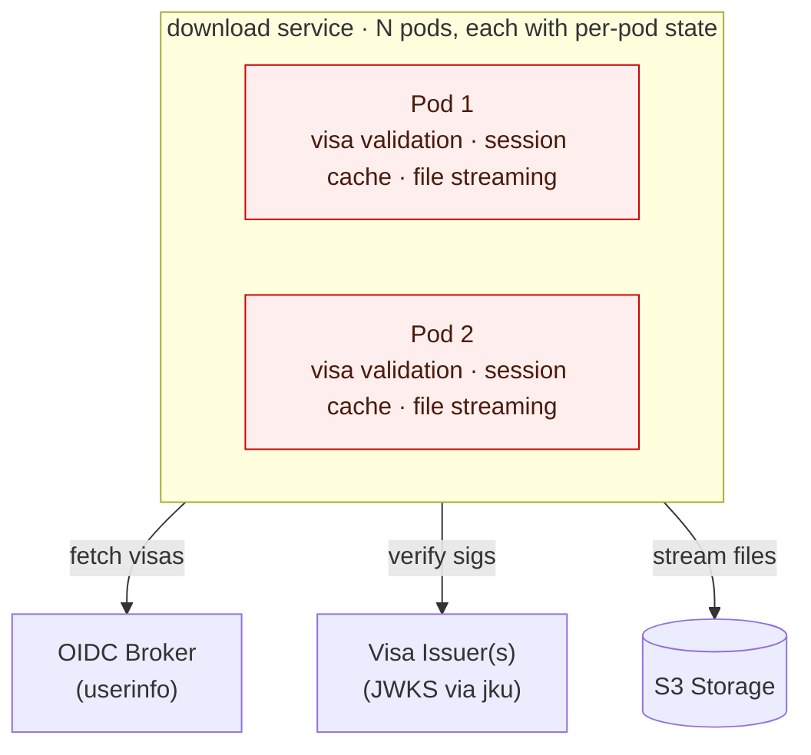
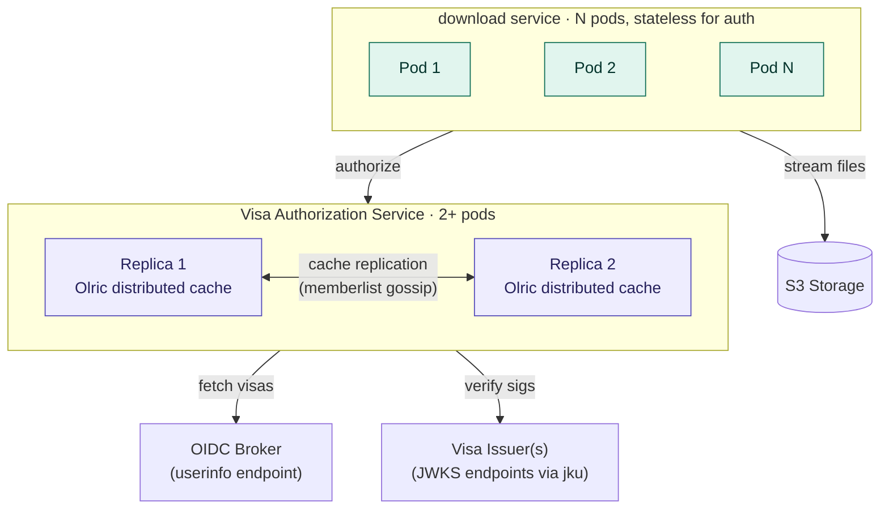
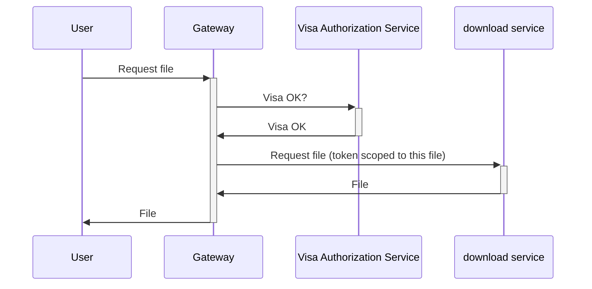

# Separate Visa Authorization Service?

## Context and Problem Statement

The download API v2 service (`sda/cmd/download`) embeds GA4GH visa validation
directly in its HTTP middleware ([auth.go][v2-auth]). On each request without a
cached session, the service:

1. Fetches visas from the OIDC userinfo endpoint (or extracts them from the
   token itself, configurable via `visa.source`)
   ([validator.go#L104][v2-validator-L104])
2. For each `ControlledAccessGrants` visa, validates all required claims:
   `by`, `value`, `source`, `asserted`, and rejects non-empty `conditions`
   ([validator.go#L393][v2-validator-L393])
3. Verifies the visa JWT signature by fetching the signing key via `jku` from
   the trusted issuer allowlist ([jwks_cache.go][v2-jwks])
4. Checks each visa's dataset value against the local database
5. Caches results in a per-pod ristretto cache with three tiers: session
   cookie, token hash, and per-visa validation ([auth.go#L465][v2-auth-L465])

The v2 implementation has significantly improved GA4GH compliance over the
legacy `sda-download` service (see [Gap Analysis](#gap-analysis) below).
However, two architectural problems remain:

**Per-pod session loss.** The session cache is local to each pod. When a
user's request is routed to a different download pod (e.g., after scaling or
pod restart), the cached session is not available and the full visa
re-validation flow must run again — involving external HTTP calls to the OIDC
userinfo endpoint and each visa issuer's JWKS endpoint. This is not an
interactive re-authentication (the bearer token is still valid), but it adds
latency and external service load on every pod switch. Since chart 3.0.18 the
download ingress carries no session affinity by default (see
[Option 4](#option-4-session-affinity-on-the-download-ingress)), so with
several replicas a pod switch happens on ordinary load-balancer rotation, not
only after scaling or a restart.

**Scaling mismatch.** Download pods need many instances for heavy I/O
(streaming large encrypted genomic files). Each pod also carries the visa
validation burden, meaning the authorization cache scales with I/O capacity
rather than with authorization demand.

[Issue #2228][issue-2228] proposes extracting visa validation into a separate
service. The GA4GH Passport specification defines a
[Passport Clearinghouse][ga4gh-passport] as "a service that consumes Visas and
uses them to make an authorization decision." The architectural separation
aligns with this model.

Originally drafted as ADR-0004 in PR #2320; converted to an RFC under
[ADR-0005][adr-0005] because the open questions below haven't converged yet.

[issue-2228]: https://github.com/neicnordic/sensitive-data-archive/issues/2228
[ga4gh-passport]: https://ga4gh.github.io/data-security/ga4gh-passport
[ga4gh-aai]: https://ga4gh.github.io/data-security/aai-openid-connect-profile
[v2-auth]: https://github.com/neicnordic/sensitive-data-archive/blob/4d54b229/sda/cmd/download/middleware/auth.go
[v2-auth-L465]: https://github.com/neicnordic/sensitive-data-archive/blob/4d54b229/sda/cmd/download/middleware/auth.go#L465
[v2-validator-L104]: https://github.com/neicnordic/sensitive-data-archive/blob/4d54b229/sda/cmd/download/visa/validator.go#L104
[v2-validator-L393]: https://github.com/neicnordic/sensitive-data-archive/blob/4d54b229/sda/cmd/download/visa/validator.go#L393
[v2-jwks]: https://github.com/neicnordic/sensitive-data-archive/blob/4d54b229/sda/cmd/download/visa/jwks_cache.go
[v2-trust]: https://github.com/neicnordic/sensitive-data-archive/blob/4d54b229/sda/cmd/download/visa/trust.go
[v2-auth-L327]: https://github.com/neicnordic/sensitive-data-archive/blob/4d54b229/sda/cmd/download/middleware/auth.go#L327
[adr-0003]: ../decisions/0003-shared-state-strategy-for-s3inbox-and-caching.md
[adr-0005]: ../decisions/0005-introduce-rfcs-as-upstream-exploration-phase.md
[pr-2320]: https://github.com/neicnordic/sensitive-data-archive/pull/2320
[chart-affinity-add]: https://github.com/neicnordic/sensitive-data-archive/commit/208b9a870c9d290836b61abe5648c077ad63bba9
[chart-affinity-drop]: https://github.com/neicnordic/sensitive-data-archive/commit/c40f9876026e6894d7818d0f95215ea6b7336263

## Decision Drivers

* **Multi-pod correctness** — download pods run behind a load balancer; session
  loss on pod switch causes unnecessary external calls and added latency.
* **Separation of concerns** — authorization logic and file streaming have
  different scaling profiles and failure modes.
* **Operational simplicity** — prefer solutions that do not require new
  infrastructure (Redis, etc.) when an architectural change suffices.
* **Reusability** — other SDA services (API, future services) may need
  visa-based authorization.

## Considered Options

1. **Separate Visa Authorization Service** (with Olric for distributed caching)
2. **Redis-backed shared session cache in the download service**
3. **Keep current architecture (status quo)**
4. **Session affinity on the download ingress** (raised in review by @pontus)
5. **Authorization at a gateway in front of the download service** (raised in
   review by @viklund)
6. **Postgres-backed shared session cache in the download service** (the
   ADR-0003 pattern; added by the authors 2026-08-31)
7. **Keep validation in-process behind a shared Go library** (reuse without
   a service; added by the authors 2026-08-31)

## Open Questions

* **Olric in production.** Has anyone in the NeIC SDA community run Olric in
  production? What's the operational maturity? What is the upgrade story when
  the embedded library version changes?
* **Latency budget.** What is the acceptable per-request latency for the new
  network hop into the authorization service? @pontus's concern in review is
  the cross-node case for workloads with many small requests (htsget-style
  range reads); @jbygdell's experience is that pod-to-pod latency inside the
  cluster is small. Has anyone measured the current cache-hit / cache-miss
  latency on the download path to compare against? Co-location (one
  authorization pod per node, `internalTrafficPolicy: Local` on its Service)
  is a possible mitigation nobody has tested.
* **Where does the authorization check sit?** @viklund asked (2026-03-30, not
  yet answered in the thread) why the download service should call the
  authorization service at all, rather than a gateway in front of download
  making the call and passing on a token scoped to the requested file (see
  [Option 5](#option-5-authorization-at-a-gateway-in-front-of-the-download-service)).
  Live at merge time; to be taken up at the next NeIC SDA-Devs meet-up.
* **Memberlist in NeIC k8s.** Does each NeIC site's Kubernetes networking
  support memberlist gossip (UDP + TCP between pods on a non-standard port)?
  Headless service DNS works in most clusters but not all.
* **Wait or extract?** Could `source` policy enforcement and Token Exchange
  be added inside the current download service, deferring the extraction
  until there is a *second* consumer of visa authorization? The
  [direction currently favoured](#direction-currently-favoured) answers:
  wait, and do both inside the current service.
* **Session affinity as an interim measure.** The chart set cookie affinity
  on the download ingress from 0.26.4 until 3.0.18 dropped it (see
  [Option 4](#option-4-session-affinity-on-the-download-ingress)). Should
  deployments re-enable it through `download.ingressAnnotations` while this
  RFC is open, whichever option is eventually chosen?
* **Replica count and TTLs.** What replication factor and what cache TTLs are
  realistic for SDA traffic patterns? The numbers in the design are sketches,
  not measurements.
* **Failure semantics.** Whatever holds the cache: when an upstream (OIDC
  userinfo, a JWKS endpoint, an authorization service, or the database) is
  unavailable, does the download service answer `503` — never `403`, and
  never fall through to an allow — and does an already-started stream
  continue? These apply to every option and are undecided.
* **Miss coalescing.** Independent of where the cache lives, concurrent
  requests carrying the same token (or the same `jku`) on a cold pod should
  be single-flighted so a rolling restart does not stampede LS AAI. The
  current code does not do this; where does it belong?
* **Measure before choosing.** How often does a cache miss on pod switch
  actually happen in production, and what does it cost in userinfo/JWKS
  calls and latency? The cookie-aware benchmark in
  `sda/cmd/download/benchmark/` is the starting point. The measurement needs
  an owner, a budget it is judged against, and a decision date, or "measure
  first" becomes indefinite.
* **Legacy `sda-download` coexistence.** How does the new service relate to
  the legacy `sda-download` during the v2 rollout? Does it serve both, or only
  v2?
* **Naming.** "Visa Authorization Service" is a working title chosen to avoid
  implying full GA4GH Clearinghouse compliance. When (if ever) does it become
  the "Passport Clearinghouse"?

## Pros and Cons of the Options

### Option 1: Separate Visa Authorization Service

Extract the visa validation logic from `sda/cmd/download/visa/` and
`sda/cmd/download/middleware/auth.go` into a dedicated service. The
authorization service maintains an in-process distributed cache via Olric;
download pods become stateless for authorization and hold no cache.

**Current architecture:**

```mermaid
flowchart TB
    subgraph pods["download service · N pods, each with per-pod state"]
        D1["Pod 1\nvisa validation · session cache · file streaming"]
        D2["Pod 2\nvisa validation · session cache · file streaming"]
    end

    OIDC["OIDC Broker\n(userinfo)"]
    JWKS["Visa Issuer(s)\n(JWKS via jku)"]
    S3[("S3 Storage")]

    pods -->|"fetch visas"| OIDC
    pods -->|"verify sigs"| JWKS
    pods -->|"stream files"| S3

    style D1 fill:#fee,stroke:#c00,color:#4a1b0c
    style D2 fill:#fee,stroke:#c00,color:#4a1b0c
```

> Session lost on pod switch — full visa re-validation required.

**Proposed architecture:**

```mermaid
flowchart TB
    subgraph download["download service · N pods, stateless for auth"]
        D1["Pod 1"] ~~~ D2["Pod 2"] ~~~ DN["Pod N"]
    end

    subgraph auth["Visa Authorization Service · 2+ pods"]
        direction LR
        CH1["Replica 1\nOlric distributed cache"]
        CH2["Replica 2\nOlric distributed cache"]
        CH1 <-->|"cache replication\n(memberlist gossip)"| CH2
    end

    OIDC["OIDC Broker\n(userinfo endpoint)"]
    JWKS["Visa Issuer(s)\n(JWKS endpoints via jku)"]
    S3[("S3 Storage")]

    download -->|"authorize"| auth
    download -->|"stream files"| S3
    auth -->|"fetch visas"| OIDC
    auth -->|"verify sigs"| JWKS

    style D1 fill:#e1f5ee,stroke:#0f6e56,color:#04342c
    style D2 fill:#e1f5ee,stroke:#0f6e56,color:#04342c
    style DN fill:#e1f5ee,stroke:#0f6e56,color:#04342c
    style CH1 fill:#eeedfe,stroke:#534ab7,color:#26215c
    style CH2 fill:#eeedfe,stroke:#534ab7,color:#26215c
```

**Distributed cache with [Olric](https://github.com/buraksezer/olric):**

The v2 download service uses ristretto (in-process, per-pod) for caching
([auth.go#L465][v2-auth-L465]). The Visa Authorization Service replaces
ristretto with [Olric][olric] — an embedded distributed cache for Go that
provides automatic peer discovery, replication, and TTL support without
external infrastructure.

[olric]: https://github.com/buraksezer/olric

* **Replication mode:** Olric partitions the key space and keeps
  `ReplicaCount` copies of each partition, with asynchronous (optimistic)
  replication by default; synchronous replication exists but there is no
  consensus, and reads are best-effort, eventually consistent. "Every entry on
  both pods" is the outcome of setting `ReplicaCount` to the member count,
  not a guarantee of the model; a stale or missing entry after a write is
  possible and must be treated as a cache miss, never as a denial.
* **Peer discovery:** Olric uses [memberlist][memberlist] (HashiCorp's gossip
  protocol) for automatic peer discovery. In Kubernetes, peers are discovered
  via a headless service DNS record.
* **Minimum replicas:** 2 (no quorum required, unlike Raft-based solutions).
* **Cache key:** SHA-256 hash of the bearer token.
* **Cached value:** authorized dataset list.
* **TTL:** bounded by the minimum of: access token `exp`, earliest visa
  `exp`, and configured maximums. Carried over from v2's existing
  `computeCacheTTL` logic.
* **Revocation:** an earlier draft proposed re-validating cached entries
  hourly by re-fetching from the userinfo endpoint. That cannot work as
  written: the cache key is a hash of the bearer token and the value is a
  dataset list, so nothing retained can call userinfo again — and keeping
  raw bearer tokens only to poll would widen the blast radius of a cache
  compromise. The current v2 code has the same property; its cached
  `AuthContext` holds a parsed `jwt.Token` (nil for opaque tokens), never the
  raw string. The honest mechanism is a maximum-staleness bound: an allow
  decision is cached no longer than the minimum of token `exp`, earliest visa
  `exp`, and a configured maximum (what `computeCacheTTL` does today), and is
  refreshed by the next request that carries the token. If near-real-time
  revocation is ever required, that needs token introspection or an
  event-driven invalidation, not polling.

[memberlist]: https://github.com/hashicorp/memberlist

**Why Olric over alternatives:**

* **vs. ristretto (current):** ristretto is per-pod only — cache misses on
  every pod switch, generating unnecessary OIDC calls.
* **vs. Redis:** requires new external infrastructure to deploy and maintain.
* **vs. Raft-based KV (e.g., hashicorp/raft):** requires odd replica counts
  for quorum, strong consistency is unnecessary for a TTL-bounded
  authorization cache where eventual consistency is acceptable.
* **vs. hand-rolled HTTP broadcast:** Olric provides peer discovery, failure
  handling, and replication as a library — avoids reinventing distributed
  cache primitives.
* **vs. Postgres (Option 6):** added 2026-08-31. Postgres is already
  deployed, already on the request path, and already the source of truth
  for permissions; a table gives the shared cache without a gossip mesh.
  This comparison is what changed the
  [direction currently favoured](#direction-currently-favoured).

The separation works because the two workloads have different scaling
profiles:

* **Download pods** need many instances for heavy I/O (streaming large
  encrypted genomic files). They currently also carry the session cache,
  which is why per-pod state loss is painful.
* **Visa Authorization Service pods** are lightweight (JWT parsing, OIDC
  HTTP calls, visa claim inspection). 2+ pods are needed for HA. Olric's full
  replication ensures every replica has every cache entry, so pod switches
  do not cause cache misses or unnecessary OIDC calls.

**Standalone service or sidecar?** @pontus suggested in review (2026-03-18)
running the authorization service as a sidecar in each download pod, which
removes the network hop. The authors' reply (2026-03-19): a sidecar does not
solve session loss, because each sidecar's cache is 1:1 with its download
pod; the code separation it gives is also given by a standalone service,
which in addition can be reused by other services. The GA4GH specification
defines the Passport Clearinghouse as a functional role, not a deployment
topology, so both are compliant. This RFC explores the standalone service;
the sidecar is recorded here so it is not re-derived.

* Good, because download pods become **stateless for authorization**.
* Good, because it requires **no new external infrastructure** — no Redis,
  no new databases.
* Good, because it creates a reusable service for visa-based authorization.
* Neutral, because the Visa Authorization Service is a new service to deploy
  and monitor.
* Bad, because it adds a network hop for authorization. @pontus's objection
  in review: when the hop crosses nodes, workloads with many small requests
  pay it on every request, and with session affinity available (Option 4) the
  proposal risks being slower than today for a scaling benefit that is not
  yet needed. @jbygdell's observation is that pod-to-pod latency inside the
  cluster is small. A possible mitigation, untested: one authorization pod
  per node (DaemonSet) with `internalTrafficPolicy: Local` on its Service,
  so calls never leave the node — though a per-node authorization pod
  recreates the scaling coupling the extraction was meant to remove.
* Bad, because download pods cannot actually stay cache-free: without a
  short-lived local decision cache every htsget range request pays the RPC,
  so "stateless for authorization" collapses to "the expensive validation
  state lives elsewhere" — which Options 6 and 7 achieve without a service.
* Bad, because Olric is new infrastructure in all but packaging: membership,
  partition ownership, rebalancing, network policy, rolling-upgrade
  compatibility, and split-brain behaviour have to be understood and
  operated at every NeIC site.

### Option 2: Redis-backed shared session cache in the download service

Add Redis to the infrastructure and replace the per-pod ristretto session
cache with a shared Redis-backed cache.

* Good, because it solves session loss across pods without architectural
  change.
* Bad, because it adds a new infrastructure dependency (Redis).
* Bad, because it introduces a new failure mode (Redis unavailability)
  requiring fallback logic.
* Bad, because authorization and file streaming remain coupled in the same
  service.

Redis is unnecessary: Option 6 gives a shared cache in a store every
deployment already runs. It could be re-evaluated if a measured need for a
shared external cache beyond what Postgres provides ever arises.

### Option 3: Keep current architecture (status quo)

* Good, because no work is required.
* Bad, because session loss on pod switch continues — users experience added
  latency on every pod rotation.
* Bad, because authorization and I/O scaling remain coupled.
* Bad, because visa validation logic cannot be reused by other services
  without code duplication.

### Option 4: Session affinity on the download ingress

Raised by @pontus in review (2026-03-18). Keep the per-pod cache and have the
load balancer route a client's subsequent requests to the pod that already
holds its session. This is not new: the `sda-svc` chart set
`nginx.ingress.kubernetes.io/affinity: "cookie"` on the download ingress from
chart 0.26.4 ([208b9a87][chart-affinity-add], June 2024) until 3.0.18
([c40f9876][chart-affinity-drop], December 2025) moved ingress annotations
into values and did not carry the affinity annotation over as a default. A
deployment that wants it back adds the annotation under
`download.ingressAnnotations` (or `downloadV2.ingressAnnotations`).

* Good, because it is a values-only change to the chart; no new service, no
  new infrastructure.
* Good, because it can be applied today, alongside any other option, as an
  interim measure.
* Bad, because it only helps clients that return the affinity cookie;
  scripted and CLI clients without a cookie jar get a cold cache on every
  request that lands on a new pod.
* Bad, because a pod restart or scale-down still loses the session, and the
  mechanism is specific to ingress-nginx.
* Bad, because affinity pins all of one client's parallel streams to a single
  pod; a user starting many large downloads at once loads one replica while
  the others idle.
* Bad, because authorization and streaming remain coupled and nothing becomes
  reusable. The authors' reply (2026-03-19) prefers Option 1 for this reason:
  the separation is wanted for its own sake, not only for the session-loss
  symptom.

### Option 5: Authorization at a gateway in front of the download service

Raised by @viklund in review (2026-03-30). Instead of the download service
calling the authorization service, a gateway in front of it makes the call
and forwards the request only if the visa check passes:

```mermaid
sequenceDiagram
    participant User
    participant Gateway
    participant Auth as Visa Authorization Service
    participant Download as download service
    User->>+Gateway: Request file
    Gateway->>+Auth: Visa OK?
    Auth->>-Gateway: Visa OK
    Gateway->>+Download: Request file (token scoped to this file)
    Download->>-Gateway: File
    Gateway->>-User: File
```

The "Visa OK" can be turned into a narrower token, so that the request the
download service sees is only valid for the file that was asked for. More
generally, the gateway is where a chain of middlewares (authorization, rate
limiting, audit) would sit before a request reaches any SDA service.

* Good, because the download service never sees an unauthorized request and
  only validates one narrow, locally issued token; visa logic leaves the
  streaming path entirely instead of moving behind an RPC.
* Good, because the file-scoped token is a capability: a replayed download
  request cannot be widened to other files.
* Good, because it composes with Option 1 rather than replacing it. The
  ingress-nginx `auth-url` subrequest and Envoy `ext_authz` implement this
  pattern with the authorization service as the backend and a response header
  carrying the scoped token upstream; the question is who calls the service,
  not whether it exists.
* Bad, because SDA has no gateway today; the chart has one ingress per
  service and nothing in between. This adds a component, or a dependency on
  the ingress controller's external-auth semantics, against the
  no-new-infrastructure driver.
* Bad, because scoping the token to a file means the authorization service
  must understand the download API's URL scheme and resolve file to dataset
  before the request reaches download, which couples it to that API and
  works against the reusability driver.
* Bad, because a proxying gateway adds a hop to the streaming path for large
  files (the subrequest model avoids this), and the scoped token adds a
  signing key to manage.

A variant without the gateway: validate visas once, wherever that happens,
mint a short-lived grant scoped to a dataset or file, and let download pods
verify that grant locally with a public key. This avoids both distributed
cache state and a per-request RPC, at the price of a signing key to rotate
and the same revocation trade-off as any cached decision. It is the token
half of this option separated from the gateway half.

Not yet discussed in the thread; recorded as an open question.

### Option 6: Postgres-backed shared session cache in the download service

Added by the authors 2026-08-31. Every SDA deployment already runs
PostgreSQL, it is the source of truth for dataset permissions, and the
download service already queries it on the request path (the middleware's
`DatasetLookup` on a cache miss; `GetFileByPath` and `CheckDatasetExists` in
the handlers). [ADR-0003][adr-0003] replaced s3inbox's per-pod in-memory
cache with database lookups for the same reason, and explicitly deferred a
shared download session cache until a measured need arose.

Keep the two ristretto tiers as a per-pod L1 and add an L2 table — token
hash, authorized dataset list, policy/config version, `expires_at` — read on
L1 miss, written after a full validation, expired lazily on read and swept
periodically. A miss on pod switch then costs one indexed primary-key read
instead of a userinfo round trip; the JWKS cache is already per-pod with a
TTL and warm after the first request per issuer.

* Good, because it needs no new infrastructure, no new service, and no
  gossip between pods; the operators already run the store.
* Good, because every Olric open question above (production maturity,
  memberlist in NeIC clusters, replication factor) disappears.
* Good, because it holds exactly what the Olric design would hold in RAM — a
  token hash and a dataset list bounded by token expiry — only persisted.
* Neutral, because the download database role needs write access to one
  table, which has to reach managed-Postgres sites through the migration and
  the chart.
* Bad, because it puts a write on the miss path and a read on every L1 miss;
  the write burst on a rolling restart and the sweep of expired rows need to
  be measured, and misses should be single-flighted per token so concurrent
  requests do not stampede userinfo.
* Bad, because authorization stays inside the download service; this option
  answers the session-loss problem, not the reusability driver (see
  Option 7).

### Option 7: Keep validation in-process behind a shared Go library

Added by the authors 2026-08-31. Reuse inside a Go monorepo does not require
a network service. Move `sda/cmd/download/visa` (and the cache logic it
needs) to a shared internal package with a stable interface, so `api` or a
future DRS service can validate visas in-process the day they need to.

* Good, because it gives the code separation, ownership, and testability
  that motivate Option 1, at zero deployment cost.
* Good, because it keeps a later extraction cheap: a Visa Authorization
  Service becomes a thin binary around the same package.
* Good, because combined with Option 6 it covers both decision drivers this
  RFC started from, without a new service.
* Bad, because decisions are not shared across services; each consumer
  validates independently (at worst once per token per service per TTL), and
  a policy change has to be rolled out to every consumer.
* Bad, because it does not decouple authorization scaling from streaming
  scaling — which nobody has yet measured to be a problem.

## More Information

### Direction currently favoured

Until 2026-08-31 this section said Option 1, the separate service with
Olric. The authors no longer favour that as the first step, for the reasons
recorded under Option 1: the embedded distributed cache is new infrastructure
in all but packaging, the revocation design did not work as written, and a
download pod needs a local decision cache anyway, so the service would move
the expensive state rather than remove it. Options 4 and 5 arrived in review;
the authors' reply of 2026-03-19 stands for Option 4, and Option 5 has not
been discussed yet.

The direction now proposed, in order:

1. **Now, without waiting for this RFC:** re-enable cookie affinity on the
   download ingress as a chart default (Option 4, with its load-skew caveat
   documented); implement `source` policy enforcement in the current visa
   package; move that package behind a shared interface (Option 7);
   single-flight cache misses.
2. **Now, with a deadline:** instrument cache-tier hits and userinfo/JWKS
   calls, set a budget, and decide at the following NeIC SDA-Devs meet-up.
   If misses matter — expected for `sda-cli` traffic, which carries no
   cookie — add the Postgres L2 tier (Option 6).
3. **Deferred:** a separate service (Option 1 without Olric, or as the
   backend of Option 5) when a second consumer needs shared decisions or
   independent scaling, or the budget from step 2 is breached. Redis and
   Olric are not planned.

The open questions that still block promotion are the failure semantics, the
measurement, and @viklund's gateway question. When those land, the authors
expect to move this RFC to `ready-for-decision` and write an ADR that says
the above, per [ADR-0005][adr-0005].

### Gap Analysis: GA4GH Passport Clearinghouse Compliance {#gap-analysis}

The GA4GH [Passport specification][ga4gh-passport] and [AAI OIDC
Profile][ga4gh-aai] define a Passport Clearinghouse as a service that
evaluates visas for authorization decisions.

The download API has two implementations: the **legacy** `sda-download`
service and the **v2** implementation at `sda/cmd/download`. The v2
implementation is the future and the basis for this RFC. The gap analysis
below applies to v2 unless noted otherwise.

#### What v2 implements today

| Spec Requirement | Status | Implementation |
| --- | --- | --- |
| Filter by visa type | Done | Only processes `ControlledAccessGrants` visas |
| Validate required claims (`by`, `value`, `source`, `asserted`) | Done | `validateControlledAccessGrant()` checks all four are present and non-empty ([validator.go#L393][v2-validator-L393]) |
| Reject visas with unsupported `conditions` | Done | Rejects non-empty `conditions` via `rejectNonEmptyConditions()` ([validator.go#L430][v2-validator-L393]) |
| Verify visa JWT signature via `jku` | Done | Fetches JWKS and verifies; `jku` checked against trusted allowlist ([jwks_cache.go][v2-jwks]) |
| Verify `jku` is trusted before calling | Done | Trusted issuer configuration is **required** when visa is enabled — startup fails if not set. HTTPS enforced for `jku` URLs unless explicitly overridden ([trust.go][v2-trust]) |
| Validate standard JWT claims (`exp`, `iat`, `nbf`) | Done | Standard JWT validation |
| Validate `aud` (audience) claim | Done | Verified against configured audience when `oidc.audience` is set ([auth.go#L327][v2-auth-L327]) |
| `asserted` staleness check | Done | Optional: configurable via `visa.validate-asserted`, rejects visas asserted in the future (with clock skew tolerance) |
| Trust relationship with Broker | Done | Configured via OIDC discovery URL |
| Visa source modes (UserInfo / Token) | Done | Configurable: `userinfo` (default, GA4GH recommended) or `token` mode; opaque tokens always fall back to userinfo ([validator.go#L104][v2-validator-L104]) |
| Three-tier caching with TTL | Done | Session cookie → token hash → per-visa validation cache; TTL bounded by token and visa expiry ([auth.go#L465][v2-auth-L465]) |

Note: the legacy `sda-download` service has significant gaps — its `Visa`
struct only contains `type` and `value`, it does not validate `source`, `by`,
`asserted`, or `conditions`, and its trusted issuer check is conditional
(returns `true` if no trusted list is configured). The legacy service should
be retired in favor of v2.

#### Remaining gaps

| Spec Requirement | Gap | Severity | Remediation |
| --- | --- | --- | --- |
| **`source` policy enforcement** — SHOULD verify source against policy per dataset | v2 validates that `source` is present and non-empty, but does not enforce policy rules like "only accept visas sourced from DAC X for dataset Y." `source` differs from `iss`: the issuer signs the JWT, the source made the access decision. | Medium | Add policy configuration mapping datasets to allowed sources. |
| **Token Exchange** — SHOULD prefer over UserInfo ([AAI spec][ga4gh-aai]) | v2 supports UserInfo and direct token extraction but not RFC 8693 Token Exchange. | Medium | Implement Token Exchange flow as an additional visa source mode. |
| **Linked Identities** — MUST verify when combining visas across different `sub` values | SDA uses a single OIDC broker (Life Science AAI); all visas share the same `sub`. Matters only for federated multi-IdP deployments. | Low | Defer until multi-IdP support is required. |
| **Access Token Polling** — visa invalid if >1 hour old unless polling confirms validity | Only applies to Visa Access Tokens. v2 uses Visa Document Tokens (validated via `jku` signature). | Low | Defer — not applicable to current token flow. |
| **Full `conditions` evaluation** — evaluate Disjunctive Normal Form conditions | v2 correctly rejects visas with conditions but cannot evaluate them. If a visa issuer requires conditions to be satisfied, those visas are denied. | Low | Implement DNF conditions evaluator when needed for specific visa issuers. |

#### Path to full GA4GH compliance

Full Clearinghouse compliance can be pursued incrementally as requirements
emerge:

1. **Done (v2):** All required visa claims validated, `conditions` rejected,
   trusted issuer enforcement mandatory
2. **With service extraction:** Add `source` policy enforcement per dataset,
   Token Exchange
3. **For GDI federation:** Linked identity support, full `conditions`
   evaluation (DNF), Access Token Polling

The service is named "Visa Authorization Service" (working title) rather than
"Passport Clearinghouse" to avoid implying full GA4GH Clearinghouse
compliance. The service could be renamed once broader compliance is achieved.

### Related issues and discussion

* [PR #2320][pr-2320] — this RFC's review thread; Options 4 and 5 and the
  objections recorded under Option 1 were folded in from it on 2026-08-31
* [#2228][issue-2228] — separate Passport Clearinghouse service (idea, to be
  fleshed out as part of implementation planning)
* [ADR-0003][adr-0003] — s3inbox shared state strategy (related per-pod state
  problem, solved independently via database lookups)
