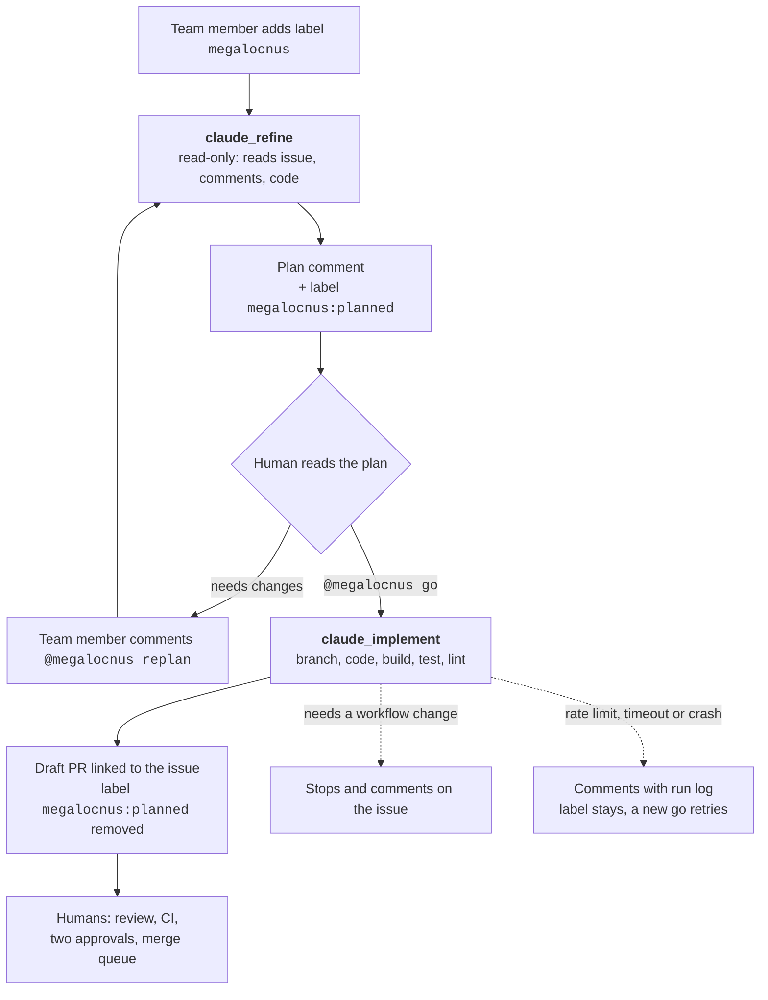

# Add a Claude coding bot ("Megalocnus") to the team

## Context and Problem Statement

Several of us already use Claude Code locally, and a large share of our backlog is small, well-defined work: chores, clear bugs, test gaps and lint fixes.
Anthropic now ships an official GitHub integration, [`anthropics/claude-code-action@v1`](https://github.com/anthropics/claude-code-action), that can run Claude on GitHub-hosted runners in response to labels and comments.
This RFC explores whether the team wants a Claude coding bot as a visible team member, how work is handed to it, and how we keep it transparent that Claude wrote the code.
It proposes a four-week pilot with a concrete design, and lists what the team still has to decide.

The proposed name is **Megalocnus**, after a Caribbean giant ground sloth; the name is free on GitHub as both App and account.

## Decision Drivers

* **Transparency** - every commit, PR and comment written by the bot must be recognisable as Claude's work, and show which human approved it.
* **Humans stay accountable** - the bot never merges; our normal review rules (two approvals, rebase-only merge queue, CI) apply unchanged.
* **Security in a public repository** - anyone can open issues and comment, so prompt injection and secret exfiltration have to be designed out, not hoped away.
* **Low review burden** - bot PRs must be small and focused, or they cost more reviewer time than they save.
* **Cheap to try, cheap to stop** - the pilot should need no budget decision and be switchable off in one click.

## Considered Options

The design breaks down into five sub-questions.

* **Where the bot runs**
  * GitHub-hosted runners with `claude-code-action`
  * Self-hosted runners on our own hardware
  * Anthropic's cloud (Claude Code on the web, Routines)
* **How it is paid for**
  * A. OAuth token from one team member's Claude Team seat (`claude setup-token`)
  * B. A Console API key in an NBIS/NeIC workspace with a spend cap
  * C. A dedicated Team seat for the bot
  * D. Workload identity federation (GitHub OIDC to the Anthropic Console, no long-lived secret)
* **GitHub identity**
  * A machine-user account (assignable) plus our own GitHub App
  * Our own GitHub App only, with work handed over by label
  * Anthropic's shared `claude[bot]` App
* **How work flows from issue to PR**
  * One entry point with a plan gate: label, plan, human says go, implement
  * Separate refine and implement labels
  * Implement directly, the bot asks only if it thinks the issue is unclear
* **Whether the App may change `.github/workflows/`**
  * No Workflows permission
  * Workflows permission

## Proposed Pilot

The pilot uses the first option listed in each sub-question, except GitHub identity: it starts with our own App only and adds the machine-user account later if the team wants assignment.
Billing option A is for the pilot only.
The rationale is in [Pros and Cons of the Options](#pros-and-cons-of-the-options).

### Flow



**Refine** runs when someone with write access adds the `megalocnus` label, or comments `@megalocnus replan`.
The bot reads the issue, its comments and the relevant code, and posts one plan comment with fixed headings: understanding, assumptions, numbered open questions, plan (files and steps), tests, size (S/M/L), cross-repo impact, and a recommendation (ready, needs answers, or too big with a proposed split).
On replan it edits its earlier plan comment instead of adding a new one.
It always adds `megalocnus:planned`; the human decides whether the plan is good enough, and can answer open questions in the go comment.

**Implement** runs when someone with write access comments `@megalocnus go` on an issue that has `megalocnus:planned`.
Its input is the latest plan comment plus team members' comments between the plan and the go.
It creates a branch `<type>/megalocnus-<issue>-<slug>` from `main`, implements the plan, runs build, unit tests and lint for the modules it touched, and opens a **draft** PR.
The PR body links the issue (`Closes #N`) and the plan, reports test results, and lists every deviation from the plan.
It then removes `megalocnus:planned`, so a second go cannot open a second PR.
Integration tests that need Docker are left to CI.

**After the PR** everything is as for any other PR.
During the pilot, humans push follow-up fixes to the bot's branch themselves.

**Failure handling.**

* Tests still failing when the budget runs out: the bot opens the draft PR anyway, marked with what fails, so someone can take over.
* The change needs a workflow edit: the bot stops and says so on the issue.
* Rate limit, timeout or crash: a final step comments with a link to the run log; `megalocnus:planned` stays, so a new go retries.

### Components

| Piece | Notes |
| --- | --- |
| GitHub App `megalocnus` | Owned by neicnordic, installed on this repository only. Contents, Issues and Pull requests read/write; Metadata read. No Workflows permission, no webhook. Setup checklist in the [appendix](#appendix-github-app-setup). |
| Repository secrets | `MEGALOCNUS_APP_ID`, `MEGALOCNUS_APP_PRIVATE_KEY`, `CLAUDE_CODE_OAUTH_TOKEN`. Only the two Megalocnus workflows reference them. |
| `.github/workflows/claude_refine.yml` | `issues: labeled` and `issue_comment` (replan). `contents: read`, `issues: write`. Read-only tools plus commenting. |
| `.github/workflows/claude_implement.yml` | `issue_comment` (go). `contents: write`, `pull-requests: write`. Build, test, lint, git and `gh pr create --draft`. |
| `.claude/commands/refine-issue.md`, `implement-issue.md` | The bot's instructions, reviewed like code. `claude-code-action` restores `.claude/` and `CLAUDE.md` from the base branch before running, so a PR cannot rewrite them. |
| Labels | `megalocnus`, `megalocnus:planned`. |
| `AGENTS.md` and `CLAUDE.md` | Shared repository instructions, see [Repository instructions](#repository-instructions). |

All jobs run on `ubuntu-latest`.
Both workflows check at job level that the event is on an issue, not a PR, and that the comment contains the trigger phrase, so stray comments do not start runners.

### Identity and Transparency

* Commits are authored by `megalocnus[bot]` and signed through the GitHub API (`use_commit_signing`), so they show as *Verified* during review.
  Rebasing via *Update branch* or the merge queue keeps the bot as author but drops the signature, as it does for every rebased commit.
* Commit messages follow Conventional Commits (ADR-0007) and carry two trailers:

  ```text
  Refs: #123
  Plan-approved-by: @handle
  ```

  We deliberately do not use `Co-authored-by` for the approver: GitHub would then show them as co-author of code they did not write.
* Every PR and plan comment ends with a footer such as:

  > 🦥 Written by **Megalocnus**, Claude (`claude-sonnet-5-5`) via claude-code-action. Plan approved by @handle in #123. Run log: (link). A human reviews every change before merge.

  The model id is filled in by the workflow.
* The App profile has a sloth avatar and the description *"Claude (Anthropic) coding agent for the SDA team. Acts only on requests from team members; every PR is human-reviewed."*
* `CONTRIBUTING.md` gets a short section on how to use Megalocnus and the team's policy for AI-written code.

### Security and Cost

* Only users with write access can trigger the bot (the action's default); `allowed_non_write_users` and `allowed_bots` stay empty.
* The implement step filters thread comments on GitHub's `author_association` field (OWNER, MEMBER, COLLABORATOR) before they reach the model.
  The issue body may come from an outsider; it is background only, the human-read plan is the contract.
* Tools are allow-listed per workflow; there is no `curl` or `wget`.
  `show_full_output` stays off, so run logs do not contain the full transcript.
* Without the Workflows permission GitHub rejects any push that touches `.github/workflows/`.
  Secrets are only exposed to jobs whose workflow file names them, so the bot cannot reach its own token or App key by editing a Makefile or a test.
* The `main` ruleset already requires a PR with two approvals, linear history and the merge queue, so the bot cannot push to `main`.
* Models: `claude-opus-5-5` for refine (short runs that need judgement), `claude-sonnet-5-5` for implement (long runs against an approved plan).
* Limits: refine at most 30 turns and 15 minutes; implement at most 100 turns and 60 minutes; one run per issue at a time and one implement run at a time across the repository.

### Repository Instructions

* `AGENTS.md` at the root holds tool-neutral facts: a repository map, build/test/lint commands, conventions (Conventional Commits, rebase-only history, CHANGELOGs, `log/slog`, `accessionID`, absolute links for the neic-sda docs aggregation) and working principles (simplest change that solves the issue, tight scope, match surrounding style, state assumptions, verifiable definition of done).
  Codex and other agents read it directly.
* `CLAUDE.md` contains `@AGENTS.md`, because Claude Code ignores `AGENTS.md` when a `CLAUDE.md` exists.
* Bot-only behaviour (plan format, footer, trailers, stopping on workflow changes) lives in `.claude/commands/`, so people's local sessions do not pick it up.
* `AGENTS.md` and `CLAUDE.md` are useful without the bot and go in a separate PR first.

### Related Repositories

The bot only has write access to this repository, but it gets read access to the public repositories that depend on our APIs or docs.

| Repository | Relationship | Access in the pilot |
| --- | --- | --- |
| [NBISweden/sda-cli](https://github.com/NBISweden/sda-cli) | User CLI for inbox and download | Shallow checkout into `.related/` on every run |
| [NBISweden/sda-download-ui](https://github.com/NBISweden/sda-download-ui) | Web UI on top of download v2 | Shallow checkout into `.related/` on every run |
| [neicnordic/neic-sda](https://github.com/neicnordic/neic-sda) | Documentation site aggregating our docs | Shallow checkout into `.related/` on every run |
| [neicnordic/crypt4gh](https://github.com/neicnordic/crypt4gh) | Go dependency | Exact version via `go mod download` |
| [umccr/htsget-rs](https://github.com/umccr/htsget-rs) | htsget server used alongside download | Listed in `AGENTS.md` only |
| [GenomicDataInfrastructure/starter-kit-storage-and-interfaces](https://github.com/GenomicDataInfrastructure/starter-kit-storage-and-interfaces) | Deploys SDA for GDI | Listed in `AGENTS.md` only |

When an issue needs a change elsewhere, the plan says so under *cross-repo impact* with a suggested issue text, and a human files it.

### Rollout

1. PR with `AGENTS.md` and `CLAUDE.md`.
2. This RFC.
3. Manual setup by an org owner and a repository admin (see [appendix](#appendix-github-app-setup)).
4. Workflows are tested in a personal sandbox repository with a separate `megalocnus-dev` App, because `issues` and `issue_comment` workflows always run from the default branch and cannot be tried from a PR branch.
   Five scenarios must pass: a clear chore, a vague issue (expect questions), an oversized issue (expect a proposed split), an issue that needs a workflow change (expect a stop), and a go from an account without write access (expect nothing).
5. PR with the two workflows, `.claude/commands/` and the `CONTRIBUTING.md` section.
6. Four-week pilot (about two sprints) on category-A issues; anyone may try harder ones.
   The sprint retrospective decides whether to continue, adjust or stop.

**Kill switch:** disable the two workflows in the Actions tab, or delete `CLAUDE_CODE_OAUTH_TOKEN`.

**Pilot measurements:** issues handled, share of PRs merged, review rounds per PR, how often a replan was needed, quota used, and incidents.

### Known Limitations of the Pilot

* The OAuth token belongs to one person's Team seat and is valid for one year; the bot stops if that person leaves, changes plan or the token expires.
  It also shares that person's usage limits, which is why implement runs are serialised.
* Anthropic's terms describe subscription OAuth as intended for "ordinary use of Claude Code" and recommend API keys for products; a shared team bot on one seat is a grey area, acceptable for a short pilot but not as a permanent setup.
* The bot cannot take CI or workflow issues.
* Fork PRs are out of reach: secrets are withheld and the App cannot push to forks.
* No automated second-model review; reviewers may run one locally (for example Codex).

## Open Questions

* **Billing after the pilot.** API key (B), workload identity federation (D) or a dedicated seat (C), and who owns the budget?
* **Assignment.** Do we want a machine-user account so issues can be assigned to the bot and show on the board, or are labels enough?
* **Two approvals on bot PRs.** Should the person who said go count as one of the two required approvers, or should both approvers be someone else?
* **Accountability trailer.** Is `Plan-approved-by:` the right trailer, or does the team prefer `Co-authored-by:` despite its meaning?
* **Review-fix loop.** Should `@megalocnus fix ...` on the bot's own PRs push follow-up commits after the pilot?
* **Second-model review in CI.** Is an automated review by another model (for example Codex) worth the extra cost and setup?
* **Workflows permission.** If secrets move to an Environment restricted to `main`, do we then grant the Workflows permission so the bot can take CI chores?
* **Scope.** Which issues count as category A, and do we want a rule for what the bot should not touch (for example database migrations or crypto code)?
* **Ruleset.** The `main` ruleset has `require_extra_approval_for_unattributed_changes` enabled; we should confirm how that interacts with bot-authored commits.

## Pros and Cons of the Options

### Where the Bot Runs

#### GitHub-hosted runners with `claude-code-action`

* Good, because they are free for public repositories, ephemeral, and the action is officially supported.
* Good, because the bot acts under its own App identity, not a person's account.
* Bad, because each run spends Actions minutes and has to set up Go and dependencies from scratch.

#### Self-hosted runners on our own hardware

* Good, because we control the machine and could keep caches warm.
* Bad, because GitHub states that self-hosted runners ["should almost never be used for public repositories"](https://docs.github.com/en/actions/reference/security/secure-use): anyone can open a PR that runs code on them, and they are not ephemeral.

#### Anthropic's cloud (Claude Code on the web, Routines)

* Good, because there is no runner to maintain.
* Bad, because there is no issue trigger (Routines react to PR and release events only), and both act as an individual's GitHub account, so the bot cannot be a team identity.

### How It Is Paid For

#### A. One person's Team seat (OAuth token)

* Good, because it costs nothing extra and needs no budget decision for a pilot.
* Bad, because of the limitations listed [above](#known-limitations-of-the-pilot).
* Bad, because rotating tokens from several people's seats to pool limits would move further into what the terms seem to prohibit; we do not do that.

#### B. Console API key with a spend cap

* Good, because the terms clearly allow it and it does not depend on any one person.
* Bad, because it is billed per token and needs someone with budget authority.

#### C. Dedicated Team seat for the bot

* Good, because the cost is fixed and predictable.
* Bad, because it is unverified whether a non-human seat is allowed; this has to be confirmed with Anthropic first.

#### D. Workload identity federation

* Good, because there is no long-lived secret to leak or rotate.
* Neutral, because it is billed like B.
* Bad, because the setup is slightly more involved.

### GitHub Identity

#### Machine-user account plus our own GitHub App

* Good, because the bot can be assigned issues and shows as assignee on the board.
* Bad, because someone has to own and secure an extra GitHub account.

#### Our own GitHub App only, handed work by label

* Good, because it has its own clear name and nothing extra to manage, and moving to the machine-user option later loses nothing.
* Good, because the person adding the label can assign themselves, which keeps a named human accountable.
* Bad, because the bot does not appear as assignee and cannot be @-autocompleted.

#### Anthropic's shared `claude[bot]`

* Good, because setup is minimal.
* Bad, because the name is generic and shared with Anthropic's Code Review, and its default `@claude` trigger collides with `@claude review`.

### How Work Flows from Issue to PR

#### One entry point with a plan gate

* Good, because every issue gets a refine step and a human approves the plan before any code is written.
* Good, because it is one label and one comment command to explain.
* Neutral, because small chores pay a small overhead: skim the plan, say go.

#### Separate refine and implement labels

* Good, because it is flexible.
* Bad, because people will skip refining on issues that needed it.

#### Implement directly

* Good, because it is fastest.
* Bad, because the bot decides what "clear enough" means, and a prompt-level instruction to plan first is not a gate.

### Workflows Permission

#### No Workflows permission

* Good, because a hijacked bot cannot push a workflow that exfiltrates secrets, and cannot weaken the checks that judge its own PRs.
* Bad, because CI and workflow issues stay with humans.

#### Workflows permission

* Good, because the bot could take CI chores.
* Bad, because it opens the exfiltration path above unless secrets are moved to an Environment restricted to `main`, which is configuration someone has to keep right.

## Appendix: GitHub App Setup

An organisation owner creates the App, because an org-owned App survives people changing jobs.
Organization settings, Developer settings, GitHub Apps, New GitHub App:

* **Name:** `megalocnus` (checked free on 2026-10-06; the plain name has no GitHub user account, so `@megalocnus` pings nobody).
* **Description:** "Claude (Anthropic) coding agent for the SDA team. Acts only on requests from team members; every PR is human-reviewed."
* **Homepage URL:** this RFC.
* **Webhook:** untick *Active*; the action does not need webhooks.
* **Repository permissions:** Contents read and write, Issues read and write, Pull requests read and write, Metadata read-only. Nothing else, in particular not Workflows.
* **Where can this GitHub App be installed:** *Only on this account*.
* After creating: upload a sloth avatar, note the App ID, generate a private key.
* **Install App:** *Only select repositories*, `sensitive-data-archive`.
* A repository admin adds `MEGALOCNUS_APP_ID` and `MEGALOCNUS_APP_PRIVATE_KEY` as repository secrets directly from the downloaded key file; the key is never pasted into chat or issues.
  The token owner adds `CLAUDE_CODE_OAUTH_TOKEN`, or hands it to the admin through a password manager.

An org-owned App limited to *Only on this account* cannot be installed in a personal sandbox, so sandbox testing uses a separate `megalocnus-dev` App with the same permissions, owned by the person testing.

## More Information

* [claude-code-action](https://github.com/anthropics/claude-code-action), including its [security notes](https://github.com/anthropics/claude-code-action/blob/main/docs/security.md) and [example workflows](https://github.com/anthropics/claude-code-action/tree/main/examples).
* [Claude Code GitHub Actions documentation](https://code.claude.com/docs/en/github-actions).
* [Claude Code legal and compliance](https://code.claude.com/docs/en/legal-and-compliance), for the subscription and API-key terms quoted above.
* [GitHub: secure use of Actions](https://docs.github.com/en/actions/reference/security/secure-use), for the self-hosted runner guidance.
* [ADR-0007](../decisions/0007-use-conventional-commits.md), Conventional Commits.
