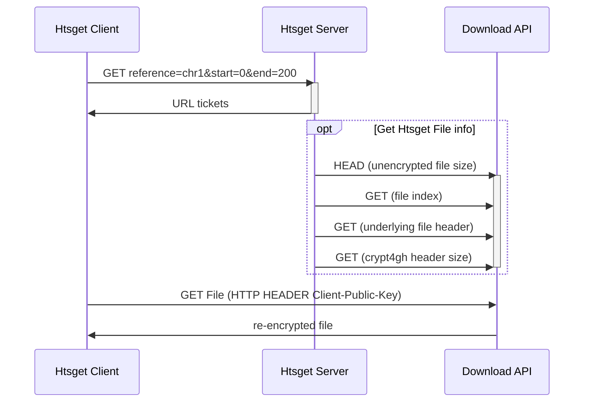

# Introduction

The European Genome-phenome Archive (EGA) [@EGA] and it's extension the
Federated EGA (FEGA) [@FEGA] are services for archiving and sharing personally
identifiable genetic and phenotypic data, while The Genomic Data Infrastructure
(GDI) [@GDI] project is enabling secondary use of genomic and phenotypic
clinical data across Europe. Both projects are focused on creating federated
and secure infrastructure for researchers to archive and share data with the
research community, to support further research. In the nordics we collaborate
on a sofware suite under the Nordic e-Infrastructure Collaboration(NeIC) [@NEIC]
umbrella called the Sensitive Data Archive to support these efforts.


This project focused on the data access part of the infrastructure. The
files are encrypted in the archives, using the crypt4gh standard [@crypt4gh].
Currently, we have a data access processes, where the files are either
decrypted on the server side and then transferred to the user or re-encrypted
server-side with the users public key and provided to the user in a dedicated
outbox. This process is cumbersome and requires a lot of manual intervention by
the archive operators. It's also not very granular, for example, in the case a
user only wants access to just a small region of the genomic files we still
provide the full reencrypted dataset, which is expensive in both human and
computational resources.


Htsget [@htsget] is a data access protocol allows that access to parts of files.
Before the Biohackathon event, there were no htsget servers that supported
partial access to encrypted data. Our goal of the project was to integrate the
htsget-rs [@htsget-rs] Rust server into the GDI starter kit and to extend it to
support GA4GH Passport authorized, re-encrypted access to partial files.


We also aimed to extend already existing client tools so they can access
encrypted data over the htsget protocol using GA4GH Passport and Visa standard,
which enhances the security of the data access interfaces.


# Results

In order to achieve the project goals, both htsget-rs and sda-download needed to be extened.
The following sections describe the work done on each of the services.


## HTSGet

In order to enable for random data access on encrypted files, we
extended htsget-rs [@htsget-rs] to work with the new version of the sda-download.
We developed the following sequence diagram for interactions between the server softwares.
In short, the client first communicates with the Rust server
to get information on what to download, and then downloads the expected data from the sda-download service.





## Extend sda-download to support re-encryption

We also extended the functionality of the sda-download service to support re-encryption of
requested files. This allows users to get files that are encrypted with their own
keypair instead of receiving just plain unencrypted files. To ensure the security of
the archive secret key (that is, to avoid keeping it in the htsget service, which is available directly from the
internet) we have implemented a small microservice (gRPC Server in the diagram)
that recieves the encrypted header and a public key, re-encrypts the file, and sends
it back to the user.


 ```mermaid
sequenceDiagram
    client->>sda-download: HTTP Header: Crypt4gh-Public-Key
    activate sda-download
    sda-download->>gRPC Server: Request: OldHeader, PublicKey
    activate gRPC Server
    gRPC Server->>sda-download: NewHeader
    deactivate gRPC Server
    sda-download->>client: encrypted Data
    deactivate sda-download
 ```


## Additional updates

Two docker compose files were developed in order to include the whole infrastructure for the sensitive data archive and the htsget-rs version. These compose files allow the users to make requests to the htsget and receive a response containing pointers to the requested parts of the data, which the client can then download and assemble.

The Sensitive Data Archive Command Line Interface (sda-cli) has a demo version of the htsget command.
This command, when provided with the public key of a user and (potentially) a region for a file, it makes the request to htsget, retrieves the results, requests the particular regions from the sda-download and then assembles these parts together.


# Conclusions and Future work

Some of the collaborators that joined our project were also members of the team developing the
htsget protocol for bioinformatics in Rust from the University of Melbourne (Center for Cancer Research).
This in person collaboration helped identifying the needs to achieve the project goal,
and to closely work together on developing the sda-download and
htsget server to meet those needs.

The project was focused on improving the data access part of the sensitive data archive infrastructure. The existing process
of data access was cumbersome: user receiving the whole file even when only a small part of it was needed.
To address this, the htsget-rs was extended to support access to encrypted data and it is planned to extend it further
by implementing the crypt4gh and enabling support for crypt4gh edit lists. The sda-download service was also
extended to support re-encryption of requested files and we further aim to
implement authentication of requests/tickets. This will allow the sda-download
service to fully trust that a request comes from the htsget-rs service, as well as
removing unnecessary bytes from the file. We also aim for a showcase where an
encrypted file will be read over the htsget protocol.

Furthermore, there are two additional focus areas for future development. First, we plan to implement random access of files in sda-download service.
Secondly, we aim to extend the sda-cli to automate
the key genaration for communication with htsget, by automatically generate a
key and send the public part to htsget.


# GitHub repositories

* [GenomicDataInfrastructure/starter-kit-storage-and-interfaces](https://github.com/GenomicDataInfrastructure/starter-kit-storage-and-interfaces)
* [GenomicDataInfrastructure/starter-kit-htsget](https://github.com/GenomicDataInfrastructure/starer-kit-htsget)
* [umccr/htsget-rs](https://github.com/umccr/htsget-rs)
* [neicnordic/sda-download](https://github.com/neicnordic/sda-download)
* [neicnordic/sensitive-data-archive](https://github.com/neicnordic/sensitive-data-archive)
* [NBISweden/sda-cli](https://github.com/NBISweden/sda-cli)


# Acknowledgements

We thank the organizers of the BioHackathon-Europe 2023 for the travel support and for the well planned event.


# References

