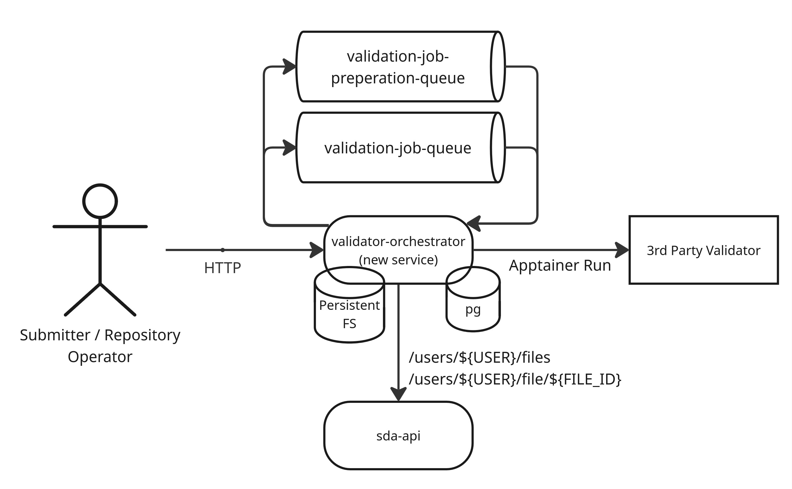

# Sensitive Data Archive - validator-orchestrator

The sda-validator-orchestrator is responsible for integrating with 3rd party apptainer validators, and for hosting an
API which allows the callers to see the available validators, to invocate validation of a set of file paths
belonging to a user, and to read the result for a specific validation request.

See [swagger_v1.yml](swagger_v1.yml) for the OpenAPI definition of the ValidatorOrchestratorAPI.

## High level

The following sections aims to describe to sda-validator-orchestrator on a high level

### Diagram



### "Components"

The sda-validator-orchestrator mainly consists of three "components", the HTTP server, job preparation workers, and job
workers.

#### HTTP server

The HTTP server implements the [ValidatorOrchestratorAPI](swagger_v1.yml) and allows for users and admins to request the
currently available validators,
request a set of files to be validated with a set of validators, and to fetch the results of a validation request.

The HTTP server will authenticate requests, expecting a Bearer token in the "Authorization" header, if not provided, not
valid, or not signed by any key configured by either
the [--jwt.pub-key-path or --jwt.pub-key-url configurations](#configuration) 401 (unauthorized) will be returned.
The HTTP server also enforces RBAC (role based access control) towards the available APIs on
the [ValidatorOrchestratorAPI](swagger_v1.yml), the RBAC policy is expected to be provided by
the [rbac.policy-file-path configuration].
example policy

```json
{
  "policy": [
    {
      "role": "admin",
      "path": "/admin/validate",
      "action": "POST"
    },
    {
      "role": "admin",
      "path": "/admin/result",
      "action": "GET"
    },
    {
      "role": "submission",
      "path": "/validators",
      "action": "GET"
    },
    {
      "role": "submission",
      "path": "/validate",
      "action": "POST"
    },
    {
      "role": "submission",
      "path": "/result",
      "action": "GET"
    }
  ],
  "roles": [
    {
      "role": "admin",
      "rolebinding": "submission"
    },
    {
      "role": "testu@lifescience-ri.eu",
      "rolebinding": "admin"
    },
    {
      "role": "EXAMPLE_TOKEN_SUBJECT",
      "rolebinding": "admin"
    },
    {
      "role": "EXAMPLE_TOKEN_SUBJECT_2",
      "rolebinding": "submission"
    }
  ]
}
```

The port the HTTP server is hosted on can be configured with the [--api-port configuration](#configuration).

The HTTP server communicates with the [sda-api](../../sda/cmd/api/api.md) using the `/users/${USER}/files` API to ensure
requested files exists, that they belong to the user, and to get additional information about the files such as their "
sda id" and the file size.
The sda-api is expected to be hosted on the URL provided by the [--sda-api-url configuration](#configuration)
The sda-api requires authentication, the sda-validator-orchestrator will authenticate calls towards the sda-api with the
token configured by the [--sda-api-token configuration](#configuration).

The HTTP server implementation will publish job preparations messages to the rabbitmq queue configured by
the [--job-preparation-queue configuration](#configuration).

#### Job Preparation Worker

Current main responsibility is to download the files that are to be validated into a created directory for this
validation request in the configured validation work directory[see validation-work-dir configuration](#configuration).

Files are downloaded from the [sda-api](../../sda/cmd/api/api.md) using the `/users/${USER}/file/${FILE_ID}` API which
is expected to be hosted on the URL provided by the [--sda-api-url configuration](#configuration)
The sda-api requires authentication, the sda-validator-orchestrator will authenticate calls towards the sda-api with the
token configured by the [--sda-api-token configuration](#configuration).

Before downloading the files the job preparation workers will ensure that sufficient space is available in the volume,
and if it can not reserve space for all files, it will abort and reconsume the message until other validations has
finished such that sufficient space can be reserved for the requested files.

Once files has been downloaded it will send a validation job for the files for each validator requested.

Amount of job preparation workers in a sda-validator-orchestrator can be configured by
the [--job-preparation-worker-count configuration](#configuration).
Job preparation workers will consume from the rabbitmq queue specified by
the [--job-preparation-queue configuration](#configuration).
Job preparation workers will publish job messages to the rabbitmq queue specified by
the [--job-queue configuration](#configuration).

#### Job worker

The main responsibly of a job worker is to invocate the 3rd Party Validators(Apptainer) with the required inputs and to
read the result and store it in the [file_validation_job table](#postgres) postgres database.

After each job is completed it checks if all jobs in a validation are finished and cleans up the files from the file
system for the validation.

Amount of job workers in a sda-validator-orchestrator can be configured by
the [--job-worker-count configuration](#configuration)
Job workers will consume from the rabbitmq queue specified by the [--job-queue configuration](#configuration)

### Postgres

The sda-validator-orchestrator requires a Postgres database connection, this connection is setup with
the [--database.* configurations](#configuration).
And [file_validation_job table](database/postgres/initdb.d/01_create_table_file_validation_job.sql) is expected to
exist in the database && schema provided in the configuration.

### Rabbitmq Broker

The sda-validator-orchestrator requires a rabbitmq connection, this connection is setup with
the [--broker.* configurations](#configuration)..

Each job preparation and job worker will start consuming messages from the configured queues based
on [--job-preparation-queue configuration](#configuration) and [--job-queue configuration](#configuration).
It will publish messages to the exchange configured by the [--broker.exchange configuration] with routing keys based on
the [--job-preparation-queue configuration](#configuration) and [--job-queue configuration](#configuration).

### File system

The sda-validator-orchestrator expects a file system to be available in the [--validation-work-dir](#configuration),
this is the directory where files will be downloaded and stored for the 3rd Party Validators to access.

It is recommended that this volume is persistent such that the sda-validator-orchestrator is more resilient for
restarts, etc, and for scaling.

The sda-validator-orchestrator will ensure that sufficient space is available in
the [--validation-work-dir](#configuration) volume by reserving space before proceeding with the downloading of the
file, and one set of files for a validation can not exceed the [--validation-file-size-limit](#configuration)
configuration.

## Configuration

| Name:                          | Env variable:                | Type:   | Usage:                                                                                                                                                                                       | Default Value:             |         
|--------------------------------|------------------------------|---------|----------------------------------------------------------------------------------------------------------------------------------------------------------------------------------------------|----------------------------|                               
| --log.level                    | LOG_LEVEL                    | string  | Set the log level, supported levels: PANIC, FATAL, ERROR, WARN, INFO, DEBUG, TRACE                                                                                                           | 0                          |        
| --api-port                     | API_PORT                     | int     | Port to host the ValidationAPI server at                                                                                                                                                     | 0                          |        
| --broker.ca-cert               | BROKER_CA_CERT               | string  | The broker ca cert                                                                                                                                                                           |                            |        
| --broker.client-cert           | BROKER_CLIENT_CERT           | string  | The cert the client will use in communication with the broker                                                                                                                                |                            |        
| --broker.client-key            | BROKER_CLIENT_KEY            | string  | The key for the client cert the client will use in communication with the broker                                                                                                             |                            |        
| --broker.exchange              | BROKER_EXCHANGE              | string  | The exchange the client will use when publishing messages                                                                                                                                    |                            |        
| --broker.host                  | BROKER_HOST                  | string  | The host the broker is served on                                                                                                                                                             |                            |        
| --broker.password              | BROKER_PASSWORD              | string  | Password to used to authenticate with in communication with broker                                                                                                                           |                            |        
| --broker.port                  | BROKER_PORT                  | int     | The port the broker is served on                                                                                                                                                             | 0                          |        
| --broker.prefetch-count        | BROKER_PREFETCH_COUNT        | int     | How many messages the broker will try to keep on the network for the consumers before receiving delivery acks                                                                                | 2                          |        
| --broker.server-name           | BROKER_SERVER_NAME           | string  | ServerName is used to verify the hostname on the returned certificates if ssl is enabled                                                                                                     |                            |        
| --broker.ssl                   | BROKER_SSL                   | bool    | If the broker connection should use ssl                                                                                                                                                      | true                       |        
| --broker.user                  | BROKER_USER                  | string  | Username to used to authenticate with in communication with broker                                                                                                                           |                            |        
| --broker.verify-peer           | BROKER_VERIFY_PEER           | bool    | If the broker connection should use verify-peer, if true client cert, and client key needs to be provided                                                                                    | false                      |        
| --broker.vhost                 | BROKER_VHOST                 | string  | The virtual host name to connect to                                                                                                                                                          |                            |        
| --config-file                  | CONFIG_FILE                  | string  | Set the direct path to the config file                                                                                                                                                       |                            |        
| --config-path                  | CONFIG_PATH                  | string  | Set the path viper will look for the config file at                                                                                                                                          | .                          |        
| --database.ca-cert             | DATABASE_CA_CERT             | string  | The database ca cert                                                                                                                                                                         |                            |        
| --database.client-cert         | DATABASE_CLIENT_CERT         | string  | The cert the client will use in communication with the database                                                                                                                              |                            |        
| --database.client-key          | DATABASE_CLIENT_KEY          | string  | The key for the client cert the client will use in communication with the database                                                                                                           |                            |        
| --database.host                | DATABASE_HOST                | string  | The host the postgres database is served on                                                                                                                                                  |                            |        
| --database.name                | DATABASE_NAME                | string  | Database to connect to                                                                                                                                                                       | sda_validator_orchestrator |        
| --database.password            | DATABASE_PASSWORD            | string  | Password to used to authenticate with in communication with database                                                                                                                         |                            |        
| --database.port                | DATABASE_PORT                | int     | The port the database is served on                                                                                                                                                           | 0                          |        
| --database.schema              | DATABASE_SCHEMA              | string  | Database schema to use as search path                                                                                                                                                        | sda_validator_orchestrator |        
| --database.ssl-mode            | DATABASE_SSL_MODE            | string  | The database ssl mode                                                                                                                                                                        | disable                    |        
| --database.user                | DATABASE_USER                | string  | Username to used to authenticate with in communication with database                                                                                                                         |                            |        
| --job-preparation-queue        | JOB_PREPARATION_QUEUE        | string  | The queue for job preparation workers                                                                                                                                                        |                            |        
| --job-preparation-worker-count | JOB_PREPARATION_WORKER_COUNT | int     | Amount of job preparation workers to run                                                                                                                                                     | 1                          |        
| --job-queue                    | JOB_QUEUE                    | string  | The queue for validation job workers                                                                                                                                                         |                            |        
| --job-worker-count             | JOB_WORKER_COUNT             | int     | Amount of job workers to run                                                                                                                                                                 | 2                          |        
| --jwt.pub-key-path             | JWT_PUB_KEY_PATH             | string  | Local file containing jwk for authentication for API authentication                                                                                                                          |                            |        
| --jwt.pub-key-url              | JWT_PUB_KEY_URL              | string  | Url for fetching the elixir JWK for API authentication                                                                                                                                       |                            |        
| --rbac.policy-file-path        | RBAC_POLICY_FILE_PATH        | string  | Path to file containing rbac policy                                                                                                                                                          | /rbac/rbac.json            |        
| --sda-api-token                | SDA_API_TOKEN                | string  | Token to authenticate when calling the sda-api service                                                                                                                                       |                            |        
| --sda-api-url                  | SDA_API_URL                  | string  | Url to the sda-api service                                                                                                                                                                   |                            |        
| --validation-file-size-limit   | VALIDATION_FILE_SIZE_LIMIT   | string  | The human readable size limit of files in a single validation, this should equal the size of the size of the validation-work-dir. Supported abbreviations: B, kB, MB, GB, TB, PB, EB, ZB, YB | 100GB                      |        
| --validation-work-dir          | VALIDATION_WORK_DIR          | string  | Directory where application will manage data to be used for validation                                                                                                                       | /validators                |        
| --validator-paths              | VALIDATOR_PATHS              | strings | The paths to the available validators, in comma separated list                                                                                                                               | []                         |

## Open API generation

To generate a go-gin-server template and helper structs, run the following commands, this command generates some
additional files which are not needed and are removed as part of the following command

``` bash 
rm -rf api/openapi_interface/*
openapi-generator-cli generate -g go-gin-server -i swagger_v1.yml -o api/openapi_interface --openapi-normalizer SET_TAGS_FOR_ALL_OPERATIONS=validator_orchestrator --additional-properties=interfaceOnly=true
rm -rf api/openapi_interface/.openapi-generator
rm -rf api/openapi_interface/api
rm -rf api/openapi_interface/Dockerfile
rm -rf api/openapi_interface/go.*
rm -rf api/openapi_interface/main.go
rm -rf api/openapi_interface/.openapi-generator-ignore
rm -rf api/openapi_interface/go/README.md
mv api/openapi_interface/go/* api/openapi_interface/
rm -rf api/openapi_interface/go/
```

## Build and deploy

The [Dockerfile](Dockerfile) will produce an image containing the sda-validator-orchestrator and only its dependant
binaries by utilising the [distroless image](gcr.io/distroless/static-debian12.

The main dependant binary is [Apptainer](#apptainer) which is described in its section.

To deploy the image see the [.kube folder](.kube) for an example of the kubernetes resources which populates
the [sda-validator-orchestrator configuration](#configuration), and mounts an ephemeral volume as the validation work
directory, in a production environment its is recommended that this volume is persistent such that the
sda-validator-orchestrator is more resilient for restarts, etc, and for scaling.

### Apptainer

[Apptainer](https://apptainer.org/) is downloaded into the final image from a precompiled debian 13 binary, which then
utilises the [apptainer.conf](apptainer.conf) to override the following default configration:

- allow setuid = yes (default: no)
    - Reason: Only allow apptainer to run in unprivileged user namespaces.
- config resolv_conf = no (default: yes)
    - Reason: Apptainer should not have access to internet, so no reason to config resolv.conf.
- mount proc = no (default: yes)
    - Reason: No additional mounting besides files to be validated.
- mount sys = no (default: yes)
    - Reason: No additional mounting besides files to be validated.
- mount dev = no (default: yes)
    - Reason: No additional mounting besides files to be validated.
- mount home = no (default: yes)
    - Reason: No additional mounting besides files to be validated.
- mount tmp = no (default: yes)
    - Reason: No additional mounting besides files to be validated.
- enable fusemount = no (default: yes)
    - Reason: Fuse mounting is not needed
- mount slave = no (default: yes)
    - Reason: No additional mounting besides files to be validated.
- Remove bind paths:
    - bind path = /etc/localtime
        - Reason: No additional mounting besides files to be validated.
    - bind path = /etc/hosts
        - Reason: Apptainer should not have access to internet, so no reason to mount /etc/hosts