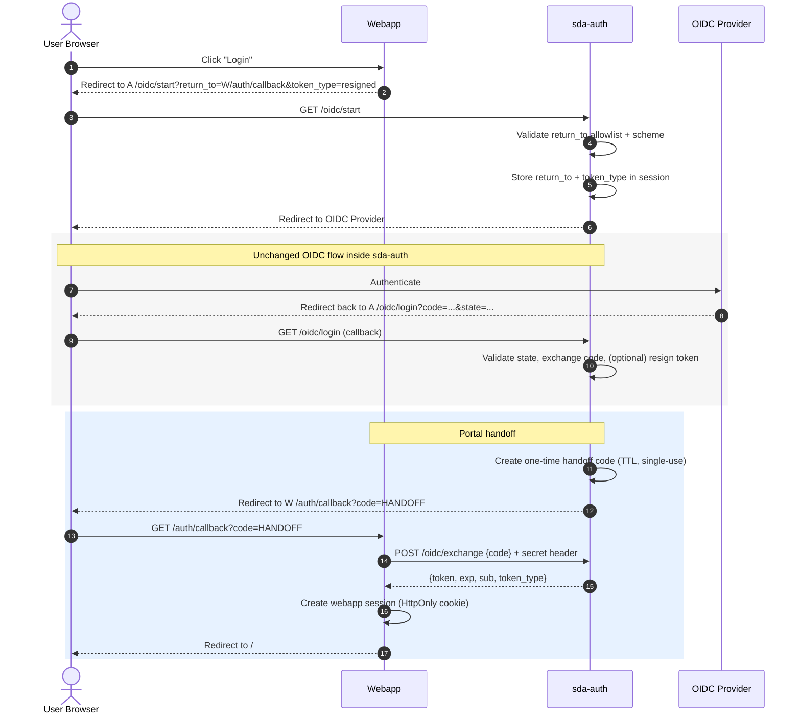

# Brokered OIDC login via `sda-auth` with one-time code handoff to `sda-download-UI` webapp

## Context

We need a simple web login experience for a server-side web application (e.g., Next.js) that:

1. Uses the existing `sda-auth` service for authentication.
2. Redirects the user back to the webapp after successful authentication.
3. Makes a JWT (raw OIDC access token or optionally a resigned token issued by `sda-auth`) available **server-side** in the webapp so it can be used in subsequent API calls to `sda-download`.
4. Minimizes changes to `sda-auth` and avoids persisting handoff state to the database (no schema changes).

`sda-auth` currently supports interactive OIDC login and can produce tokens, but it does not provide a standard mechanism to redirect back to an external relying party with a token or code. It primarily renders HTML templates and offers a JSON endpoint (`/oidc/cors_login`) that is not directly suitable for a clean redirect-back flow.

## Proposal

Adopt a brokered handoff flow where `sda-auth` performs OIDC login and then issues a **short-lived, single-use handoff code** that can be exchanged for a token by the webapp (a “code flow” between the webapp and `sda-auth`).

### Summary of changes (current implementation)

`sda-auth` has been extended with:

- `GET /oidc/start?return_to=...&token_type=raw|resigned`
  - Validates `return_to` against a configured allowlist (and enforces HTTPS unless explicitly allowed).
  - Stores `return_to` and `token_type` in the Iris session.
  - Initiates the existing OIDC flow (redirects to IdP via existing `/oidc` behavior).

- Modified existing callback `GET /oidc/login`
  - If `return_to` exists in the session:
    - Does **not** render HTML.
    - Creates a one-time code mapped to the selected token (raw/resigned) in a TTL in-memory store.
    - Redirects the browser to `return_to?code=...` (or `&code=...` if query params already exist).
    - Clears `return_to` + `token_type` from session (one-time).
  - If `return_to` does not exist:
    - Preserves current behavior and renders templates.

- `POST /oidc/exchange`
  - Exchanges `{code}` for `{token, exp, sub, token_type}` and invalidates the code (single-use).
  - Protected by a shared secret header:
    - Client must send `X-SDA-AUTH-EXCHANGE-SECRET: <secret>`
    - Endpoint is disabled (not registered) if `auth.exchange_secret` is not set.

### Feature gating

To reduce unnecessary background work and avoid unused state:

- `/oidc/start` is only registered if `auth.return_to_allowlist` is configured (non-empty after normalization).
- `/oidc/exchange` is only registered if `auth.exchange_secret` is set (non-empty after trimming).
- The in-memory handoff store (and its cleanup goroutine) is only created if **both** are enabled.

## Expected webapp behavior

- Webapp login button redirects user to `sda-auth /oidc/start` with a `return_to` callback on the webapp.
- Webapp callback endpoint:
  - reads `code`
  - calls `sda-auth /oidc/exchange` server-to-server (with the shared secret header)
  - stores the token server-side (e.g., encrypted HttpOnly cookie or server-side session)
  - redirects user to the homepage without the code in the URL

## Rationale

This approach:

- Avoids rewriting an OIDC client in the webapp and keeps `sda-auth` as the central OIDC broker.
- Avoids passing JWTs in URLs or requiring browser-side token storage.
- Provides a clean integration pattern for server-side applications.
- Is backwards-compatible: existing interactive UI behavior remains unchanged when not using `/oidc/start`.

## Decision Drivers

- Must go through `sda-auth` for authentication.
- JWT must be available server-side in the webapp for downstream API calls.
- Prefer minimal and backwards-compatible changes to `sda-auth`.
- Avoid browser storage of JWTs.
- Different origins (subdomains); redirect-based integration preferred.

## Architecture / Flow

### Actors

- User browser
- `sda-auth` at `sda-auth.example.se`
- Webapp at `download-portal.example.se`
- OIDC Provider

### Sequence

1. Browser → Webapp: user clicks Login
2. Webapp → Browser: redirect to  
   `https://sda-auth.example.se/oidc/start?return_to=https://download-portal.example.se/auth/callback&token_type=resigned`
3. Browser → `sda-auth`: `/oidc/start` validates and stores `return_to` + `token_type` in session, then redirects to IdP
4. Browser ↔ IdP: user authenticates
5. IdP → Browser → `sda-auth`: redirects to `/oidc/login?code=...&state=...`
6. `sda-auth` verifies state, exchanges code, obtains identity/tokens, optionally resigns token, then:
   - generates one-time handoff code
   - stores `{code -> token metadata}` in TTL store (single-use)
   - redirects to `return_to?code=<handoff_code>`
7. Browser → Webapp: `/auth/callback?code=...`
8. Webapp backend → `sda-auth`: `POST /oidc/exchange` with `{code}` and header `X-SDA-AUTH-EXCHANGE-SECRET`
9. `sda-auth` returns token; invalidates code
10. Webapp sets secure session and redirects browser to `/`

## Implementation Notes

- `sda-auth` uses an injected `HandoffStore` interface with a `MemoryHandoffStore` implementation:
  - TTL (configured)
  - max entries (configured); returns an error when full
  - single-use `GetAndDelete`
  - random URL-safe codes
  - periodic cleanup goroutine (only started when handoff is enabled)

- Token selection supports:
  - `token_type=raw` → raw OIDC token
  - `token_type=resigned` → resigned token (if enabled)

## Security Considerations

### What is exposed to the browser?

- The **handoff code** is in the webapp callback URL query parameter.
- The **JWT is not** exposed in the URL or HTML by this broker flow (unless the user uses the existing template endpoints).

### Mitigations

- Code is:
  - short-lived (TTL)
  - single-use
- Webapp callback should:
  - perform exchange server-side immediately
  - redirect to a clean URL (no code) to avoid persistence in address bar/history
- `return_to` protection:
  - enforced allowlist validation in `/oidc/start`
  - HTTPS enforced unless explicitly configured otherwise
- Exchange endpoint protection:
  - shared secret header `X-SDA-AUTH-EXCHANGE-SECRET`
  - endpoint disabled if secret is not set
  - (recommended) additionally restrict by network policy/ingress so only the webapp can call it

### Cookies / SameSite

- State/session cookies remain scoped to `sda-auth` and are used only between browser and `sda-auth`.
- The webapp maintains its own session cookie (HttpOnly, Secure, SameSite=Lax).

## Operational Considerations / Risks

### Multi-replica `sda-auth`

Because the handoff store is in-memory:

- If `sda-auth` runs multiple replicas behind a load balancer, the callback request and exchange request may hit different replicas, causing “code not found”.

**Mitigations (choose one for production):**
1. Sticky sessions at ingress for `sda-auth` (cookie affinity), or
2. Single replica, or
3. Replace in-memory store with shared storage (e.g., Redis/DB) (not currently implemented).

### Failure modes

- Expired/invalid code → webapp callback fails; user must retry login.
- Exchange endpoint unreachable → webapp cannot establish session.
- OIDC errors handled as today.

## Alternatives Considered (rejected)

1. Use `/oidc/cors_login` + browser JS relay
   - pushes token handling into browser and complicates SSR.
2. Direct OIDC in the webapp (bypass `sda-auth`)
   - would lose central broker behavior and resigned-token functionality.

## Consequences

### Positive
- Meets requirements: brokered login, redirect-back, server-side token availability.
- Minimal and backwards-compatible `sda-auth` changes.
- Supports both raw and resigned tokens.
- Avoids exposing JWT in browser URL.

### Negative / Tradeoffs
- In-memory store requires sticky sessions or single replica for HA.
- New endpoints must be secured (allowlist + exchange secret).
- Adds coupling: webapp depends on `sda-auth`.

## Sequence diagram (Mermaid)



## How to test (local)

From repo root:

1. Build and start the stack:
   ```sh
   make build-sda
   make sda-s3-up
   ```

2. Create `callback.html`:

   ```html
   <form action="http://localhost:8801/oidc/start" method="get">
     <input type="hidden" name="return_to" value="http://localhost:3000/callback.html">
     <input type="hidden" name="token_type" value="raw">
     <button type="submit" style="font-size:1.25rem;padding:.75rem 1.25rem;">Login</button>
   </form>
   ```

3. Serve it:
   ```sh
   python3 -m http.server 3000
   ```

4. Open in browser: `http://localhost:3000/callback.html`
   Click Login, complete LS-AAI login, and you should be redirected back with `?code=...`.

5. Exchange the code server-to-server (replace `<copied_code>` and `<exchange_secret>`):

   ```sh
   curl -s http://localhost:8801/oidc/exchange \
     -H 'Content-Type: application/json' \
     -H "X-SDA-AUTH-EXCHANGE-SECRET: <exchange_secret>" \
     -d '{"code":"<copied_code>"}'
   ```

6. Cleanup:
   ```sh
   make sda-s3-down
   ```

Notes:
- `/oidc/start` will be disabled unless `return_to` allowlist is configured.
- `/oidc/exchange` will be disabled unless `auth.exchange_secret` is set.
- Local HTTP testing of `/oidc/start` requires `AllowInsecureReturnTo=true` and an allowlist that includes the `http://` return URL (only for local/dev).