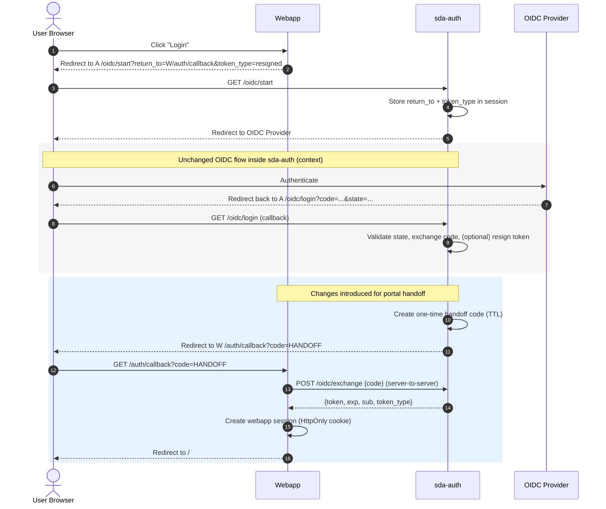

# Brokered OIDC login via `sda-auth` with one-time code handoff to `sda-download-UI` webapp

(for instructions on how to test the proof of concept got to the last section)

## Context

We need a simple web login experience for a server-side web application (e.g., Next.js) that:

1. Uses the existing `sda-auth` service as the authentication.
2. Redirects the user back to the webapp after successful authentication.
3. Makes a JWT (raw OIDC access token or optionally a resigned token issued by `sda-auth`) available **server-side** in the webapp so it can be used in subsequent API calls to `sda-download`.
4. Minimizes changes to `sda-auth` and avoids persisting state to the database for the handoff mechanism so to avoid any schema changes as well.

`sda-auth` currently supports interactive OIDC login and can produce tokens, but it does not provide a standard mechanism to redirect back to an external relying party with a token or code. It primarily renders HTML templates and offers a JSON endpoint (`/oidc/cors_login`) that is not directly suitable for a clean redirect-back flow.

## Proposal

Adopt a broker handoff flow where `sda-auth` performs OIDC login and then issues a **short-lived, single-use handoff code** that can be exchanged for a token by the webapp. In essence, a code flow between the webapp and `sda-auth`.

### Summary of changes

- Extend `sda-auth` with:
  - `GET /oidc/start?return_to=...&token_type=raw|resigned`
    - Stores `return_to` and `token_type` in session and initiates existing OIDC flow.
  - Modify existing callback `GET /oidc/login`
    - If a `return_to` exists, do not render HTML; instead create a one-time code mapped to the selected token (raw/resigned) in an in-memory store and redirect to `return_to?code=...`.
    - If no `return_to` exists, preserve current behavior and render templates.
  - `POST /oidc/exchange`
    - Exchanges `{code}` for `{token, exp, sub, token_type}` and invalidates the code (single-use).
- The handoff store is injected into `AuthHandler` and implemented as a TTL-based in-memory map (implications of this discussed below).

### Expected webapp behavior

- Webapp login button redirects user to `sda-auth /oidc/start` with a `return_to` callback on the webapp.
- Webapp callback endpoint:
  - Reads `code`
  - Calls `sda-auth /oidc/exchange` server-to-server
  - Stores token server-side (e.g., encrypted HttpOnly cookie or server-side session)
  - Redirects user to the homepage without the code in the URL

## Rationale

This approach:

- Avoids re-writing a webapp OIDC client and keeps `sda-auth` as the central OIDC broker.
- Avoids passing JWTs in URLs or requiring browser-side token storage.
- Provides a clean integration pattern for server-side applications.
- Requires minimal changes to `sda-auth` and keeps existing UI behavior intact for other users.

## Decision Drivers

- Must go through `sda-auth` for authentication.
- JWT must be available server-side in the webapp for downstream API calls.
- Prefer minimal and backwards-compatible changes to `sda-auth`.
- Avoid browser storage of JWTs (security).
- Subdomains share the same registrable domain (e.g. `sda-auth.example.se`, `sda-download.example.se`, `download-portal.example.se`), but are different origins; redirect-based integration preferred.

## Architecture / Flow

### Actors

- User browser
- `sda-auth` at `sda-auth.example.se`
- Webapp at `download-portal.example.se`
- OIDC Provider

### Sequence

1. Browser → Webapp: user clicks Login
2. Webapp → Browser: redirect to  
   `https://sda-auth.example.se/oidc/start?return_to=https://download-portal.example.se/auth/callback&token_type=resigned`
3. Browser → `sda-auth`: `/oidc/start` stores `return_to` + `token_type` in Iris session, then redirects to IdP (existing `/oidc` behavior)
4. Browser ↔ IdP: user authenticates
5. IdP → Browser → `sda-auth`: redirects to `/oidc/login?code=...&state=...`
6. `sda-auth` verifies state, exchanges code, obtains identity/tokens, optionally resigns token (existing logic), then:
   - Generates one-time handoff code
   - Stores `{code -> token metadata}` in TTL store (single-use)
   - Redirects to `return_to?code=<handoff_code>`
7. Browser → Webapp: `/auth/callback?code=...`
8. Webapp backend → `sda-auth` backend: `POST /oidc/exchange` with `{code}`
9. `sda-auth` returns token; invalidates code
10. Webapp sets secure session (HttpOnly cookie) and redirects browser to `/`

## Implementation Notes (Proof of Concept)

- `sda-auth` uses an injected `HandoffStore` interface with a `MemoryHandoffStore` implementation:
  - TTL (e.g., 2 minutes)
  - single-use `GetAndDelete`
  - random URL-safe codes
- Token selection supports:
  - `token_type=raw` → `OIDCID.RawToken`
  - `token_type=resigned` → `OIDCID.ResignedToken` (falls back to raw if resigning disabled / identical)

## Security Considerations

### What is exposed to the browser?

- The **handoff code** is in the callback URL query parameter.
- The **JWT is not** exposed in the URL or HTML by this broker flow (unless the user uses existing template endpoints).

### Mitigations

- Code is:
  - short-lived (TTL)
  - single-use
- Webapp callback should:
  - perform exchange server-side immediately
  - redirect to a clean URL (no code) to avoid persistence in address bar/history
- For production hardening (recommended):
  - Add strict allowlist validation for `return_to` in `sda-auth` to prevent open redirects.
  - Protect `/oidc/exchange`:
    - require a shared secret header (e.g., `X-EXCHANGE-SECRET`), and/or
    - restrict by network policy/ingress so only the webapp can call it.
  - Add `Referrer-Policy: no-referrer` (or `same-origin`) on the webapp callback endpoint to avoid referrer leakage.

### Cookies / SameSite

- The state/session cookies remain scoped to `sda-auth.example.se` and are used only between browser and `sda-auth`.
- The webapp maintains its own session cookie (HttpOnly, Secure, SameSite=Lax).

## Operational Considerations / Risks

### Multi-replica `sda-auth`

Because the handoff store is in-memory:

- If `sda-auth` runs with multiple replicas behind a load balancer, the callback request and the exchange request may hit different replicas, causing “code not found”.

**Mitigations (choose one for production):**

1. Configure sticky sessions on ingress for `sda-auth.example.se` (cookie affinity), or
2. Run `sda-auth` as a single replica, or
3. Replace the in-memory store with a shared store (volume or DB table) — not chosen for PoC.

### Failure modes

- Expired/invalid code → webapp callback fails; user must retry login.
- Exchange endpoint unreachable → webapp cannot establish session.
- OIDC errors handled as today (authentication fails).

## Alternatives Considered (but rejected)

1. **No `sda-auth` changes; use `/oidc/cors_login` and browser JS**  
   - Requires JS on `sda-auth` origin to relay token (postMessage), or requires token handling in browser.
   - Harder to make server-side and clean redirect-back flow.
   - Rejected due to security/complexity and mismatch with SSR token requirement.

2. **Directly integrate OIDC in the webapp (bypass `sda-auth`)**  
   - Would simplify integration, but then we do not use a centralized OIDC and also lose resigned-token functionality.

## Consequences

### Positive

- Meets functional requirements: brokered login, redirect-back, server-side token availability.
- Minimal and backwards-compatible `sda-auth` modifications.
- Supports both raw and resigned tokens.
- Avoids exposing JWT to browser URLs.

### Negative / Tradeoffs

- In-memory store requires sticky sessions or single replica for production.
- Adds new endpoints to `sda-auth` that must be secured (exchange + return_to validation).
- Add `sda-auth` dependency to webapp.

## Next Steps / Action Items

- [ ] Implement strict `return_to` allowlist in `sda-auth` configuration.
- [ ] Add authentication/authorization for `/oidc/exchange` (shared secret header or network policy).
- [ ] Decide production strategy for multi-replica support:
  - sticky sessions or shared state somehow
- [ ] Implement webapp callback as server-side exchange + redirect (remove code from URL).

## Sequence diagram (Mermaid)



## How to test it

Move to the root of this repo and run `make build-sda` to build the images. Then `make sda-s3-up` to deploy the containers locally.

Create a file `callback.html` with the following contents:

```html
<form action="http://localhost:8801/oidc/start" method="get">
  <input type="hidden" name="return_to" value="http://localhost:3000/callback.html">
  <input type="hidden" name="token_type" value="raw">
  <button type="submit" style="font-size:1.25rem;padding:.75rem 1.25rem;">Login</button>
</form>
```

and serve it:

```python
python3 -m http.server 3000
```

Open a browser at: `http://localhost:3000/callback.html` and press the Login button, complete the LS-AAI login and after pressing Consent you should be redirected back.

Coppy the code from the browser's URL and paste it in the following terminal command:

```shell
curl -s http://localhost:8801/oidc/exchange -H 'Content-Type: application/json' -d '{"code":"<copied_code>>"}'
```

You should get a json response containing the token. Run `make sda-s3-down` to cleanup.