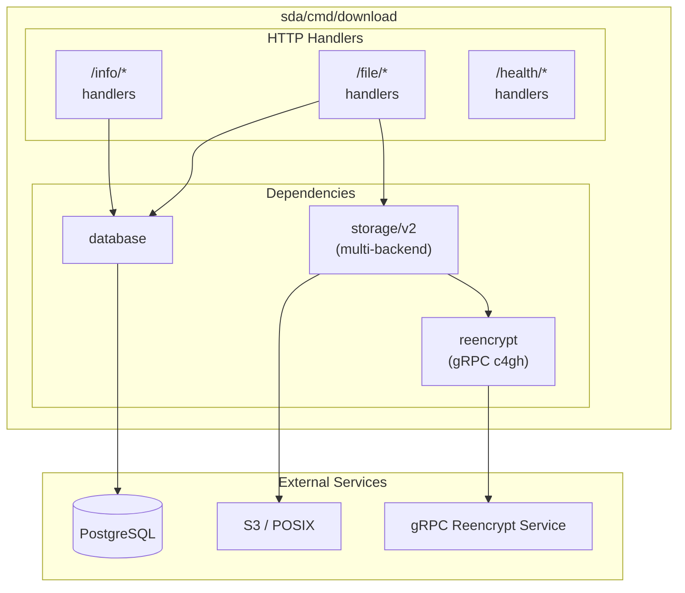

# Implementation Plan: New Download Service

> **Issue:** [#1680 - Create the new download service](https://github.com/neicnordic/sensitive-data-archive/issues/1680)  
> **Related:** [#2023 - Create a diagram for the new download service](https://github.com/neicnordic/sensitive-data-archive/issues/2023)  
> **Base branch:** `feature/multiple-backends-wip` (PR #2162)

## Summary

Create a new download service within `sda/cmd/download/` that:

- Uses the new `storage/v2` package for multi-backend support
- Follows v2 patterns from `sda-validator/orchestrator`
- Implements the public API defined in `swagger_v1.yml`
- Replaces `sda-download/` over time

## Decisions Made

| Question                | Decision              | Rationale                                                  |
| ----------------------- | --------------------- | ---------------------------------------------------------- |
| Base on storage/v2?     | ✅ Yes                | Recommended by Karl, provides multi-backend support        |
| Separate go.mod?        | ❌ No                 | Build within `sda/go.mod` to reuse `internal/` packages    |
| Unencrypted downloads?  | ❌ Not supported      | New service requires `public_key` header (more secure)     |
| Two download endpoints? | ✅ Yes                | Bigpicture needs file path lookup, others use file ID      |
| Deprecate sda-download? | ⏳ Later              | Keep until new service has all functionality + HTSget      |
| HTSget support?         | 📋 Separate issue     | Out of scope for initial implementation                    |
| App code in internal/?  | ❌ No                 | App-specific code in `cmd/<app>/`, not `internal/`         |
| Shared config pattern?  | ✅ internal/config/v2 | Apps register their config, follows validator-orchestrator |
| Per-app database pkg?   | ✅ Yes                | Each app has own DB queries, reduces cross-app coupling    |

## API Endpoints (from swagger_v1.yml)

### Info Endpoints

| Method | Path                            | Description                                   |
| ------ | ------------------------------- | --------------------------------------------- |
| GET    | `/info/datasets`                | List datasets user has access to              |
| GET    | `/info/dataset?dataset=X`       | Get dataset metadata (date, file count, size) |
| GET    | `/info/dataset/files?dataset=X` | List files in a dataset                       |

### Download Endpoints

| Method | Path                         | Description                                        |
| ------ | ---------------------------- | -------------------------------------------------- |
| GET    | `/file/{fileId}`             | Download file by stable ID (supports Range header) |
| GET    | `/file?dataset=X&fileId=Y`   | Download file by ID with dataset context           |
| GET    | `/file?dataset=X&filePath=Y` | Download file by submitted path (Bigpicture)       |

### Health Endpoints

| Method | Path            | Auth | Description                                     |
| ------ | --------------- | ---- | ----------------------------------------------- |
| GET    | `/health/ready` | No   | Detailed health check (db, storage, grpc, oidc) |
| GET    | `/health/live`  | No   | Simple liveness probe                           |

## Architecture



## File Structure

> **Architecture Decision (from @KarlG-nbis):** Application-specific code lives in `cmd/<app>/`, NOT in
> `internal/`. The `internal/` directory contains only shared packages that support applications.
> Each application has its own database package with app-specific queries.

```
sda/
├── cmd/
│   └── download/
│       ├── main.go                  # Entry point
│       ├── swagger_v1.yml           # API spec (existing)
│       ├── IMPLEMENTATION_PLAN.md   # This file
│       │
│       ├── config/                  # App-specific config registration
│       │   └── config.go
│       ├── database/                # App-specific DB queries
│       │   ├── database.go
│       │   └── database_test.go
│       ├── handlers/
│       │   ├── handlers.go          # Handler struct + route registration
│       │   ├── options.go           # Options pattern for dependencies
│       │   ├── info.go              # /info/* endpoint handlers
│       │   ├── file.go              # /file/* endpoint handlers
│       │   └── health.go            # /health/* endpoint handlers
│       ├── health/
│       │   ├── health.go            # gRPC health server for K8s probes
│       │   └── health_test.go
│       ├── middleware/
│       │   ├── auth.go              # OIDC/visa authentication
│       │   └── auth_test.go
│       ├── reencrypt/
│       │   ├── reencrypt.go         # gRPC client for re-encryption
│       │   └── reencrypt_test.go
│       └── streaming/
│           ├── streaming.go         # File streaming with Range header
│           └── streaming_test.go
│
└── internal/
    ├── storage/v2/                  # Shared storage abstraction
    │
    └── config/v2/                   # Shared config registration framework
        ├── config.go                # Allows apps to register their own config
        └── config_test.go
```

## Implementation Phases

### Phase 1: Project Setup ✅

- [x] Create branch from `feature/multiple-backends-wip`
- [x] Set up directory structure under `sda/cmd/download/`
- [x] Create `main.go` with basic server setup

### Phase 2: Configuration ✅

- [x] Create `internal/config/v2/config.go` (shared framework if not exists)
- [x] Create `cmd/download/config/config.go` (app-specific registration)
- [x] Use flag-based registration pattern (like sda-validator/orchestrator)
- [x] Configuration options:
  - `api.host`, `api.port`
  - `api.server-cert`, `api.server-key`
  - `grpc.*` (reencrypt service connection)
  - `oidc.*` (authentication)
  - `session.*` (session caching)
  - `db.*` (database connection)

### Phase 3: Database Layer ✅

- [x] Create `cmd/download/database/database.go` (app-specific queries)
- [x] Required queries (specific to download service):
  - `GetUserDatasets(ctx, visas)` - datasets from user's visas
  - `GetDatasetInfo(ctx, datasetID)` - metadata (date, file count, total size)
  - `GetDatasetFiles(ctx, datasetID)` - list files with metadata
  - `GetFileByID(ctx, fileID)` - file info for download
  - `GetFileByPath(ctx, datasetID, filePath)` - lookup by submitted path
  - `CheckFilePermission(ctx, fileID, visas)` - verify access rights

### Phase 4: Authentication Middleware ✅

- [x] Create `cmd/download/middleware/auth.go`
- [x] OIDC token validation (JWT verification via JWKS)
- [x] Visa extraction for dataset permissions (GA4GH passport v1)
- [x] Session caching with ristretto

### Phase 5: Info Endpoints ✅

- [x] `GET /info/datasets` - return user's accessible datasets
- [x] `GET /info/dataset` - return dataset metadata
- [x] `GET /info/dataset/files` - return file list with metadata
- [x] Auth middleware integration with dataset access checks

### Phase 6: Download Endpoints ✅

- [x] `GET /file/{fileId}` - download with path parameter
  - [x] Require `public_key` header
  - [x] Permission check via auth context
  - [x] Parse `Range` header (RFC 7233)
  - [x] Use `storage/v2` Reader for file access
  - [x] Re-encrypt header via gRPC
  - [x] Stream file content to client
- [x] `GET /file` - download with query parameters
  - [x] Support `fileId` OR `filePath` (not both)
  - [x] Require `dataset` parameter
  - [x] Lookup fileId from path when needed
  - [x] Implement actual file streaming
- [x] New packages:
  - [x] `cmd/download/reencrypt/` - gRPC client for re-encryption service
  - [x] `cmd/download/streaming/` - File streaming with Range header support

### Phase 7: Health Endpoints ✅

- [x] `GET /health/ready` - check all dependencies (placeholder)
- [x] `GET /health/live` - simple 200 OK
- [x] gRPC Health Server for Kubernetes probes (port 8081)
- [x] Options pattern for dependency injection (like sda-validator/orchestrator)

### Phase 8: Testing (Parallel with Development)

**Strategy:** Write tests alongside implementation, not after.

#### Database Tests (Port from sda-download)

- [ ] `TestBuildConnInfo` - Connection string building
- [ ] `TestNewDB` - Database connection
- [ ] `TestCheckFilePermission` - Permission queries
- [ ] `TestGetFile` - File metadata queries
- [ ] `TestGetFiles` - File list queries
- [ ] `TestGetDatasetInfo` - Dataset metadata
- [ ] `TestGetFileByPath` - NEW: Path-based lookup (Bigpicture)
- [ ] `TestGetDatasetMetadata` - NEW: File count, total size

#### Handler Tests (New, based on sda-download patterns)

- [ ] `TestInfoDatasets_Success` / `_Unauthorized` / `_Empty`
- [ ] `TestInfoDataset_Success` / `_NotFound` / `_NoAccess`
- [ ] `TestInfoDatasetFiles_Success` / `_NotFound`
- [ ] `TestDownloadByFileId_Success` / `_NotFound` / `_NoPermission`
- [ ] `TestDownloadByFilePath_Success` / `_DatasetRequired`
- [ ] `TestDownload_PublicKeyRequired` - NEW: Mandatory header
- [ ] `TestDownload_RangeHeader_*` - RFC 7233 parsing
- [ ] `TestDownload_Reencryption` - gRPC integration
- [ ] `TestHealthReady_*` / `TestHealthLive_*`

#### Integration Tests

- [ ] End-to-end test with mock services
- [ ] Manual testing with dev environment

#### Test Utilities to Create

- [ ] `mockDatabase` - Interface mock for handlers
- [ ] `mockStorage` - storage/v2 Reader mock
- [ ] `fakeGRPC` - Reencrypt service mock (port from sda-download)
- [ ] `testhelpers.go` - Common test setup functions

### Phase 9: Documentation & Cleanup

- [ ] Update README if needed
- [ ] Verify swagger_v1.yml matches implementation
- [ ] Code review and cleanup

## Migration Strategy

```
Phase 1: New service ready
    ↓
Phase 2: Deploy both services in parallel
    ↓
Phase 3: Add HTSget support (separate issue)
    ↓
Phase 4: Deprecate sda-download (after N releases)
    ↓
Phase 5: Remove sda-download/ from repository
```

## Breaking Changes from sda-download

| Change            | Old (sda-download)                       | New                                  |
| ----------------- | ---------------------------------------- | ------------------------------------ |
| Dataset list      | `GET /metadata/datasets`                 | `GET /info/datasets`                 |
| Dataset info      | N/A                                      | `GET /info/dataset`                  |
| File list         | `GET /metadata/datasets/{id}/files`      | `GET /info/dataset/files`            |
| Download          | `GET /files/{fileid}`                    | `GET /file/{fileId}`                 |
| Public key header | `Client-Public-Key` (optional)           | `public_key` (required)              |
| Byte range        | `startCoordinate`/`endCoordinate` params | `Range` header (RFC 7233)            |
| S3 passthrough    | `GET /s3/*path`                          | Removed (internal API)               |
| Health            | `GET /health`                            | `GET /health/ready` + `/health/live` |

## Open Questions

1. **Helm charts** - Update `charts/sda-svc/` or create new chart?
2. **Integration tests** - Reuse existing test infrastructure?
3. **Audit logging** - Same pattern as sda/cmd/api?

## Code Reuse from sda-download

### Can Port Directly (with minor adjustments)

| Component             | Source                             | Changes Needed                       |
| --------------------- | ---------------------------------- | ------------------------------------ |
| Database queries      | `sda-download/internal/database/`  | Copy to `cmd/download/database/`     |
| SQL mock tests        | `database_test.go`                 | Change imports                       |
| gRPC reencrypt client | `api/sda/sda.go:reencryptHeader()` | Extract to `cmd/download/reencrypt/` |
| Fake gRPC server      | `sda_test.go:fakeGRPC`             | Port for testing                     |
| SeekableMultiReader   | Already in `storage/v2`            | ✅ No porting needed                 |
| Handler test patterns | `api/sda/sda_test.go`              | Adapt to new endpoints               |

### Must Rewrite

| Component        | Reason                                   |
| ---------------- | ---------------------------------------- |
| Config           | New flag-based pattern                   |
| Handlers         | New endpoint paths, mandatory public_key |
| Main entry point | New setup pattern                        |

### Can Reference for Patterns

| Component                    | Useful for                         |
| ---------------------------- | ---------------------------------- |
| `sda-validator/orchestrator` | Config pattern, database interface |
| `sda/cmd/api`                | RBAC, gin setup, logging           |

## References

- [swagger_v1.yml](./swagger_v1.yml) - API specification
- [storage/v2 README](../../internal/storage/v2/README.md) - Storage configuration
- [sda-validator/orchestrator](../../../sda-validator/orchestrator/) - v2 pattern reference
- [sda-download](../../../sda-download/) - Current implementation (for reference)
